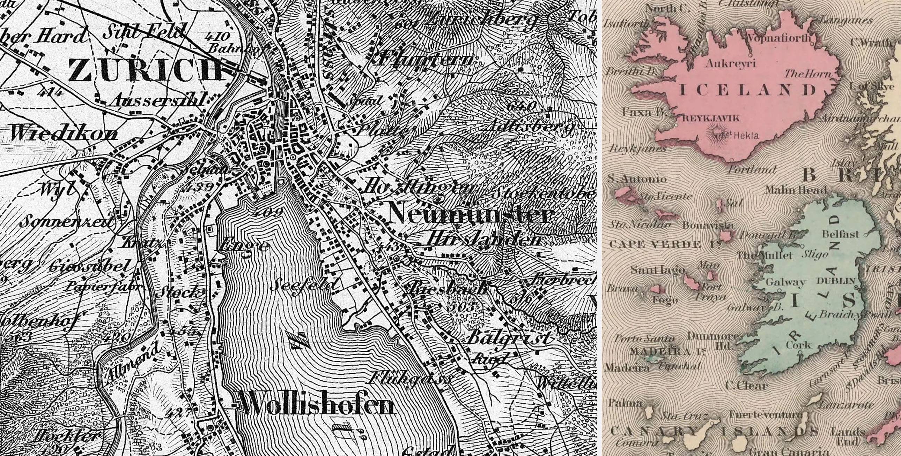
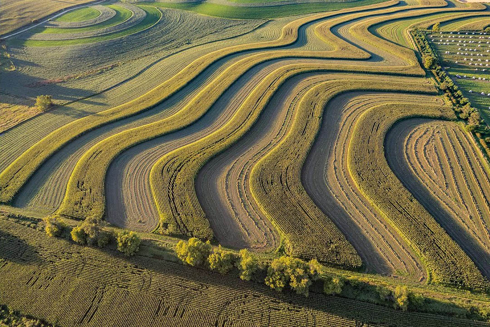
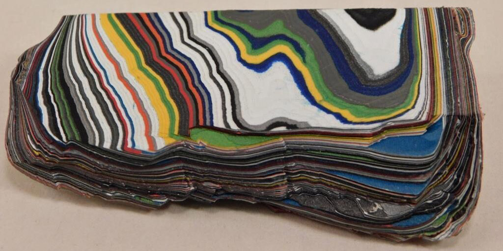
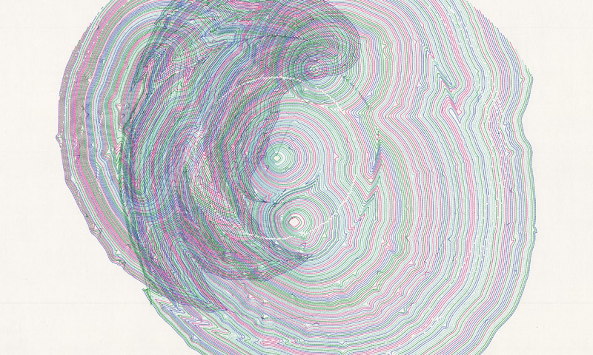

# Offset Curves / Parallel Curves

*[Offset curves](https://en.wikipedia.org/wiki/Parallel_curve) are shapes that run a fixed distance away from an original curve. They are essential in applications ranging from CNC machining to typography, and have many analogies in layered phenomena in the natural world. Despite their simple definition, offset curves are mathematically complex: they can develop cusps, self-intersections, and abrupt changes even when the original curve is smooth. Understanding them helps artists and engineers work more precisely with form, structure, and process.*

*Offset curves are also known as equidistant curves or parallel curves.*

---

## Code

Here is some working demonstration code to compute offset curves in Java, JavaScript, and Python. *Note that these implementations differ widely in how they are used, and in the quality of their results. In my opinion, the Python [Shapely](https://shapely.readthedocs.io/en/stable/) library — a professional-grade cartography toolkit – will produce the best-quality, most robust results, but your mileage may vary!*

* [**Python** demo](python/README.md) (using the [Shapely](https://shapely.readthedocs.io/en/stable/) library v.2.1.1)
* [**Processing** (Java) v.4.4 demo](processing/offset_curves/offset_curves.pde) (requires the [PEmbroider](https://github.com/CreativeInquiry/PEmbroider) library)
* [**p5.js** (JavaScript) demo](p5js/) (using [Unmess.ts](https://github.com/LingDong-/squiggy) by Lingdong Huang); Also see [here](https://editor.p5js.org/golan/sketches/3weJl07Re) and [here](https://editor.p5js.org/golan/sketches/hJ--ERIWQ)

Some additional implementations of offset curves include: 

* [SKIA PathKit (JavaScript via WebAssembly and asm.js)](https://skia.org/docs/user/modules/pathkit/#pathkit) 
* [jsts + d3](https://github.com/bjornharrtell/jsts), as shown [here](https://observablehq.com/@rveciana/coastal-vignettes-with-jsts-d3js)
* [OpenFrameworks (C++) implementation](https://github.com/Bryce-Summers/ofxScribbleSegmenter/blob/master/src/OffsetCurves.cpp) by Bryce Summers

---

## Offset Curves In Nature

Some examples of layered phenomena in the natural world.

Layers of sedimentary geology, i.e. [*varves*](https://en.wikipedia.org/wiki/Varve) and other [*rhythmites*](https://en.wikipedia.org/wiki/Rhythmite)

Laguna Agate and [Condor Agate](https://en.wikipedia.org/wiki/Condor_agate)

Coral growth bands

Annual tree rings

Layers of an onion

The [Belousov-Zhabotinsky chemical reaction](https://www.youtube.com/watch?v=jRQAndvF4sM)

---

## In Art and Human Activity

These are not isolines, but rather, [*waterlines*](https://observablehq.com/@oliviafvane/ii-drawing-waterlines-on-maps), a functional embellishment used in cartography.

Rice terraces in Vietnam

Contour farming in [Vernon County, Wisconsin](https://www.google.com/maps/@43.5997103,-90.9630865,2465m/data=!3m1!1e3?entry=ttu&g_ep=EgoyMDI1MDgwNi4wIKXMDSoASAFQAw%3D%3D). This pattern conserves rainwater and reduces soil loss.

Maya Lin, [*Systematic Landscapes*](https://camstl.org/exhibitions/maya-lin-systematic-landscapes/), 2007

[Cuna mola embroidery designs](https://www.jstor.org/stable/community.15377658), 1955, from the Peabody Museum of Archaeology and Ethnology, Harvard University

Verner Panton, [Spectrum textile](https://www.moma.org/collection/works/292747), 1974

CNC machining toolpaths

Pedro Ramírez Vázquez et al., [*Mexico 1968 olympics logo*](https://www.logohistories.com/p/folk-art-psychedelia)

Sumit Mehndiratta, [*No. 251*](https://www.artfinder.com/product/composition-no-251-5a215/), 2021

Layers in [Fordite](https://en.wikipedia.org/wiki/Fordite)

Laurel Bancroft, [*core section of the CMU fence*](https://www.flickr.com/photos/golanlevin/2426520046), 2007

Robert Hodgin, [*Individuation*](https://roberthodgin.com/project/individuation), 2021

M.J. Lindow, [*Jardin*](https://www.fxhash.xyz/project/jardin), generative NFT artwork, 2021

Zach Lieberman, [*Offsety Person*](https://www.instagram.com/p/BHBKPsgAOA0/), 2016. Discussion [here](https://zachlieberman.medium.com/daily-sketches-2016-28586d8f008e#:~:text=When%20I%20mentioned%20this%20problem%20to%20Golan%20Levin%2C%20he%20connected%20me%20with%20Bryce%20Summers%2C%20whose%20ofxScribbleSegmenter%20helped%20solve%20for%20self%20intersection%20of%20those%20polygon%20offsets%20and%20I%20was%20able%20to%20do%20offsets%20pretty%20fast). 

Jürg Lehni, [*Otto*](https://vimeo.com/129666491), 2014

Carl Lostritto, *Cascading Lines Break the Circle*. Plotter artwork, 2016

[Jenn Karson](https://jennkarson.studio/), *Lifelines*, 2024

Plotter artwork by [Targz](https://www.instagram.com/targz/?hl=en)