# Realtime Plotting

#### *Contents*

* [*Some Prior Art*](#some-prior-art)
* [*Techical Resources*](#technical-resources)

---

## Some Prior Art

#### Drawing Machines Under Realtime Control

* [*DiceGL*](https://twitter.com/v3ga/status/1734285242809065546), Julien Gachadoat, 2023. Dice rolls generate vector patterns and drive a plotter accordingly. 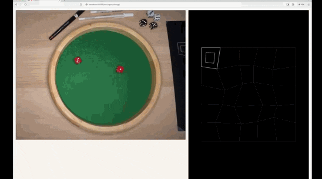
* [Sougwen Chung](https://www.youtube.com/watch?v=hpEE_s0pN64). 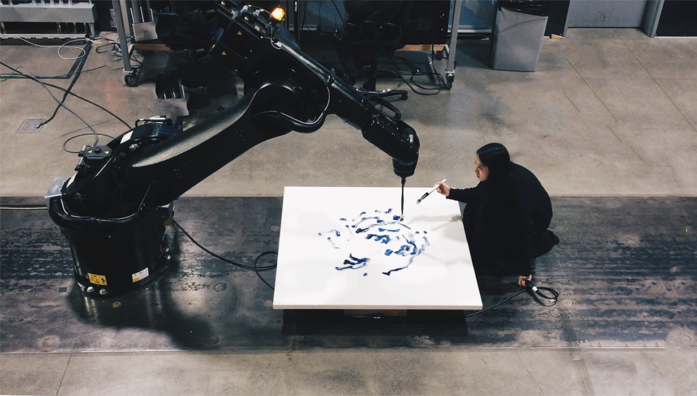
* [*Portraits*](https://www.youtube.com/watch?v=A4dQIuD6xbA), [Patrick Tresset](https://patricktresset.com/new/), 2016. 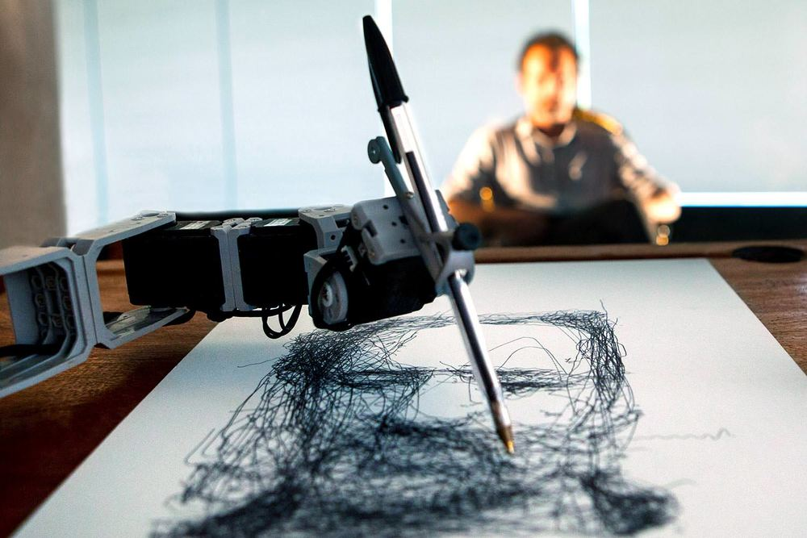
* [*Contour Capture Kiosk*](https://twitter.com/golan/status/1554593715875987456), Elliot Spelman, 2022. 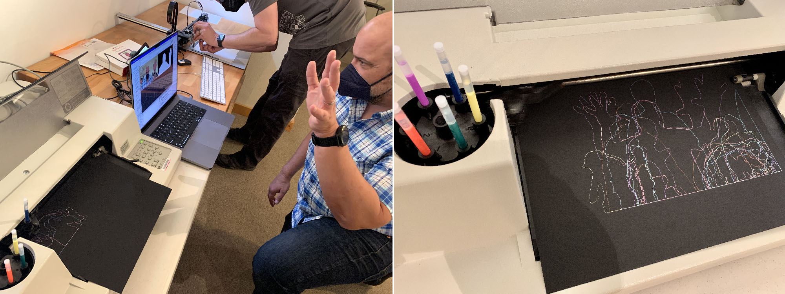
* [*Pen Wiggler*](https://scanlime.org/2021/05/scanlime055-pen-wiggler/), Micah Elizabeth Scott (Scanlime), 2021. [Hackaday](https://hackaday.com/2021/05/14/random-robot-makes-random-art/#more-476118) 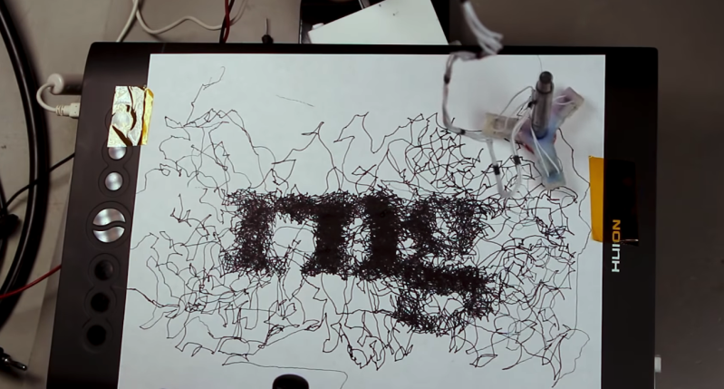
* [*A Crack in the Hourglass*](https://www.youtube.com/watch?v=BsVsULhoSbM), Rafael Lozano-Hemmer, 2021. Portraits of deceased loved ones are drawn, ephemerally, in sand. 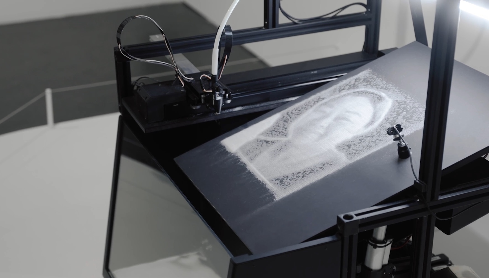
* [*Seismoscope*](https://vimeo.com/46055629), Rafael Lozano-Hemmer, 2009. Realtime seismic data influences how a plotter executes a portrait. 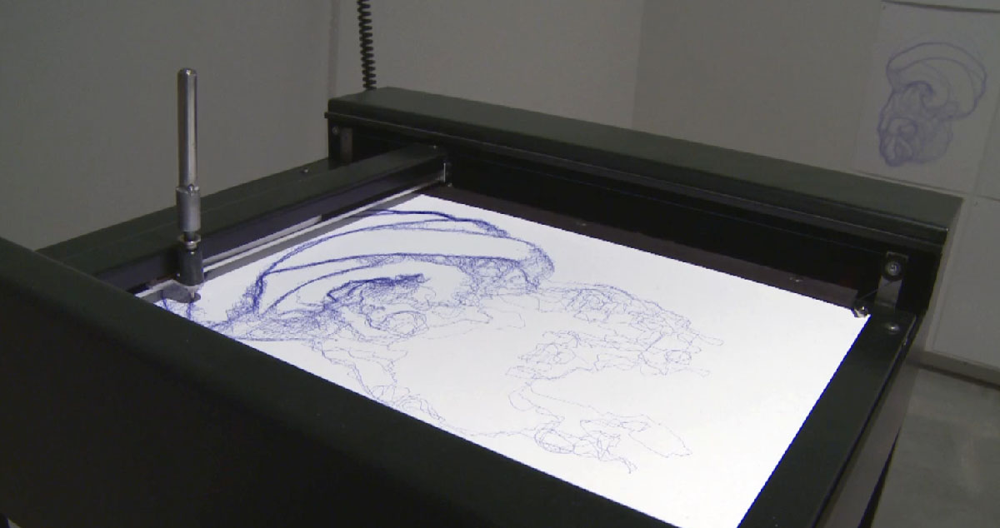
* [*Repeater*](https://twitter.com/creativeapps/status/1736747265023242264), Georgios Cherouvim, 2023. A feedback loop between a pen plotter and a pen digitizer. 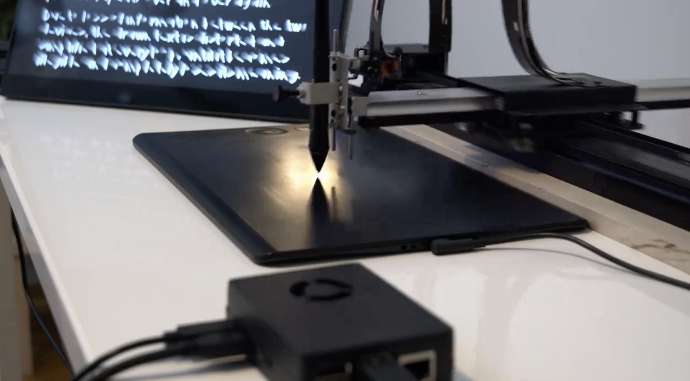

#### Some Previous CMU Student Realtime Projects

* [*Drawing with Heart*](https://www.youtube.com/watch?v=Gso9xMhnO-M), Robert Zacharias, 2016. A drawing machine that renders the pulse of a participant in realtime. ([Writeup](https://ems.andrew.cmu.edu/2016/zach/02/17/drawing-with-heart/)) 
* [*Asemic Transcription*](https://courses.ideate.cmu.edu/60-428/f2021/author/grape/), Sarah Di, 2021. The system transcribes the pitch of your voice into nonsense writing, in realtime. [Video](https://www.youtube.com/watch?v=_alznpKj0AE) 
* [*Three Trees*](https://www.youtube.com/watch?v=fv8tembgAcA), Jacqui Fashimpaur, 2016. A simple use case: Jacqui used Processing to control the plotter in real-time, in order to dip a brush in ink. 
* [*Tracing Movement*](https://www.youtube.com/watch?v=zw7HS-e2mCk), Jacqui Fashimpaur, 2016. Jacqui used a Kinect to track the skeleton of a dancer; the traces of the dancer's joints were then captured to paper using the plotter. 
* [*Threadsteading*](http://lea.zone/threadsteading.html), Lea Albaugh, 2016. ([Article](https://dl.acm.org/doi/10.1145/2851581.2889466)) A two-player territory control game designed to be played on a modified computer-controlled quilting machine. 

#### Live Performances and Machine-Assisted Human Plotters

* [*Blind Self-Portrait*](https://vimeo.com/78431948), Kyle McDonald & Matt Mets, 2013. 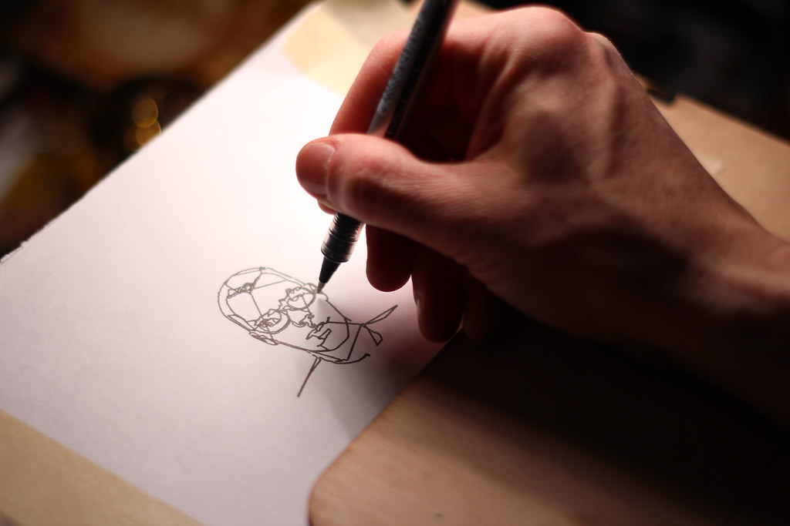
* [*Being the Machine: 3D printing en plein air*](http://beingthemachine.com/?p=114), Laura Devendorf, 2015. Laser-guided 3D-printing by hand. 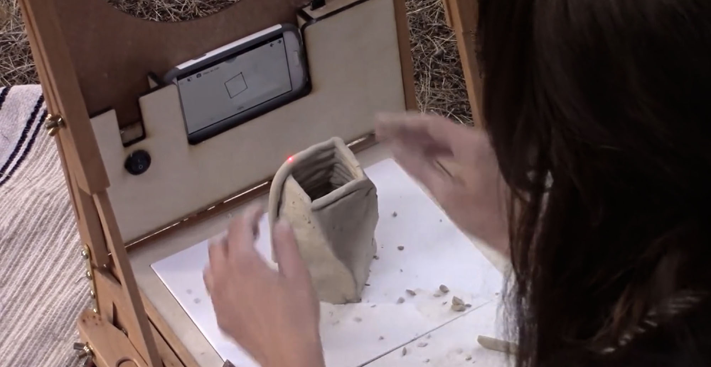
* [*Computer-Controlled Finger Painting*](https://twitter.com/golan/status/1552509950424821760), Deanna Gelosi, 2022. Gelosi became a cyborg AxiDraw meat-puppet, expressing a posthuman squiggle through a computer-controlled finger-painting apparatus. 
* [*Accessibility Aids*](https://art.josephwilk.net/projects/accessibility_aids.html), Joseph Wilk, 2022: "A performance that blurs the line between bodies and machines that comes from the experience of living with a wheelchair as a body: Drawing tools are used as assitive aids acting as different extensions of the body and enabling movements that my body finds difficult....Paint is carefully placed by hand on a canvas and finally the pen-plotter using various clay sculpting tools manipulates the paint." 
* [*The Interfered Microscopy Plot*](https://www.youtube.com/watch?v=CBZDvtHyRfo&t=1382s), Golan Levin, 2022. "The live feed of a digital microscope spurs the machine hallucinations of a semiautonomous drawing algorithm, whose interpretations are both coaxed and culled by the performer". 

#### Projection Plotting

Projection mapping on (live) plotting. 

 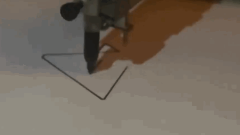

* Daniel Berio's [Graffitizer](https://www.enist.org/post/drawing_machines/graffitizer-2/) & [tweet](https://twitter.com/colormotor/status/1320356812424646657)
* [Daniel Berio](https://twitter.com/colormotor/status/1415020778542800900)
* [Joanie Lemercier](https://twitter.com/JoanieLemercier/status/719283368119152641)
* [Gustavo M.](https://twitter.com/bustavo/status/1509923339195719690)
* [Receipt Racer](https://vimeo.com/24987120), D_Effekt et al., 2011. Augmented projection game on live receipt printer. [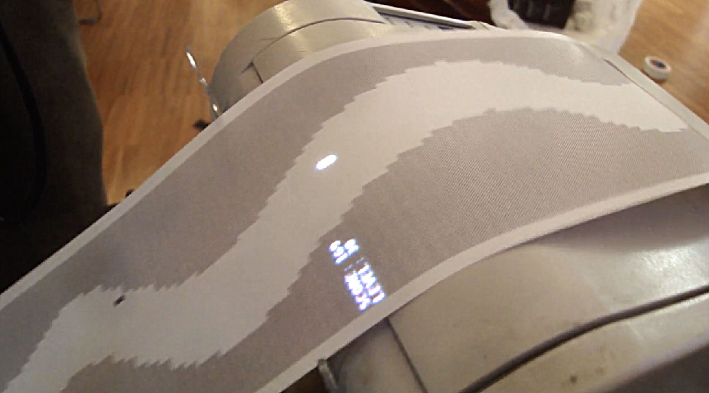](https://vimeo.com/24987120)

---

## Technical Resources

#### AxiDraw: 

* [Realtime control of AxiDraw with Python](https://axidraw.com/doc/py_api/#quick-start-interactive-xy)
* [Realtime control of AxiDraw with Python (unofficial)](https://github.com/fogleman/axi)
* [Realtime control of AxiDraw with Processing (Java)](https://github.com/golanlevin/DrawingWithMachines/blob/main/machines/axidraw/realtime_processing/simple_mouse_axidraw_2024/simple_mouse_axidraw_2024.pde) (2024)
* [Gannon's AxiDraw_Mouse](https://github.com/madelinegannon/axidraw/tree/master/AxiDraw_Mouse)

#### Line-Us: 

* [Realtime control of Line-Us with p5.js](https://github.com/golanlevin/DrawingWithMachines/tree/main/machines/line-us/p5js/lineus_p5js_realtime)

#### HP7475A: 

* [Realtime control of HP7475a in Processing (Java)](https://github.com/golanlevin/DrawingWithMachines/blob/main/machines/hp7475a/processing/realtime_7475a/realtime_7475a.pde)
* [ofxHPGL control of HP7475a in OpenFrameworks (C++)](https://github.com/NickHardeman/ofxHPGL)

#### Todo: 

* Etherdream/ILDA