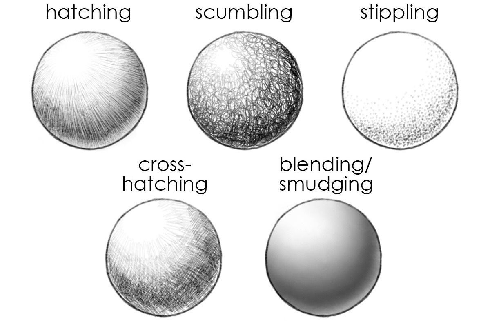
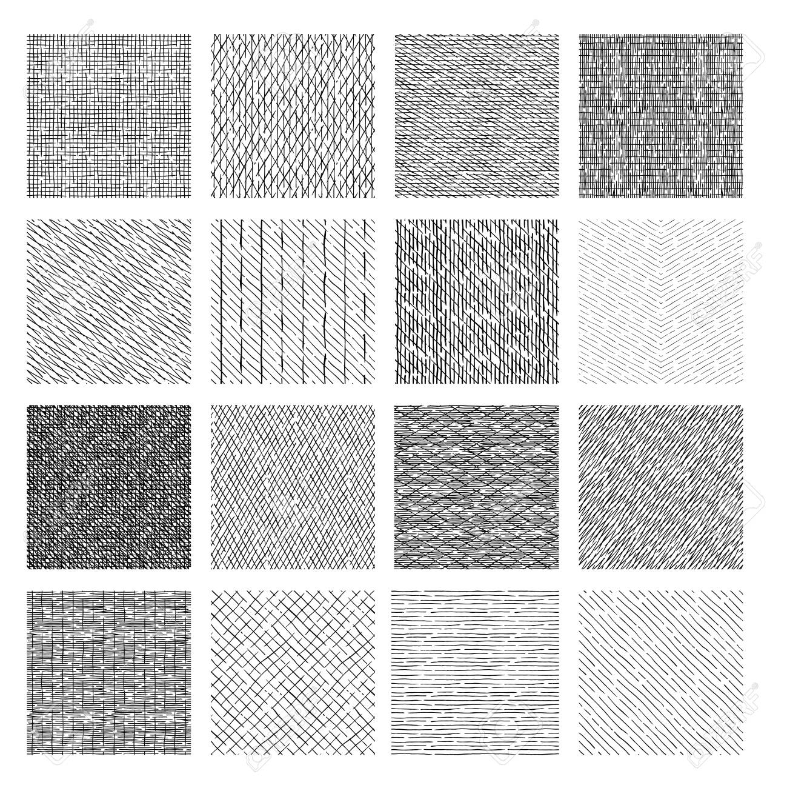
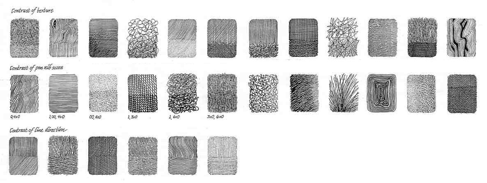
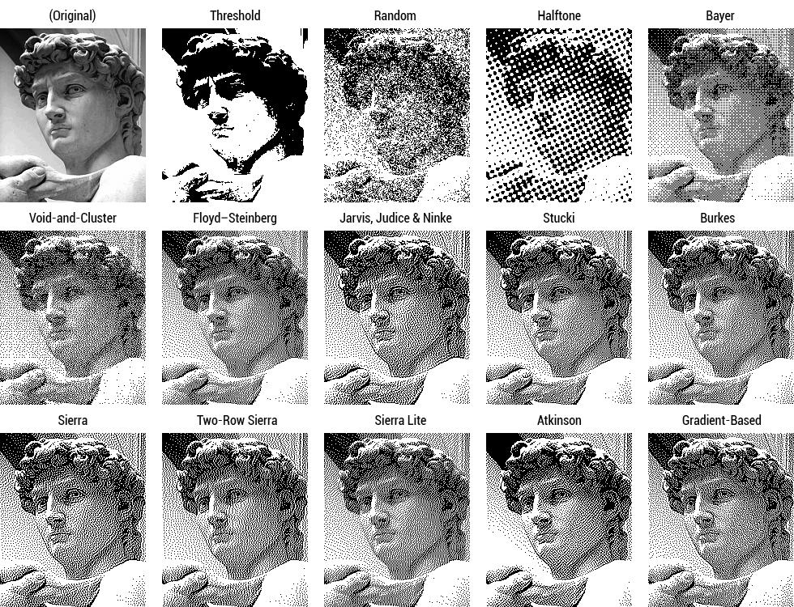
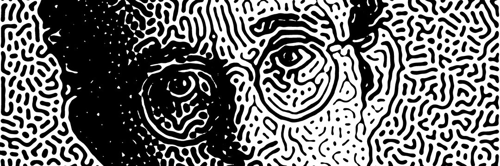

# Tone

---

## Hatching: Some Reminders

* Question to the group: What are some *dimensions of variability* that are used to achieve tone and tone textures in drawings?

<details><summary>Click to reveal some examples</summary>

* density (elements per linear inch or square inch)
* orientation
* line weight
* layering (cross-hatching)
* duty cycle (of a dashed line)
* hardness of pencil
* darkness of ink

</details>






---

### Orientation Matters. 

You can hatch along, against, or perpendicular to natural gradients in the image.

<br />*Gérard Edelinck after Charles Le Brun, French, ca. 1675.*

<br />Hendrick Goltzius (1558–1617), *Apostle Simon*, 1589 (detail)

...or hatch in ways that ignore gradients in the "primary" visual material, establishing secondary flows in the image plane.

<br />By Nicolas Jolly.

#### Material Considerations.

Contrasts: 


Gradient of drawing devices:


Possibilities for dwelling-based halftoning (ink bleeding):


#### Contrasts



---

## Tone and Algorithm I: Modular Texture Elements

One way to establish tone is to use an **alphabet** of modular elements of varying luminance.

<br />Leon Harmon & Ken Knowlton, *Computer Nude (Studies in Perception I)*, 1967.

> *Computer Nude (Studies in Perception I)* is the most widely circulated early artwork made using a computer. It demonstrates the unique capacity of the viewer's brain to interpret a composition of abstract symbols grouped to emulate areas of tonal value as a human figure. Leon Harmon, a researcher in cognitive neuroscience, and Ken Knowlton, a computer engineer at AT&T’s Bell Labs, reenvisioned a photograph of dancer Deborah Hay as a bitmap mosaic using a program they developed. Harmon and Knowlton were brought together by Experiments in Art and Technology (E.A.T.), a nonprofit group which aimed to provide creative minds with access to new technology and engineering professionals. A special scanner converted analog voltages to binary numbers which were assigned typographic symbols.


> Rauschenberg hung a copy of this image in his studio during a press conference for an E.A.T. event. It was photographed and subsequently reproduced in an October 11, 1967, article in The New York Times titled “Art and Science Proclaim Alliance in Avant-Garde Loft,” becoming the publication’s first full-frontal nude. Due to the popularity of the image, a limited-edition screen print was created from the original work.

Nowadays we know this as ASCII art. Here's live ASCII webcam video art by [Alida Sun](https://www.instagram.com/p/Cz87BMryZgW/?hl=en&img_index=1): 

<br />Alida Sun

<br />Arjan van der Meij


<details><summary>Sidebar about stamps/printing</summary>

Our current discussion focuses on using *lines*. Having an alphabet of modular elements verges on imaging with stamps (i.e. **printing**), as in this thumbprint work by Chuck Close:<br />


Or this typewriter drawing by Lenka Clayton:<br />


</details>

---

## Tone and Algorithm II. 


Just a small handful of many possible approaches: 

[Weighted Rejection Sampling](https://editor.p5js.org/golan/sketches/qmdA2b2_Y) (p5)


[Rasterization with variable line weight](http://paperjs.org/examples/spiral-raster/) (SpiralRaster)


[Novel approaches to variable line density](https://msurguy.github.io/SquiggleCam/) (SquiggleCam)


[Weighted Voronoi Stippling](https://observablehq.com/@mbostock/voronoi-stippling) & [p5.js](https://editor.p5js.org/golan/sketches/i3-pa_GPI)


[Traveling Salesman Problem tour](https://www.math.uwaterloo.ca/tsp/data/art/)


[TSP Tour & Figurative Tour](https://blogs.scientificamerican.com/roots-of-unity/when-the-mona-lisa-is-np-hard/)

> As Bosch and Wexler write, “Even though this tour is the best one possible and does indeed resemble the target image, it doesn’t achieve as good a likeness as the points do alone.” It seems like kind of a waste to solve the traveling salesman problem just to make the picture worse, so they decided to change the rules of the game.


> Instead of clustering the points in their image, they start with a regular grid of points. The object of the game is then to connect them not with a path that solves the traveling salesman problem but with one that visually resembles the target image. The path should still hit each point exactly once, but now the winning trip will probably be longer than the TSP-optimal path.


The [DrawingBotv34 software](https://drawingbotv3.com/) offers many different readymade algorithms for converting raster images to vector drawings.


## Tone and Algorithm III: Dithering

[Dithering](https://en.wikipedia.org/wiki/Dither) is the problem of rendering a continuous-tone (or high bit-depth) raster image with fewer bits. There are many, many different techniques.


Some easy ones are: *Threshold*; *Random*; *Bayer*. (How do you suppose they work?)



[Floyd-Steinberg](https://en.wikipedia.org/wiki/Floyd%E2%80%93Steinberg_dithering) is the most common dithering method. it works by using error diffusion, meaning it propagates (adds) the residual quantization error of a given pixel onto its neighboring pixels, to be dealt with later.

```
for each y from top to bottom do
    for each x from left to right do
        oldpixel := pixels[x][y]
        newpixel := find_closest_palette_color(oldpixel)
        pixels[x][y] := newpixel
        quant_error := oldpixel - newpixel
        pixels[x + 1][y    ] := pixels[x + 1][y    ] + quant_error × 7/16
        pixels[x - 1][y + 1] := pixels[x - 1][y + 1] + quant_error × 3/16
        pixels[x    ][y + 1] := pixels[x    ][y + 1] + quant_error × 5/16
        pixels[x + 1][y + 1] := pixels[x + 1][y + 1] + quant_error × 1/16
```

#### Further Reading on Dithering

If you want to nerd out, these articles are amazing:

* [Wikipedia Article on Dithering](https://en.wikipedia.org/wiki/Dither)
* [Image Dithering: Eleven Algorithms and Source Code](https://tannerhelland.com/2012/12/28/dithering-eleven-algorithms-source-code.html)
* [Ditherpunk — The article I wish I had about monochrome image dithering](https://surma.dev/things/ditherpunk/)
* [Joel Yliluoma's arbitrary-palette positional dithering algorithm](https://bisqwit.iki.fi/story/howto/dither/jy/)
* [Case Study: Dithering in *Return of the Obra Dinn*](https://forums.tigsource.com/index.php?topic=40832.msg1363742#msg1363742)
* [DITHERT: Dithering implementations in Processing](https://bitbucket.org/mwebster_/dithering/src/master/)


#### Dithering Art

[Work by Loackme (Loïc Schwaller)](https://twitter.com/loackme_)

<!-- 

-->


[*Cajal* Neural Drawings by Mark Webster](https://twitter.com/search?q=%40motiondesign_01%20cajal)


---

## Time Permitting

[Halftoning with Reaction-Diffusion Patterns](https://estebanhufstedler.com/2020/05/17/halftoning-with-reaction-diffusion-patterns/) (+[Sims](https://www.karlsims.com/rd.html))



---

[2021 version](https://courses.ideate.cmu.edu/60-428/f2021/index.html%3Fp=771.html)