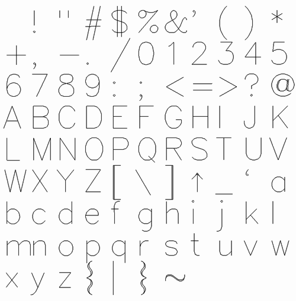

# Typography

## Hershey Fonts

[The Hershey Fonts with Frank Griesshammer](https://vimeo.com/178015110) 

> *In the 1960s, at Dahlgren Naval Weapons Laboratory, Dr. Allen V. Hershey worked on what was to become some of the earliest digital fonts. Hershey’s work is impressive for both technical and creative aspects, and was documented in a report called “CALLIGRAPHY FOR COMPUTERS”.*

#### Hershey Font Tools by Lingdong Huang (BCSA 2019):

* [p5-hershey-js](https://github.com/LingDong-/p5-hershey-js) Hershey Fonts in p5.js ([live demo](https://lingdong-.github.io/p5-hershey-js/))
* [chinese-hershey-font](https://github.com/LingDong-/chinese-hershey-font) Chinese Hershey Font ([live demo](https://lingdong-.github.io/chinese-hershey-font/))
* [legumes](https://github.com/LingDong-/legumes) Sheet music in polylines using Hershey text
* [hfmath](https://github.com/LingDong-/hfmath) Render LaTeX math with Hershey Fonts
* [ttf2hershey](https://github.com/LingDong-/ttf2hershey) TTF-to-Hershey Converter 
* [hfedit.glitch.me](https://hfedit.glitch.me/) Hershey Font Editor 

Other Hershey Font tools and Single-Line Fonts:

* [cnc-text-tool](https://msurguy.github.io/cnc-text-tool/) Browser-based SVG editor with Hershey text overlayer
* [Hershey Font Inkscape plugin](https://wiki.inkscape.org/wiki/index.php/Release_notes/1.0#Hershey_Text) 
* [Index of many single-line fonts](http://www.imajeenyus.com/computer/20150110_single_line_fonts/index.shtml)
* [Commercial single-line fonts](https://www.singlelinefonts.com/)

---

## Getting Points from Glyphs

p5.js (JavaScript): 

* [textToPoints()](https://p5js.org/reference/#/p5.Font/textToPoints) reference (from p5.Font)
* [textToPoints() demo #1](https://editor.p5js.org/golan/sketches/YR_GSPMmY) by golan
* [textToPoints() demo #2](https://editor.p5js.org/aferriss/sketches/B1BOfBdZX) by aferris
* [Improved extraction of sub-contours in p5](https://editor.p5js.org/ffd8/sketches/TaPWHTaH)
* [Advanced decomposition of glyph components in p5](https://editor.p5js.org/allison.parrish/sketches/ByNj90dT7)

Processing (Java):

* [Geomerative](http://www.ricardmarxer.com/geomerative/) library
* [Geomerative Text Processing Example](https://www.youtube.com/watch?v=IthjKDGf7oQ) (Video)
* [Autonomous Agents following Glyph Outlines](https://www.youtube.com/watch?v=PA8VUXCX19c) (Video)

--- 

### Inspo: Type Studies by Zach Lieberman

* [https://www.instagram.com/tv/CJi3NPkjoed/](https://www.instagram.com/tv/CJi3NPkjoed/)
* [https://www.instagram.com/p/CJgMp-tD6w_](https://www.instagram.com/p/CJgMp-tD6w_)
* [https://www.instagram.com/p/CF2NSdojr_c](https://www.instagram.com/p/CF2NSdojr_c)
* [https://www.instagram.com/p/CEhxjyYDsjk](https://www.instagram.com/p/CEhxjyYDsjk)
* [https://www.instagram.com/p/CEhn9nijGhd](https://www.instagram.com/p/CEhn9nijGhd)
* [https://www.instagram.com/p/CFm8-JIjZtY](https://www.instagram.com/p/CFm8-JIjZtY)
* [https://www.instagram.com/p/B0_OxmcDMjM](https://www.instagram.com/p/B0_OxmcDMjM)
* [https://www.instagram.com/p/Bqw1RFIh0hj](https://www.instagram.com/p/Bqw1RFIh0hj)
* [https://www.instagram.com/p/BnwJgT-h2Z-](https://www.instagram.com/p/BnwJgT-h2Z-)
* [https://www.instagram.com/p/Bj6slhaA-VV](https://www.instagram.com/p/Bj6slhaA-VV)
* [https://www.instagram.com/p/BhDZbE1AKmp](https://www.instagram.com/p/BhDZbE1AKmp)
* [https://www.instagram.com/p/BdunBVpAFJX](https://www.instagram.com/p/BdunBVpAFJX)

---

[*2021 Version*](https://courses.ideate.cmu.edu/60-428/f2021/daily-notes/10-27-new-ii/typography/)
