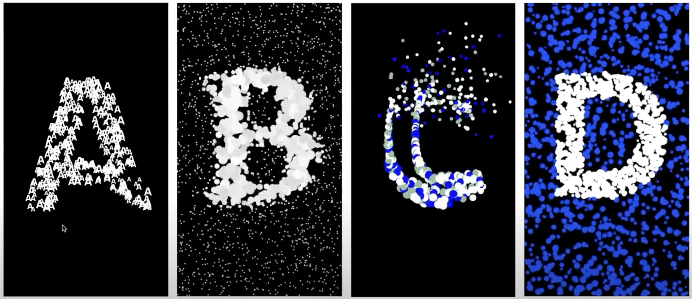
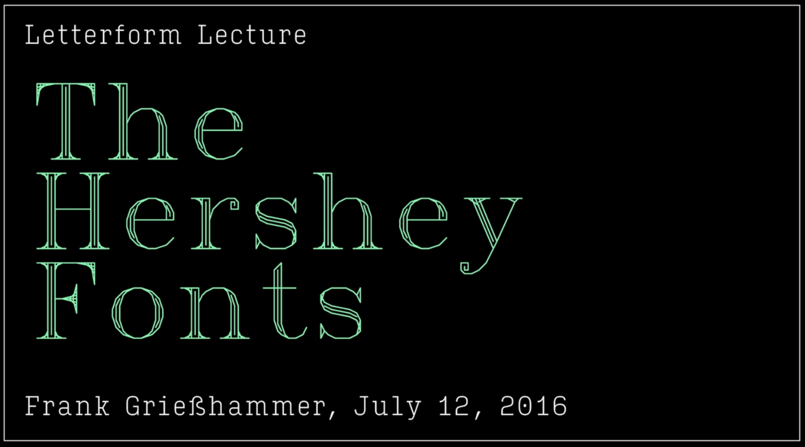
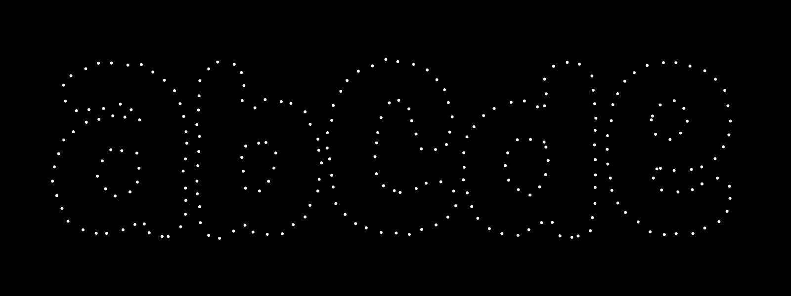
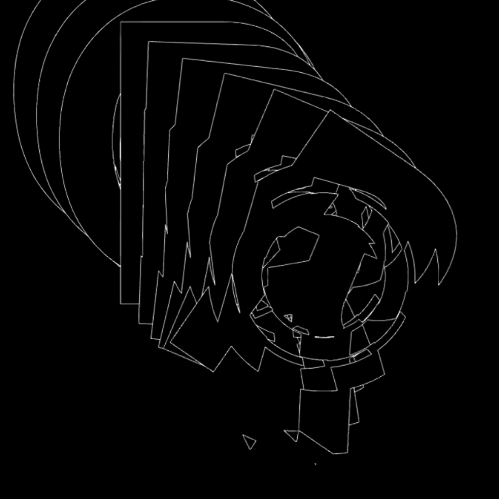

# Typography

 *MIT Media Lab: Space Type Studio* lecture (video)

---

## Hershey Fonts

[The Hershey Fonts with Frank Griesshammer](https://vimeo.com/178015110) (video) 

> *In the 1960s, at Dahlgren Naval Weapons Laboratory, Dr. Allen V. Hershey worked on what was to become some of the earliest digital fonts. Hershey’s work is impressive for both technical and creative aspects, and was documented in a report called “CALLIGRAPHY FOR COMPUTERS”.*

* See [p5-hershey-js](https://github.com/LingDong-/p5-hershey-js) Hershey Fonts in p5.js ([live demo](https://lingdong-.github.io/p5-hershey-js/))

---

## p5.js Single-Line Font Resources

[This is a repository](https://github.com/golanlevin/p5-single-line-font-resources/blob/main/README.md) of p5.js programs for loading and displaying **single-line vector fonts** (also called single-stroke or monoline fonts) in a variety of formats — including TTF, SVG Font, Hershey Font, and others. The repository also includes an authoritative **archive of single-line fonts** (and procedural fonts) from a wide range of creative projects, obsolete technologies, and other sources.

---

## Getting Points from Glyphs

[**This terrific article**](https://erraticgenerator.com/blog/p5js-texttopoints-function/) provides an overview of the p5.js `textToPoints()` function, and some of the nuances of using it well. 

p5.js (JavaScript) examples: 

* [textToPoints()](https://p5js.org/reference/#/p5.Font/textToPoints) reference (from p5.Font)
* [textToPoints() demo #1](https://editor.p5js.org/golan/sketches/YR_GSPMmY)
* [textToPoints() demo #1b](https://editor.p5js.org/golan/sketches/0gbZoi7Jg)
* [textToPoints() demo #2](https://editor.p5js.org/golan/sketches/X-GOmJo5I)
* [Improved extraction of sub-contours in p5](https://editor.p5js.org/golan/sketches/1m2YaC0d9)
* [Advanced decomposition of glyphs in p5](https://editor.p5js.org/allison.parrish/sketches/ByNj90dT7) (uses patched p5)
* [textToPoints+openType](https://gist.github.com/erraticgenerator/e20cc8c8806ae89d077ceaf962d913af#file-p5-texttopoints-opentypejs-html) example

Processing (Java) examples:

* [Geomerative](http://www.ricardmarxer.com/geomerative/) library
* [Geomerative Text Processing Example](https://www.youtube.com/watch?v=IthjKDGf7oQ) (Video)
* [Autonomous Agents following Glyph Outlines](https://www.youtube.com/watch?v=PA8VUXCX19c) (Video)

--- 

## Some Inspiration: Type Studies by Zach Lieberman

* [https://www.instagram.com/tv/CJi3NPkjoed/](https://www.instagram.com/tv/CJi3NPkjoed/)
* [https://www.instagram.com/p/CJgMp-tD6w_](https://www.instagram.com/p/CJgMp-tD6w_)
* [https://www.instagram.com/p/CF2NSdojr_c](https://www.instagram.com/p/CF2NSdojr_c)
* [https://www.instagram.com/p/CEhxjyYDsjk](https://www.instagram.com/p/CEhxjyYDsjk)
* [https://www.instagram.com/p/CEhn9nijGhd](https://www.instagram.com/p/CEhn9nijGhd)
* [https://www.instagram.com/p/CFm8-JIjZtY](https://www.instagram.com/p/CFm8-JIjZtY)
* [https://www.instagram.com/p/B0_OxmcDMjM](https://www.instagram.com/p/B0_OxmcDMjM)
* [https://www.instagram.com/p/Bqw1RFIh0hj](https://www.instagram.com/p/Bqw1RFIh0hj)
* [https://www.instagram.com/p/BnwJgT-h2Z-](https://www.instagram.com/p/BnwJgT-h2Z-)
* [https://www.instagram.com/p/Bj6slhaA-VV](https://www.instagram.com/p/Bj6slhaA-VV)
* [https://www.instagram.com/p/BhDZbE1AKmp](https://www.instagram.com/p/BhDZbE1AKmp)
* [https://www.instagram.com/p/BdunBVpAFJX](https://www.instagram.com/p/BdunBVpAFJX)

---

[*2021 Version*](https://courses.ideate.cmu.edu/60-428/f2021/daily-notes/10-27-new-ii/typography/)
