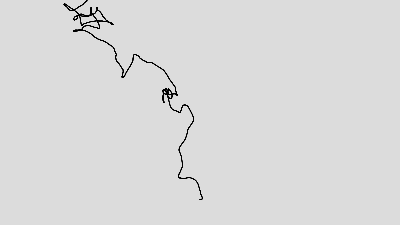
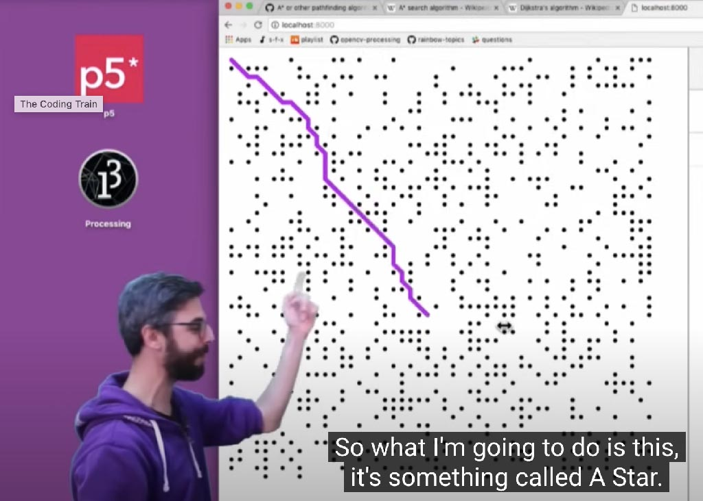

# Some Strategies for Walking a Dot


<br />Colette and Charles Bangert, [*Complex Intersecting Line*](https://spalterdigital.com/artworks/3314/), computer plot, 1976. Spalter Collection. [Detail](https://i0.wp.com/spalterdigital.com/wp-content/uploads/2019/09/IMG_4451-e1569338421449.jpeg?fit=2000%2C1500&ssl=1)

---

*This lecture presents a few common approaches used in creative coding for "walking a dot", i.e. creating an interesting trace of a moving point.*

**Contents**

1. **Direct Calculation**. Use an equation to determine the position of a point leaving a trace. For example: 
  * explicit curves: `y=f(x)`
  * parametric curves: `y=f(t), x=g(t)`, etc.
  * polar curves: `r=f(θ)` [...and then convert: `x=r*cos(θ), y=r*sin(θ)`]
  * Evolutes and involutes
2. **Differential Curve Plotting**
3. **Path-Planning Algorithms**
4. **Whole-line transformations**.
  * Signal processing and filtering (convolution): Smoothing & sharpening
  * Differential growth
  * Filament simulations
  * Recursive Segment Substitution (fractals)
5. **Grab Bag Time**
  * Fourier epicycles
  * Recurrence formula

---


# 1. Direct Calculation

## 1.1. Graphs of simple non-parametric functions

### 1.1.1. Case Study: Vera Molnar's *Mont St. Victoire*

The profile of the Mont Sainte-Victoire, a mountain in southern France, became the subject of [more than 30 of Cézanne's paintings](https://en.wikipedia.org/wiki/Mont_Sainte-Victoire_(C%C3%A9zanne)). In the 1980s, pioneering computer artist Vera Molnar, living in France and a fan of Cezanne, likewise considered Mont St. Victoire as a subject in a [series of plotter artworks](https://dam.org/museum/artists_ui/artists/molnar-vera/sainte-victoire/), representing this *instantly-recognizable* landscape with a piecewise continuous, single-valued polyline. 


### 1.1.2. Case Study: Bridget Riley

In the 1960s and 70s, as part of the *Op Art* movement, English artist Bridget Riley made large paintings with rhythmic patterns of sine waves. At their foundation, these paintings present traces of `y = sin(x)` — though there is much more going on here with color, rhythm, and composition. 

<br />A recent photo of Bridget Riley standing in front of her 1967 painting, *Cataract 3*.

Although Riley did not use a computer, she did have access to [books like these](https://archive.org/details/fiveplacelogari10hillgoog/page/n380/mode/2up) shown below, containing tables of values of sines and cosines. This is how most people did trigonometric calculations before the personal computer.


---

## 1.2. Parametric Curves

### 1.2.1. Case Study: Spirograph Curves

You're probably familiar with the popular *Spirograph* toy: a set of geared jigs for taking dots on precise walks.


Spirographs produce parametric [plane curves](https://mathworld.wolfram.com/topics/PlaneCurves.html) called [*roulettes*](https://mathworld.wolfram.com/topics/Roulettes.html). These curves are traced out by a point on a circle, as it rolls along another shape. When circles roll around circles, we get sub-species of roulettes including [*epicycloids*](https://mathworld.wolfram.com/Epicycloid.html) (shown just below) and [*hypocycloids*](https://mathworld.wolfram.com/Hypocycloid.html), among others. 


Spirographs were commercialized in the mid-1960s, but [had their origins](https://americanhistory.si.edu/explore/stories/spirograph-and-kinematic-models-making-math-touchable-and-pretty) about a century earlier in various kinematic models, often made in Germany, used for engineering and mathematics research. 


The kinematic model shown here traces out a [*trochoid*](https://mathworld.wolfram.com/Trochoid.html). These are curves that are formed by a point on either the radius of a circle, the circumference of a circle, or the extension of the radius of a circle as it rolls along a straight line. Trochoids obey the parametric equations below, as demonstrated in [this p5 sketch](https://editor.p5js.org/golan/sketches/XeVk96kax),

``` 
x = a*t - b*sin(t)
y = a - b*cos(t);
```

**Hundreds** of such parametric equations can be found in the [Mathworld Plane Curves site](https://mathworld.wolfram.com/topics/PlaneCurves.html). If you're browsing the collection of [Polar Curves](https://mathworld.wolfram.com/topics/PolarCurves.html) and see equations of the form `r = f(t)`, such as this nice [cranioid](https://mathworld.wolfram.com/Cranioid.html), just remember that once you have calculated `r` from `t`, you can plot `(x,y)` coordinates using the identities below, as demonstrated [in this p5 sketch](https://editor.p5js.org/golan/sketches/2HuAJCzhG):

```
x = r * cos(t);
y = r * sin(t); 
```

---

### 1.2.2. Case Study: Spencerian Flourishes (1800s copperplate calligraphy)

Spencerian flourishes are the ornate, looping decorative extensions found in 19th-century copperplate calligraphy, popularized by calligrapher Platt Rogers Spencer in the mid-1800s. They were designed both to beautify handwriting and to demonstrate a calligrapher’s skill in controlling rhythm, curves, and elegant line variation.

Some decorative Spencerian designs can be emulated using parametric equations based on periodic functions. For example, in this [interactive p5.js code example](https://editor.p5js.org/golan/sketches/_bBzlrd26), both `x` and `y` are derived from sinusoidal functions of `t`. These periodic functions approximate the movement of the calligrapher's hand over time:

```
x = a * (t + b*sin(3*t) + c*sin(2*t));
y = d + e * sin(t);
```

[](https://editor.p5js.org/golan/sketches/_bBzlrd26)


You can view more examples of this calligraphy [here](img/flourishes_23.jpg), [here](img/flourish-exercises-2.jpg) and [here](img/flourish-exercises-3.png).

---


# 2. Differential Curve Plotting

In **differential curve plotting**, we think about a trace as the movement of a point, as its position accumulates small deviations. Those small stepwise differences can be computed in lots of (ultimately similar and related) ways:

  * 2.1. Using **controlled randomness** (e.g. a structured drunk walk): `x+=random(), y+=random()`.
  * 2.2. Using **turtle graphics**, in which an agent's bearing (speed and orientation) change over time: `x+=speed*cos(orientation), y+=speed*sin(orientation)`
  * 2.3. Using **particle physics and flocking algorithms**: in which a particle's position or velocity changes as a result of environmental "forces" at its location (gravity, wind, flow fields, attraction to other agents or food sources, avoiding predators, etc.):
  	* `velocity += f(avoidance, separation, cohesion, hunger, fear, sex, wind...)`
  	* See: Braitenberg Vehicles, Craig Reynolds' Steering Behaviors, Boids-type Flocking, etc.
  * using **parametric differential equations**: `dy=f(t), dx=g(t); y+=dy, x+=dx`.
  * using **recurrence formulas**: `xNew = f(xPrev), yNew = g(yPrev)`


---

## 2.1. Controlled Randomness: (Structured) Drunk Walks

### 2.1.1. Simple Drunk Walk


Behold, a simple drunk walk ([p5 demo](https://editor.p5js.org/golan/sketches/n5FcXhEgq)). On each step, the turtle/cursor moves with a random deflection in `x` and `y`. The cursor's movement is completely uncorrelated from one moment to the next.

```
// Simple Drunk Walk
let px = 200; 
let py = 200;
let speed = 5; 

function setup() {
  createCanvas(400, 400);
  background(220);
}

function draw() {
  let qx = px + speed * random(-1,1);
  let qy = py + speed * random(-1,1);
  line(px,py,qx,qy); 
  px = qx; 
  py = qy;
}
```

### 2.1.2. Simple Perlin Drunk Walk



* [p5.js simple drunk walk demo](https://editor.p5js.org/golan/sketches/Tl2M-q_1Y)

```
// Simple Perlin Drunk Walk
let px = 200; 
let py = 200;

function setup() {
  createCanvas(400, 400);
  background(220);
}

function draw() {
  let t = millis()/1000;
  let qx = px + (noise(t, 123) - 0.5);
  let qy = py + (noise(t, 456) - 0.5);
  line(px,py,qx,qy); 
  px = qx; 
  py = qy;
}
```


### 2.1.3. Case Study: Manfred Mohr, *P-021/B*, 1969

Here is a 1969 work by computer arts pioneer Manfred Mohr. It accumulates sequences of different types of movements, with a bias towards the right, producing a script-like asemic text. Mohr writes:

> *"The elements are horizontal, vertical, 45 degree lines, square waves, zig-zags, and have probabilities for line widths and lengths. The algorithm places elements in a horizontal direction and has a high probability to move from left to right and a limited probability to backtrack. The original idea of this algorithm was to create a visual musical score which defies the progression in time by occasionally turning back on itself. Thus at the same time an abstract text is created."*


*P-021/A + B*, "band-structure", computer generated algorithmic plotter drawings, ink/paper, 1969, 50cm x 50cm.

For related work, also see Vera Molnar's 1998 [*Une Ligne Vagabonde*](img/vera_molnar_une_ligne_vagabonde_1998.jpg).


### 2.1.4. Non-Reversing and Self-Avoiding Walks


Researchers have identified several types of random walks on a lattice (discrete grid) — including purely random walks, *non-reversing walks*, [*self-avoiding walks*](https://en.wikipedia.org/wiki/Self-avoiding_walk), and *maximal self-avoiding walks*. A self-avoiding walk is a sequence of moves on a lattice that does not visit the same point more than once. Maximal self-avoiding walks also visit every point in a defined region. 

https://thecodingtrain.com/challenges/162-self-avoiding-walk


### Case Study: Michael Fogleman's Combinatorics of Mowing a Lawn


---


## 2.2. Turtle Graphics

[](https://www.youtube.com/watch?v=xMzojQFyMo0&t=59s)

[**Turtle graphics**](https://www.youtube.com/watch?v=xMzojQFyMo0&t=59s) are vector graphics using a relative cursor (the "turtle") on a Cartesian plane (x and y axis). The turtle has three attributes: a location, an orientation (or direction), and a pen with an on/off state. The turtle moves with commands that are relative to its own position, such as "move forward 10 spaces" and "turn left 90 degrees". A student could understand and reason about) the turtle's motion by imagining what they would do if they were the turtle. 

Turtle graphics were devised by Seymour Papert at MIT in the late 1960s, using actual drawing robots, as a way of teaching children to write computer programs. He called the turtle's first-person perspective "body syntonic reasoning". In support of this, Papert also developed the LOGO programming language.

* [p5.js turtle graphics starter program](https://editor.p5js.org/golan/sketches/SeiQiFsMa)


Here's my own [attempt at a turtle-graphics design](https://editor.p5js.org/golan/sketches/im4aJHJO_), inspired by Colette Bangert's [*Complex Intersecting Line*](https://spalterdigital.com/artworks/3314/) from 1976. In my program, the turtle's stepsize and heading/orientation vary continuously according to Perlin noise:

<br />
[*Golan's Attempt*](https://editor.p5js.org/golan/sketches/im4aJHJO_) (p5)


### 2.2.1. *Meander* Designs: Turtle Graphics with Periodic Sequences

A meander or *meandros*, also called a Greek fret or Greek key, is a decorative border constructed from a continuous line, shaped into a repeated motif. Meanders are [common decorative elements in Greek and Roman art](https://blogmymaze.wordpress.com/2012/06/07/different-types-of-meanders-in-greek-art/), used as running ornaments. On one hand, the name “meander” recalls the twisting and turning path of the Maeander River in Asia Minor, and on the other hand, as Karl Kerenyi has pointed out, “the meander is the figure of a labyrinth in linear form”.

Meanders such as those shown below can be formed by repetitive sequences of differential movements. For example, the meander design in the second row is made using the pattern below, shown in LOGO code: 

`repeat 22 [fd 2 rt 90 fd 2 rt 90 fd 1 rt 90 fd 1 lt 90 fd 1 lt 90 fd 2 lt 90]`

You can try this program yourself in this [online LOGO programming environment](https://www.transum.org/software/Logo/).


### 2.2.2. Case Study: Tauba Auerbach's *Ligature Drawings*

Tauba Auerbach has been investigating rhythmic meanders in her [*Ligature Drawing*](https://taubaauerbach.com/view.php?id=645) series (2019). 


Auerbach is the author of an artist book, [A Partial Taxonomy of Periodic Linear Ornament](https://www.printedmatter.org/catalog/49988/) (2017). She describes the book as exploring "ORNAMENT AS [ENTHEOGEN](https://en.wikipedia.org/wiki/Entheogen)" — "A personal account of a group of questions which sprang up around a particular group of shapes. Topics such as chirality, gesture, Traditional Chinese Medicine and 4-dimensional space are discussed."


---

## 2.3. Traces from Particle Systems and Flocking Algorithms

A [*particle system*](https://en.wikipedia.org/wiki/Particle_system) considers the fate of a set of simulated virtual points whose positions and velocities are affected by various extrinsic forces, such as gravity, wind, magnetic repulsion, etc. Simulated [flocking algorithms](https://en.wikipedia.org/wiki/Boids) use similar underlying mechanics, but consider intrinsic motivations as "forces" that might cause an animal to pursue prey, flee from predators, and avoid bumping into others of their kind. Particle systems and flocking algorithms are staples of creative coding. Tracing the path left by a simulated particle or flock-member is one of many terrific approaches to "walking a dot". 

* [Dead minimal particle example (p5)](https://editor.p5js.org/golan/sketches/-cpcLrkRI)

### 2.3.1. Case Study: Scott Snibbe's [*Tripolar*](https://editor.p5js.org/golan/sketches/nurnJ6_8l), 2002. 

[*Tripolar*](https://www.snibbe.com/art/tripolar) is an interactive artwork commissioned for the Whitney Museum of American Art's CODeDOC project in 2002. The program simulates a pendulum swinging above three magnets; experience it in this [p5.js recreation](https://editor.p5js.org/golan/sketches/nurnJ6_8l). Snibbe writes, 

> draws the complete path that a pendulum would follow if it were released above the table exactly at the cursor’s point. This is a well-known chaotic system in which minute changes to the starting position produce large changes in the pendulum’s path, and the magnet on which it lands. By invisibly interpolating the starting position towards the actual mouse position, one can explore points between pixels, simulating a screen resolution hundreds of times the actual pixel resolution. By its title, the program tries to suggest the connection between mental states and chaotic phenomena: if even a simple physical system is so unpredictable and sensitive to initial conditions, what about our minds? Chaos and complexity reign at all scales.

[](https://editor.p5js.org/golan/sketches/nurnJ6_8l)

### 2.3.2. Example: Dan Shiffman's [*Double Pendulum*](https://editor.p5js.org/codingtrain/sketches/jaH7XdzMK)

[](https://editor.p5js.org/codingtrain/sketches/)

### 2.3.3. Flocking Algorithms

Contemporary flocking algorithms got their start in 1987 with Craig Reynolds' SIGGRAPH paper on "Boids". Based on biology literature, Reynolds simulated particles that obeyed three main steering behaviors: *separation*, *alignment*, and *cohesion*. 


* [Boids with sliders](https://openprocessing.org/sketch/1132022): alignment, cohesion, separation
* [Boids with predator](https://openprocessing.org/sketch/645961)
* [Boids with trails and sliders](https://editor.p5js.org/dominicewan/sketches/WswwIIfaL)


### 2.3.4. Case Study: Casey Reas, *Phototaxis* (Braitenberg Vehicle traces)

* **[Notes on *Phototaxis*](https://medium.com/@REAS/notes-on-phototaxis-db7aa7641ad8)** by Casey Reas 
* [MIT Braitenberg robot demo video, 1m](https://www.youtube.com/watch?v=VWeRC6j0fW4)
* Coding Train, [Autonomous Agents](https://natureofcode.com/autonomous-agents/) and [long video](https://thecodingtrain.com/tracks/the-nature-of-code-2/noc/5-autonomous-agents/1-steering-agents)


---


# 3. Path-Planning Algorithms

*Path planning is an active area of CS research, and there is a wide literature of algorithms for path-planning that you can use and abuse for line generation in artmaking. These algorithms are often used to find optimal ways of moving a robot from one place to another, in a known terrain, given certain requirements (like visiting every site) or constraints (like obstacle avoidance, minimum turning radius, etc.).*

<table>
<tr>
<td></td>
<td></td>
</tr>
</table>


## 3.2. Path Planning

### 3.2.1. The Traveling Salesperson Problem (TSP Art)

Place a series of sites on the page — perhaps using [weighted voronoi stippling](https://www.youtube.com/watch?v=Bxdt6T_1qgc) so that their local density represents the tone of a scanned image. (We'll talk about this more during our *Tone/Hatching* unit.) Now, use a shortest-path [**TSP solver**](https://thecodingtrain.com/challenges/35-traveling-salesperson) (Simulated Annealing, Christofides’ Algorithm, 2-opt local search, etc.) to connect the sites into a path which is (nearly) optimal. Plenty of [impressive work](https://www.math.uwaterloo.ca/tsp/data/art/pareja160K.png) can be accomplished this way. 

<br />TSP Art example [by Robert Bosch](https://www.pnas.org/doi/10.1073/pnas.1617584113)

### 3.2.2. Dubins Path

The [Dubins Path Algorithm](https://en.wikipedia.org/wiki/Dubins_path) is an optimal path planning algorithm for robots/turtles that have a fixed or limited turning radius. It connects two points — one with a start orientation, the other with an end orientation — exclusively with straight lines and circular arcs. 

* [Example Dubins path app (p5.js)](https://editor.p5js.org/golan/sketches/hnXTixadi)


### 3.2.3. Case Study: Jurg Lehni, *Hektor* (2002)

[*Hektor*](https://juerglehni.com/works/hektor) is a portable spray paint output device for computers, based on a hanging cable drive. It was developed for Jürg Lehniʼs diploma project at ECAL in 2002. Because the machine was fragile, it could not make abrupt turns. Using Dubins Paths, Lehni created a geometric path-finding algorithm and a custom typeface that allowed the "fragile mechanical installation to move smoothly and not lose the battle against gravity."


### 3.2.4. A* (A-Star) Path Planning

The **A* algorithm** guarantees finding the shortest path around arbitrary obstacles, but also (if desired) provides flexibility in trading optimality for speed. Dan Shiffman offers a p5 tutorial on the [A* Pathfinding Algorithm](https://www.youtube.com/watch?v=aKYlikFAV4k).

[](https://www.youtube.com/watch?v=aKYlikFAV4k)


---


# 4. Whole-Line Methods

*Until now we have considered lines as traces of a moving point. This section considers algorithms we can apply to entire lines all at once: taking a line for a walk, not a dot.*

---

## 4.1. Signal Filtering

Given a polyline, you can give it coherent character using smoothing & sharpening operations -- also known as local averaging, or "convolution kernel filtering". Here is a [p5.js code example](https://editor.p5js.org/golan/sketches/G-uT6taZ_)

[](https://editor.p5js.org/golan/sketches/G-uT6taZ_)


## 4.2. Simulated Filaments

A rope or string can be simulated with a series of particles connected by springs (sometimes called a 1-D mesh). The springs apply forces that ensure the particles remain separated by a constant distance. The particles can then be subjected to other forces (such as gravity, etc.), causing the entire rope to behave in interesting ways. Here is a [p5.js code example](https://editor.p5js.org/golan/sketches/_vAyG38UI).

[](https://editor.p5js.org/golan/sketches/_vAyG38UI)

I used this approach in my [*Floccular Portraits*](http://flong.com/archive/projects/floccugraph/index.html) (1999), shown below. In this case, the simulated ropes were affected by forces that pulled them towards brighter or darker areas of an underlying image. Note: my simulation had an additional feature, called *angular springs* (or *torsional springs*) that ensured the ropes would maintain local smoothness. 


---

## 4.3. Differential Growth


Differential growth is an algorithm in which particles along a line repel each other while the line itself is constrained to remain continuous, so that local differences in growth rate cause the line to bend, branch, and accumulate detail. Over time the curve expands into intricate, space-filling forms that closely resemble patterns in nature such as coral structures and the shapes of intestines or rivers.

The main difference between the particle simulation here, and the one discussed above, is that in differential growth, *new particles are inserted* (i.e. growth) when connected particles get stretched too far apart.


Patt Vira has a [nice YouTube tutorial on differential growth in p5.js](https://www.youtube.com/watch?v=1viK2qKuP-Y). Jason Webb has also produced excelllent resources: 

* [Github code index](https://github.com/jasonwebb/morphogenesis-resources?tab=readme-ov-file#differential-growth)
* [Explanatory article](https://medium.com/@jason.webb/2d-differential-growth-in-js-1843fd51b0ce)
* [Overview of experiments](https://jasonwebb.github.io/2d-differential-growth-experiments/)
* [Interactive playground](https://jasonwebb.github.io/2d-differential-growth-experiments/experiments/playground/)

<br />Differential growth inside blob shapes, by DwM-2021 student, Leah Minsky.


### 4.3.1. Case Study: Robert Hodgin's *Meander*

Robert Hodgin used a (custom) differential-growth algorithm in his [*Meander*](https://roberthodgin.com/project/meander) project, a procedural system for generating historical maps of rivers that never existed. His [writeup](https://roberthodgin.com/project/meander) offers outstanding insight into his creative coding process.


---


## 4.4. Recursive Segment Substitution (Fractals!)

The [Koch Snowflake](https://en.wikipedia.org/wiki/Koch_snowflake), [Peano Curve](https://en.wikipedia.org/wiki/Peano_curve), [Hilbert Curve](https://en.wikipedia.org/wiki/Hilbert_curve), [Gosper Curve](https://en.wikipedia.org/wiki/Gosper_curve), [Minkowski Island](https://en.wikipedia.org/wiki/Minkowski_sausage), and other "[space-filling fractal curves](https://teachout1.net/village/fill.html)", use *segment substitution rules*: each line segment is replaced by a more articulated polyline — whose component line segments are then likewise replaced, etc.


https://editor.p5js.org/golan/sketches/AMF9FsdKM
https://editor.p5js.org/p5/sketches/Simulate:_Koch

---


# 5. GRAB BAG

---

## 5.1. Fourier Epicycles

* https://www.youtube.com/watch?v=r6sGWTCMz2k
* https://www.youtube.com/watch?v=Mm2eYfj0SgA 
* https://www.youtube.com/watch?v=MY4luNgGfms
* https://www.youtube.com/watch?v=n9nfTxp_APM
* https://www.dynamicmath.xyz/fourier-epicycles/ Good interactive
* https://www.jezzamon.com/fourier/index.html Good interactive


* https://github.com/jasonwebb/morphogenesis-resources?tab=readme-ov-file#fourier-series
* https://www.youtube.com/watch?v=MY4luNgGfms


---

## 5.2. Case Study: Recurrence Formula by Deconbatch

https://editor.p5js.org/golan/sketches/l1uB6Kdy8

https://www.deconbatch.com/2019/05/think-it-over.html

<br />Recurrence formula art by Dmitri Cherniak (left) and Deconbatch (right)


<!--

#### Other

* Leaf venation, space colonization
* Crack formation 
* Convex Hull
* Concave Hull


#### Time Permitting

* William Forsythe's *Improvisation Technologies* (1995): [*Point-Point-Line*](https://www.youtube.com/watch?v=6X29OjcBHG8), [*Line Extrusion*](https://www.youtube.com/watch?v=e_7ixi32lCo), [*Line Avoidance*](https://www.youtube.com/watch?v=cqGyFiEXXIQ), [*Dropping Curves*](https://www.youtube.com/watch?v=_zt95yXWLX4)
-->