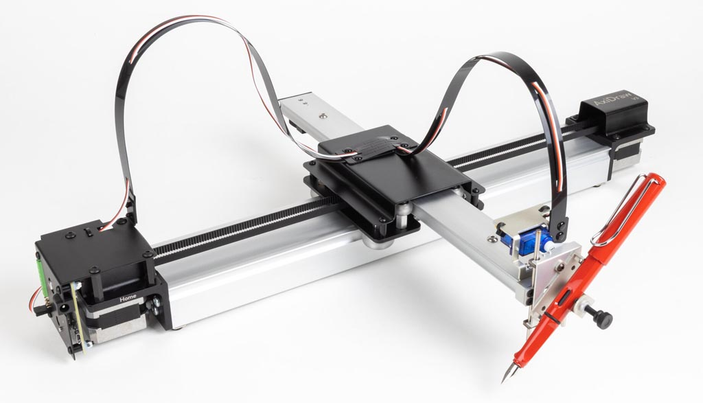

# Using the AxiDraw V3 (2025)

### Plotting SVG Files with AxiDraw

*When plotting SVG files on the AxiDraw it is recommended that you crop and/or optimize your files beforehand with vpype or similar tools; instructions for that are [here](https://github.com/golanlevin/DrawingWithMachines/tree/main/generating_svg#recommended-toolchains).*

* **Here is a [one-sheet PDF guide](axidraw_one_sheet_2025.pdf)** (2025)
* Here is the `axicli` [Command Line Interface reference](https://axidraw.com/doc/cli_api/#introduction)
* Here is the [AxiDraw User Guide](https://cdn.evilmadscientist.com/dl/ad/public/AxiDraw_Guide_v571.pdf) (18MB PDF)

---

### Realtime/Interactive Control of AxiDraw

* [Controlling the AxiDraw in realtime with Processing](realtime_processing/simple_mouse_axidraw_2024/simple_mouse_axidraw_2024.pde) (2024)
* [Tiling Camera App (Processing)](../../realtime/axidraw_boustrophedon_camera/axidraw_boustrophedon_camera.pde)
* [Mouse-to-AxiDraw (Python)](../../realtime/axidraw_python_esml/mouse_to_axidraw.py)

*Requirements:*

* Processing demos require [cncserver-2024.zip](downloads/cncserver-2024.zip)
* Python demos require [AxiDraw_API.zip](downloads/AxiDraw_API.zip); see [AxiDraw API Reference](https://axidraw.com/doc/py_api/#introduction)

---

### Less Common Instructions

* Conversion of 2010-era Macs [to Debian axicli kiosk](debianization.md)

