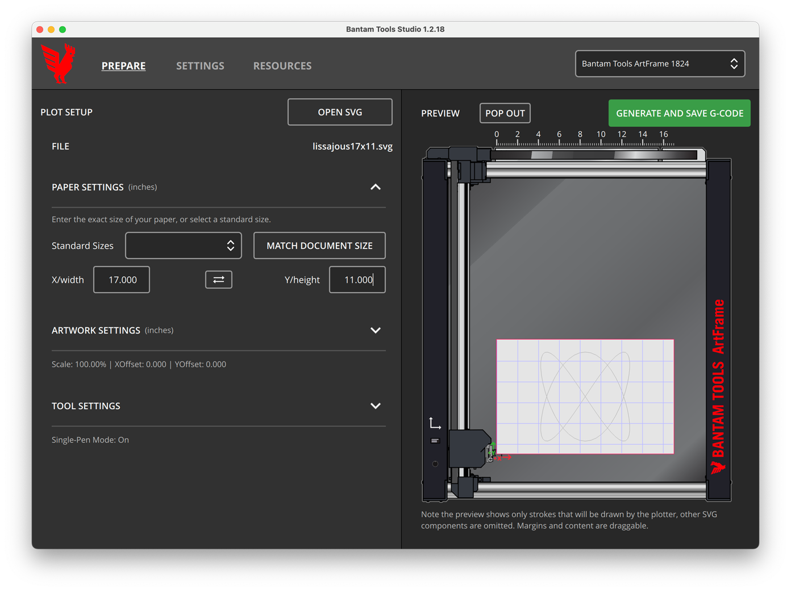
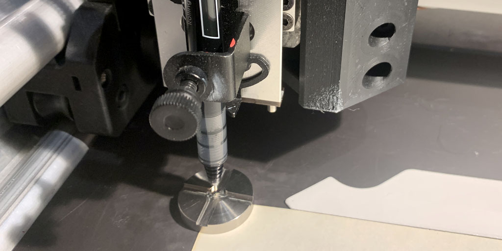

# Plotting files on the ArtFrame 1824

*This document explains how to plot an SVG file on the Bantam ArtFrame 1824. The basic workflow is to use the BantamToolsStudio.app to convert SVG to G-Code, and plot the .gcode file from the machine's own SD card. These instructions are for the ArtFrame 1824 with firmware v1.10.3, FluidNC v.3.7.4, Config 0.9.17, and BantamToolsStudio v.1.2.18.*

#### Useful Links

* Here is a [one-sheet PDF guide](artframe-one-sheet/artframe_instructions.pdf) (2025)
* Here is the [ArtFrame User Guide](artframe_guide_v1-1-1.pdf) (PDF)
* Here are instructions for [controlling the ArtFrame in real-time](https://github.com/golanlevin/DrawingWithMachines/tree/main/realtime/artframe_realtime)
* Here are [code resources for generating G-Code](https://github.com/golanlevin/DrawingWithMachines/tree/main/lectures/topics/gcode) directly from JavaScript, Java and Python.

---

## Prepare your file

**BantamToolsStudio.app** allows you to convert SVGs into G-Code for the ArtFrame. 

* Launch **BantamToolsStudio.app** on the dedicated gray Mac Mini. 
* Click **Open SVG**, and load your SVG file. (If needed, you can do tests with these Lissajous SVGs: [24x18](svg/lissajous24x18.svg), [17x11](svg/lissajous17x11.svg), [11x8.5](svg/lissajous11x8.5.svg)). 
* In the **Paper Settings** section, adjust your paper size, either manually or by clicking **Match Document Size**. If needed, you can adjust the margins and/or rotate the artwork 90° in the **Artwork Settings** section. 
* You should definitely explore the **Tool Settings**, including the pen height and feed rate (speed). XY feed rates in the range of 40-400 in/min (1000-10000 mm/min) are reasonable.
* Click **Generate and Save G-Code**. (If needed, you can do tests with these G-Code files: [24x18](gcode/lissajous24x18.gcode), [17x11](gcode/lissajous17x11.gcode), [11x8.5](gcode/lissajous11x8.5.gcode)). You can verify that the G-code is valid using browser-based software such as [NCViewer](https://ncviewer.com/).
* Copy the G-Code file onto the ArtFrame's MicroSD card (you may need a dongle). Return the MicroSD card to the plotter.

## Execute your plot

* Plug in the Bantam ArtFrame 1824, and power it on.
* Once the plotter's OLED screen displays the 📂🏠⚙️ icons, use its main Knob to scroll to the 🏠 **Home** icon, and press the Knob in. The plotter will locate its origin ("homing"). 
* On the OLED, navigate back to 📂 **Browse Files**. Select your chosen .gcode file, and press the Knob once. *NOTE*: The Z-stage may shoot downward!
* Install your paper in the plotter.
* Install your pen in the plotter. One way to do this is to move your pen down until its tip is resting on the circular metal [Pen Height Setup Tool](https://bantamtools.com/products/pen-height-setup-tool) (3.5mm above the paper), and then slide the setup block out of the way (assuming your pen height is properly set for this.)
* To actually start the plot, press the main Knob again.
* To **pause** the plot, tab the Knob; to resume, tap the knob. Note that the plotter may not stop immediately, as it may have a queue of points. To **cancel** a job altogether, give the Knob a "long press".

---


