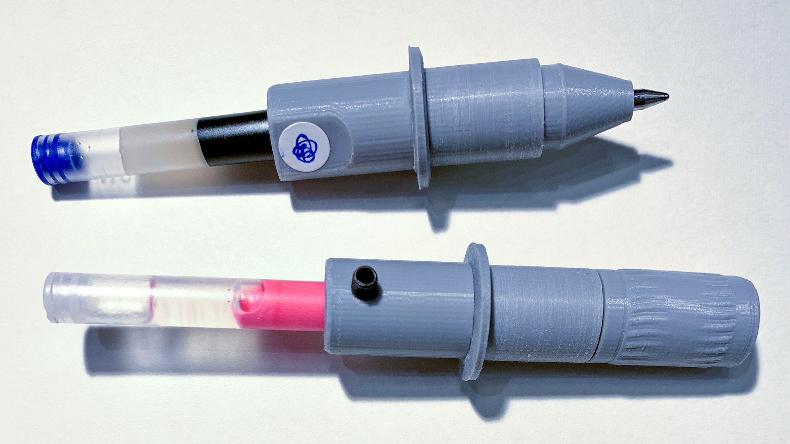
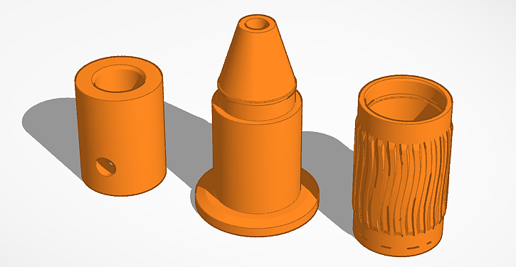

# HP7475A Pen Adapter CAD Files

---

This page contains design files for 3D printing a pen-adapter for the [HP7475A](https://hpmuseum.net/display_item.php?hw=74) (and other 1980's-era HP plotters), compatible with popular gel pens like the Pilot G-2 and Uni-Ball Signo 207. This model was designed by Golan Levin in May 2025 for the [*Drawing with Machines*](https://github.com/golanlevin/DrawingWithMachines) course at Carnegie Mellon University, and is CC BY-SA 3.0.

Contents: 

* [CAD Files](#cad-files)
* [Compatibility Notes](#compatibility-notes)
* [Fabrication Notes](#fabrication-notes)
* [Related Work](#related-work)

---

## CAD Files

The body of the pen adapter is intended for PLA filament printing in two pieces (pictured at left and center, above), which must be [super-glued](https://www.amazon.com/Super-Glue-11710615-Gel-Future/dp/B08WJSY5RK/?th=1) together. Printing the design in two pieces eliminates the need for messy support structures under the central flange. The design includes an optional pen-cap (pictured at right), which offers a snap-fit and a knurled barrel. 

* [hp7475a_pen_adapter.stl](files/hp7475a_pen_adapter.stl) – STL file
* [hp7475a_pen_adapter_obj.zip](files/hp7475a_pen_adapter_obj.zip) – OBJ & MTL files
* [hp7475a_pen_adapter.glb.zip](files/hp7475a_pen_adapter.glb.zip) - GLB/GLTF file
* [hp7475a_pen_adapter_UM2E.gcode.zip](files/hp7475a_pen_adapter_UM2E.gcode.zip) – GCODE for an Ultimaker 2 Extended+ 3D printer, using a 0.4mm nozzle
* This 3D model was created with TinkerCAD; you are welcome to remix [the design file here](https://www.tinkercad.com/things/lzj4ZikZXlT-hp7475apenadaptercap).
* A version of this model without the pen cap is also [available at Thingiverse](https://www.thingiverse.com/thing:7032730).

---

## Compatibility Notes

This adapter was designed for and has been tested with the [HP7475A](https://hpmuseum.net/display_item.php?hw=74) pen plotter. This adapter is likely compatible with other Hewlett-Packard plotters that use the HP "S Style" Fiber Tip Plotter Pens, such as the 7090, 7220A, 7221A, 7225A, 7440 HP Colorpro, 7470A, 7475A, 7550A, 7550B, 7570 HP Draftpro, 7580A, 7585A, 7586A, 7595A, 7595B, 7596A, 7596B, 7599A, 9872A, HP Draftmaster I, II, MX, RX, SX, and HP Draftpro DXL (7575A); as well as the Roland DPX, DXY, and GRX Series.

The interior cavity of this pen adapter is specially tapered to constrain various ink refills in desirable positions. This adapter is known to be compatible with the ink refills from all of the following modern roller-point gel pens (and potentially other pens with a 6mm refill barrel):

* [Pilot G-2](https://www.amazon.com/PILOT-Refills-Rolling-Point-12-Pack/dp/B0C2DZQ8V3/) (LG2RF-8M, BLS-G2-10) and G-2 Mini
* [Pilot Juice 0.38mm](https://www.amazon.com/Pilot-Juice-Retractable-LJU-10UF-0-38mm/dp/B06XF41HHH/) (LJU-10UF, LPR2F-8UF)
* [Pilot Juice 0.3mm](https://www.amazon.com/Pilot-Rollerball-point-Refill-Juice/dp/B07DNFW2DB/) (LP3RF-12S3)
* [Pilot Hi-Tec-C 0.25mm & 0.3mm](https://www.amazon.com/Pilot-Hi-Tec-C-Hyper-0-25mm-LH-20C25/dp/B06Y3P1RQG/) (LH-20C25, LH20C3)
* [Uni-Ball Signo 207](https://www.amazon.com/Uni-ball-Roller-Retractable-Plastic-Reusable/dp/B08DTGRDMF/?th=1) (UMR-87)
* [Uni-Ball Signo 0.28 mm](https://www.amazon.com/Uni-ball-UMR-82-Refills-Ballpoint-10-Pack/dp/B076JBGNKY/) (UMR-82, UM-151-28, UMR-1-28, UMN-155N-28)
* [Pentel Energel](https://www.amazon.com/Pentel-EnerGel-Liquid-Gel-Pens/dp/B09RRNVXVN/) (BL77-A)
* [Zebra Pen Sarasa 0.3mm, 0.5mm](https://www.amazon.com/Zebra-ballpoint-Sarasa-P-JJ15-BK10-pieces/dp/B00P0PT7BS/)

Fitting the adapter with the short [Pilot G-2 Mini](https://www.amazon.com/Retractable-Rolling-Assorted-colors-Turquoise/dp/B07H7YTT3D/) refill allows it to be used with the HP DraftMaster plotter.

---

## Fabrication Notes

1. Note that this pen adapter model was created specifically for fabrication with the [Ultimaker 2 Extended+](https://ultimaker.com/learn/ultimaker-2-and-ultimaker-2-extended-source-files-available/) 3D printer located in the CMU STUDIO for Creative Inquiry (CFA-111). *Your results may vary if you create these files with other 3D printers.*
2. The pen adapter weighs 4g (with cap) and consumes ~0.5m of 2.85mm filament. Printing it with a 0.4mm nozzle takes about 60-90 minutes.
3. Trimming the adapter with a [deburring tool](https://www.amazon.com/Deburring-Blades-Printing-Plastic-Printed/dp/B0DDPM9S4Y/?th=1) is recommended to ensure easy insertion and removal of pen refills. It may also help to sand the central barrel of the adapter, to ensure better uptake by the plotter's pen grabbing mechanism.
4. The body of the pen adapter is printed in two pieces, which must be [super-glued](https://www.amazon.com/Super-Glue-11710615-Gel-Future/dp/B08WJSY5RK/?th=1) together; I recommend using cyanoacrylate gel. Note that the cylindrical base piece has a small flat area (intended for e.g. [adhesive labels](https://www.amazon.com/WANSTE-Permanent-Adhesive-Color-Code-Dispenser/dp/B0DFQ3PQYH/?th=1)); when gluing the pieces of the adapter together, this flat area should be oriented *away from* the pen-point.
5. The pen adapter requires an [M3 set screw](https://www.amazon.com/Black-Socket-Screw-Assortment-200pcs/dp/B07H5P7J5P/) (also called a "grub screw") to hold the pen refill in place. To adjust the M3 set screw, you will need a [1.5mm hex wrench](https://www.amazon.com/Piutouyar-Hexagon-Replacement-Repairing-Furniture/dp/B0BL29MTDM/).

---

## Related Work

* *New* pens compatible with the HP7475A have occasionally been available from Amazon: Check for [KOH-I-NOOR Fiber-Tip Plotter Pens](https://www.amazon.com/dp/B000KNNIL0), with manufacturer product number 6401.01F, UPC 14173-28306. Note: Old HP numbers were 178xxP.
* This [YouTube video](https://www.youtube.com/watch?v=h-oj4HrTH14) by CuriousMarc shows a method for refilling the ink in a vintage pen.
* Various persons have developed 3D-printed adapters to allow modern pens in the HP7475A:
   * [3D printable plotter adapters for pens and refills](https://github.com/juliendorra/3D-printable-plotter-adapters-for-pens-and-refills) (extensive!)
	* [Thingiverse: 227985](https://www.thingiverse.com/thing:227985) 
	* [Thingiverse: 229982](https://www.thingiverse.com/thing:229982)
	* [Thingiverse: 1261805](https://www.thingiverse.com/thing:1261805)
	* [Thingiverse: 2955469](https://www.thingiverse.com/thing:2955469) 
	* [Thingiverse: 4720715](https://www.thingiverse.com/thing:4720715)
	* [Thingiverse: 4813060](https://www.thingiverse.com/thing:4813060)
	* [plotter-oem-pen-body-mode](https://softsolder.com/2015/04/21/hp-7475a-plotter-oem-pen-body-model/)
	* [plotter-sakura-micron-pen-adapter](https://softsolder.com/2015/04/22/hp-7475a-plotter-sakura-micron-pen-adapter/)
	* [plotter-full-up-sakura-micron-pen-tests](https://softsolder.com/2015/04/23/hp-7475a-plotter-full-up-sakura-micron-pen-tests/)
	* [felt-tip-adapter-for-hp-style-plotters](https://www.printables.com/model/138334-felt-tip-adapter-for-hp-style-plotters)
   * [HP 7475A Plotter Sharpie Adapter](https://www.ebay.com/itm/223985161644)

---

*Keywords: HP7475A, Pilot G2, Uniball 207, pen plotter, pen adapter, roller-point gel pen refill, 3D printing, CAD files, #plotterTwitter*