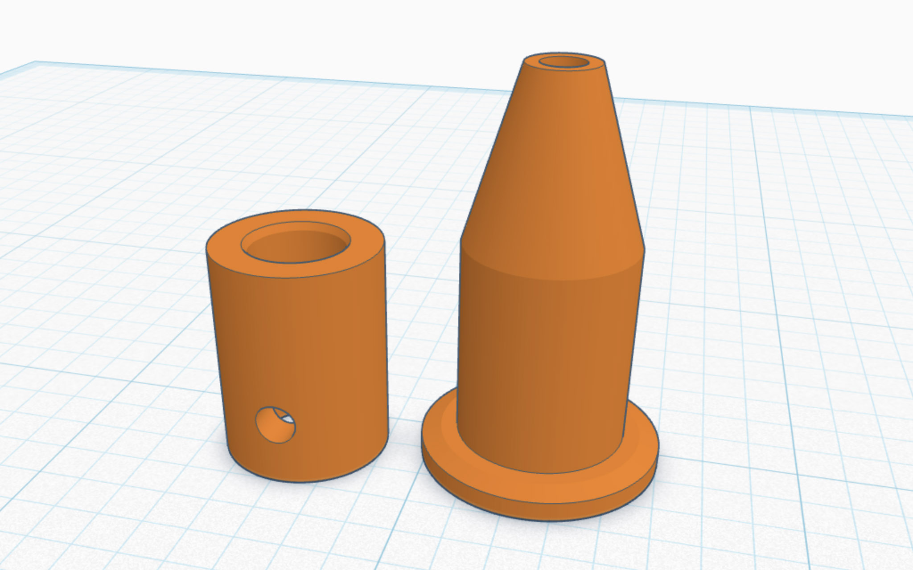

# HP7475A Pen Adapter CAD Files

---

This page contains CAD files for 3D printing a pen-adapter for the HP7475A (and other 1980's-era HP plotters), compatible with popular gel pens like the Pilot G-2. This model was designed by Golan Levin for the [*Drawing with Machines*](https://github.com/golanlevin/DrawingWithMachines) course at Carnegie Mellon University, and is CC BY-SA 3.0. 

---

### Design Files

* [hp7475a_pen_adapter.stl](files/hp7475a_pen_adapter.stl) – STL file
* [hp7475a_pen_adapter_obj.zip](files/hp7475a_pen_adapter_obj.zip) – OBJ & MTL files
* [UM2E_hp7475a_pen_adapter.gcode.zip](files/UM2E_hp7475a_pen_adapter.gcode.zip) – GCODE for an Ultimaker 2 Extended+ 3D printer, using a 0.4mm nozzle
* This 3D model was created with TinkerCAD; you are welcome to remix [the design file here](https://www.tinkercad.com/things/ly3dX3E4d2C-hp7475apenadapter).
* This model is also [available at Thingiverse](https://www.thingiverse.com/thing:7032730).

---

### Compatibility

This adapter was designed for the HP7475A pen plotter. This adapter is likely compatible with other plotters that use the HP "S Style" Fiber Tip Plotter Pens, such as the 7090, 7220A, 7221 A, 7225A, 7440 HP Colorpro, 7470A, 7475A, 7550A, 7550B, 7570 HP Draftpro, 7580A, 7585A, 7586A, 7595A, 7595B, 7596A, 7596B, 7599A, 9872A, HP Draftmaster I, II, MX, RX, SX, HP Draftpro DXL (7575A); as well as the Roland DPX, DXY, and GRX Series.

This pen adapter is known to be compatible with all of the following modern roller-point gel pens (and potentially other pens with a 6mm refill barrel):

* [Pilot G-2](https://www.amazon.com/PILOT-Refills-Rolling-Point-12-Pack/dp/B0C2DZQ8V3/) (LG2RF-8M, BLS-G2-10) and G-2 Mini
* [Pilot Juice 0.38mm](https://www.amazon.com/Pilot-Juice-Retractable-LJU-10UF-0-38mm/dp/B06XF41HHH/) (LJU-10UF, LPR2F-8UF)
* [Pilot Juice 0.3mm](https://www.amazon.com/Pilot-Rollerball-point-Refill-Juice/dp/B07DNFW2DB/) (LP3RF-12S3)
* [Pilot Hi-Tec-C 0.25mm, 0.3mm](https://www.amazon.com/Pilot-Hi-Tec-C-Hyper-0-25mm-LH-20C25/dp/B06Y3P1RQG/) (LH-20C25, LH20C3)
* [Uni-Ball Signo 0.28 mm](https://www.amazon.com/Uni-ball-UMR-82-Refills-Ballpoint-10-Pack/dp/B076JBGNKY/) (UMR-82, UM-151-28, UMR-1-28, UMN-155N-28)
* [Zebra Pen Sarasa 0.3mm, 0.5mm](https://www.amazon.com/Zebra-ballpoint-Sarasa-P-JJ15-BK10-pieces/dp/B00P0PT7BS/)

---

### Fabrication Notes

1. This design is intended for PLA filament printing in two pieces, which must be super-glued together (using e.g. cyanoacrylate "krazy" [glue gel](https://www.amazon.com/Super-Glue-11710615-Gel-Future/dp/B08WJSY5RK/?th=1)). Printing the design in two pieces eliminates the need for messy support structures under the central flange. Note that the cylindrical base piece has a small flat area (intended for e.g. labels); when attaching the pieces, this flat area should be positioned *away from* the pen-point. 
2. The pen adapter requires an [M3 set screw](https://www.amazon.com/Black-Socket-Screw-Assortment-200pcs/dp/B07H5P7J5P/) (also called a "grub screw") to hold the pen refill in place.
3. The pen adapter weighs 3g and consumes 0.43m of 2.85mm filament. Printing it with a 0.4mm nozzle takes about 1 hour.
4. Note that this pen adapter model was created specifically for fabrication with the [Ultimaker 2 Extended+](https://ultimaker.com/learn/ultimaker-2-and-ultimaker-2-extended-source-files-available/) 3D printer located in the CMU STUDIO for Creative Inquiry (CFA-111). *Your mileage may vary if you attempt to create these files with other 3D printers.*

---

### Related Work

* Compatible new pens have been available from Amazon: [KOH-I-NOOR Fiber-Tip Plotter Pens](https://www.amazon.com/dp/B000KNNIL0), with manufacturer product number 6401.01F, UPC 14173-28306. Note: Old HP numbers were 178xxP.
* This [YouTube video](https://www.youtube.com/watch?v=h-oj4HrTH14) shows a method for refilling the ink in a vintage pen.
* Various persons have developed 3D-printed adapters to allow modern pens in the HP7475A:
   * [3D printable plotter adapters for pens and refills](https://github.com/juliendorra/3D-printable-plotter-adapters-for-pens-and-refills) (extensive!)
	* [Thingiverse: 227985](https://www.thingiverse.com/thing:227985) 
	* [Thingiverse: 229982](https://www.thingiverse.com/thing:229982)
	* [Thingiverse: 1261805](https://www.thingiverse.com/thing:1261805)
	* [Thingiverse: 2955469](https://www.thingiverse.com/thing:2955469) 
	* [Thingiverse: 4720715](https://www.thingiverse.com/thing:4720715)
	* [Thingiverse: 4813060](https://www.thingiverse.com/thing:4813060)
	* [plotter-oem-pen-body-mode](https://softsolder.com/2015/04/21/hp-7475a-plotter-oem-pen-body-model/)
	* [plotter-sakura-micron-pen-adapter](https://softsolder.com/2015/04/22/hp-7475a-plotter-sakura-micron-pen-adapter/)
	* [plotter-full-up-sakura-micron-pen-tests](https://softsolder.com/2015/04/23/hp-7475a-plotter-full-up-sakura-micron-pen-tests/)
	* [felt-tip-adapter-for-hp-style-plotters](https://www.printables.com/model/138334-felt-tip-adapter-for-hp-style-plotters)
   * [HP 7475A Plotter Sharpie Adapter](https://www.ebay.com/itm/223985161644)
