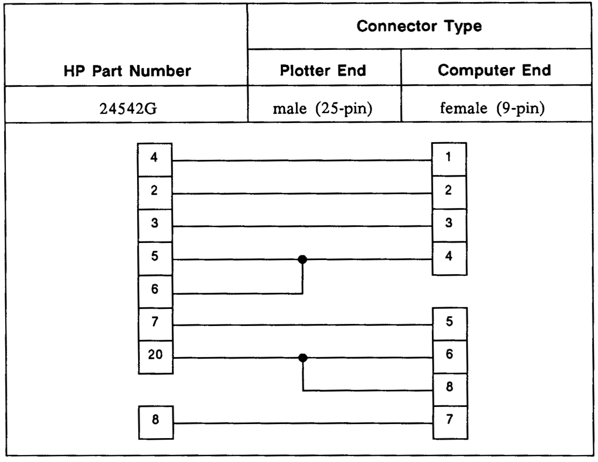
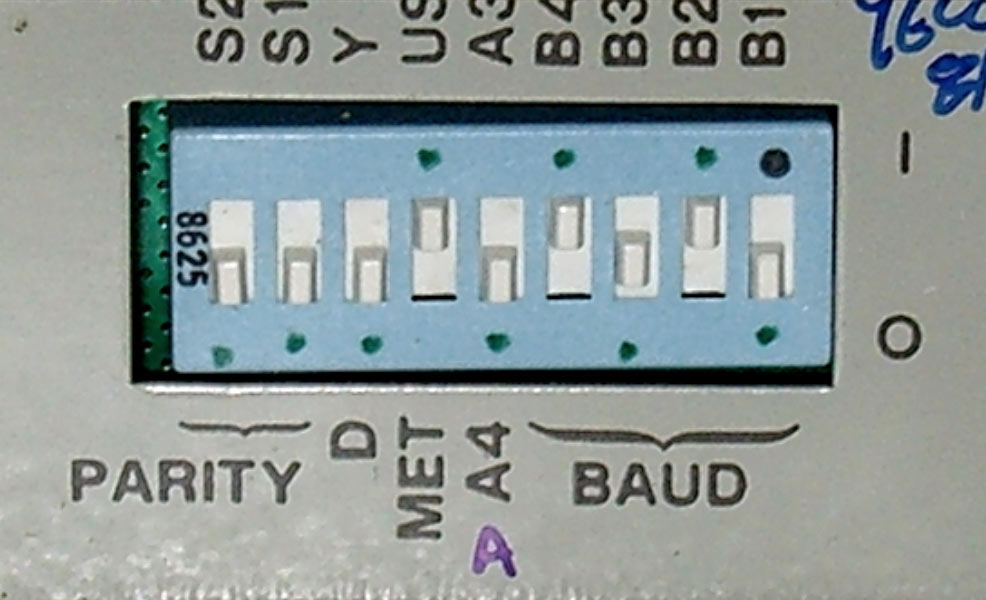
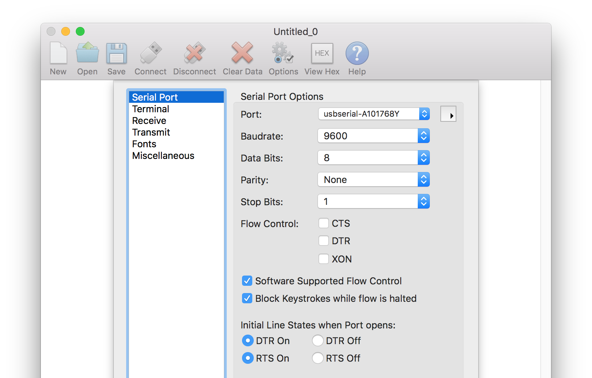
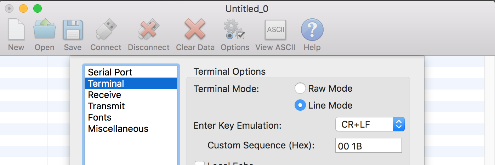
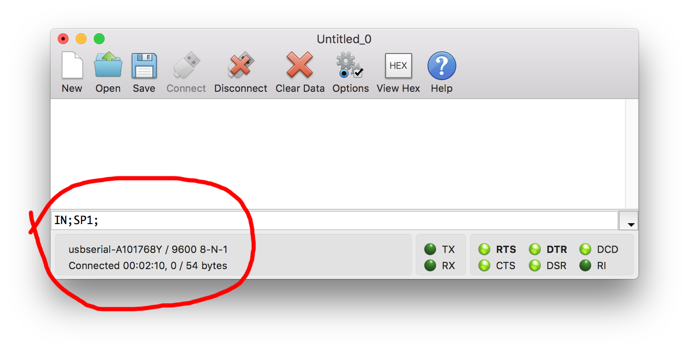
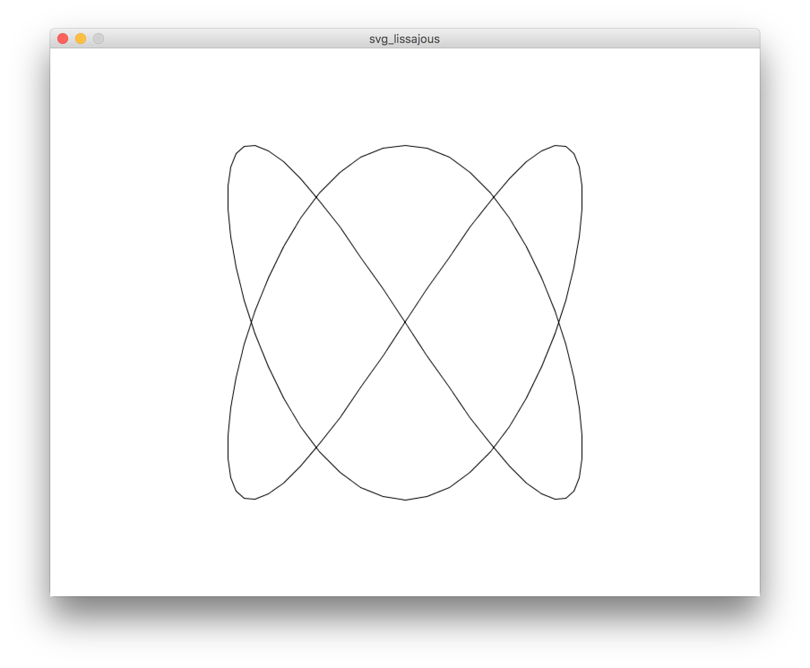

# Plotting with the HP7475A

This document outlines a workflow for offline (non-interactive) plotting with the STUDIO for Creative Inquiry's HP7475A, using Processing and from a Mac.

#### Contents

* [Standalone Testing the HP7475A](#standalone-testing-the-hp7475a)
* [Testing Connectivity of a Mac to the HP7475A](#testing-connectivity-of-a-mac-to-the-hp7475a)
* [Some Alternate Workflows](#some-alternate-workflows)

1. [Generate an SVG with Processing](#1-generate-an-svg-with-processing)
2. [Convert SVG to HPGL with vpype](#2-convert-svg-to-hpgl-with-vpype)
3. [Transmit HPGL to HP7475A with Chiplotle](#3-transmit-hpgl-to-hp7475a-with-chiplotle)


---

## Standalone Testing the HP7475A:

1. **Plug in** the HP7475A plotter to 120VAC wall power.
2. **Load** the plotter carousel with 6 pens. You'll need to depress the carousel's spring-loaded black rubber pen-caps in order to insert the pens.
3. **Load** the plotter with letter (8.5x11) paper. Push the paper load lever up; align the paper against the left edge; and push the paper just past the short white line in the upper left of the paper bed. 
4. **Execute** the plotter's "Demonstration Plot (Confidence Test)" as described on page 2-31 of the HP7475A [*Operation and Interconnection Manual*](manuals/7475A-OperationAndInterconnectionManual-07475-90002-102pages-Sep90.pdf). This is achieved by holding down the plotter's P1 and P2 buttons while powering it on, and continuing to hold them down "until the tapping noise begins". This should produce a multicolor plot which looks something like the following: 


---

## Testing Connectivity of a Mac to the HP7475A:

1. **Connect** the USB to Serial Cable Adapter (USB-A to DB9 male) to your Mac. The STUDIO has a Sabrent cable which is known to work. (If your Mac uses USB-C, you may need to pre-pend a USB-C to USB-A adapter.)
2. **Verify** that the serial adapter is visible to your Mac's operating system, by opening the Terminal app and typing ```ls /dev/tty.*```. You should see something similar to ```/dev/tty.usbserial-A101768Y``` among the listed results.
3. **Connect** the serial adapter into the HP 24542G cable (DB9 female to DB25 male). This cable has the following wiring, according to page A-6 of the HP7475A [*Operation and Interconnection Manual*](manuals/7475A-OperationAndInterconnectionManual-07475-90002-102pages-Sep90.pdf):<br /> 
4. **Ensure** that the DIP switches on the rear of the plotter are set to [9600/8-N-1](https://en.wikipedia.org/wiki/8-N-1), and US letter (8.5x11") paper, as described on page 2-21 of the HP7475A [*Operation and Interconnection Manual*](manuals/7475A-OperationAndInterconnectionManual-07475-90002-102pages-Sep90.pdf). Note that the DIP switches control the machine *defaults* for paper size and measuring system (imperial/metric), but these can be changed from the front panel as well. The switches should look like the following:<br />. 
5. **Turn on** the plotter.
6. **Launch** a serial port terminal program, such as [CoolTerm](http://freeware.the-meiers.org/). (A list of other possible serial port apps can be found [here](https://pbxbook.com/other/mac-ser.html) and includes Screen, Minicom, ZTerm, goSerial, Serial Tools, etc.) CoolTerm is distributed for macOS, Windows, Linux, and Raspberry Pi; a backup copy of version 1.9.0 (5/31/2021) for Mac is stashed [here](tools/CoolTermMac_1.9.0.zip).
7. **Configure** the serial port terminal program so that it matches the communication settings of the plotter, 9600/8-N-1:<br />
8. **Configure** (optionally) the serial port terminal program so that it is in "line mode", meaning that commands are transmitted when you press return:<br />
8. **Transmit** HPGL to the plotter. Type the command ```IN;SP1;``` into CoolTerm and press return:<br />
9. In response to the command, the HP7475A plotter should Initialize Set Instruction (```IN;```) and Select Pen #1 (```SP1;```). 


---

## 1. Generate an SVG with Processing

**Summary:** Generate an SVG file using [Processing](https://processing.org/) and its [SVG Library](https://processing.org/reference/libraries/svg/index.html).

1. Download Processing from [here](https://processing.org/download/) and install it in your Applications folder. This tutorial was tested with [Processing v.3.5.4 on Mac OSX 10.15](https://download.processing.org/processing-3.5.4-macosx.zip). 
2. Create a new sketch (⌘N) and paste in the code below, or download the code from [here](processing/svg_lissajous/svg_lissajous.pde). Save your sketch (⌘S).  
3. Run the sketch (⌘R). This will generate and export an SVG file of a [Lissajous curve](https://en.wikipedia.org/wiki/Lissajous_curve). You can locate this SVG file by opening the folder containing your sketch (⌘K). 

```
// Generate a Lissajous curve, and export it as an SVG file.
// For more information on the Processing SVG library, see:
// https://processing.org/reference/libraries/svg/index.html
import processing.svg.*;

void setup() {
  size(792, 612); // Letter 11"x8.5" @72dpi
  noLoop(); // just execute once.
}

void draw() {
  background(255); 
  stroke(0);
  noFill();

  beginRecord(SVG, "lissajous.svg");

  int nPoints = 100;
  float cx = width/2; 
  float cy = height/2; 
  float radius = width/4; 

  beginShape(); 
  for (int i=0; i<nPoints; i++) {
    float theta = map(i, 0, nPoints, 0, TWO_PI);
    float px = cx + radius * sin(2.0 * theta);
    float py = cy + radius * cos(3.0 * theta); 
    vertex(px, py);
  }
  endShape(CLOSE); 
  endRecord();
}
```

The resulting [SVG file](processing/svg_lissajous/lissajous.svg), when examined with a text editor, begins something like this:

```
<?xml version="1.0"?>
<!DOCTYPE svg PUBLIC '-//W3C//DTD SVG 1.0//EN'
          'http://www.w3.org/TR/2001/REC-SVG-20010904/DTD/svg10.dtd'>
<svg xmlns:xlink="http://www.w3.org/1999/xlink" 
<!-- etcetera -->
```

This SVG file depicts a vector graphic resembling the following: 



**Helpful tips** ([explained here](https://processing.org/reference/libraries/svg/index.html)): 

* You can also export a single frame from an animation as an SVG. 
* Using Processing's 3D renderer, ```beginRaw()``` and ```endRaw()```, you can export SVG Files from 3D geometry.
* You'll probably want to use ```noLoop()``` or ```exit()``` to terminate the program after you export the SVG.


---

## 2. Convert SVG to HPGL with vpype

**Summary:** Convert the SVG to HPGL with [vpype](https://github.com/abey79/vpype), using its export settings for the HP7475A as described [here](https://vpype.readthedocs.io/en/latest/cookbook.html#converting-a-svg-to-hpgl). For more information on the HPGL language, here's the complete [HPGL specification](hpgl/HPGL.pdf) (PDF).


1. *vpype* requires at least Python 3.6, and Python version 3.9.1 or later is strongly recommended. See [here](https://www.python.org/downloads/mac-osx/) for downloads.
2. In your Mac's Terminal app, per the instructions [here](https://github.com/abey79/vpype#installation), install the command-line interface for *vpype* using ```pip install vpype```.
	* (*Actually*, I used ```pip install --user vpype```; the ```--user``` flag ensures that pip installs packages in your home directory instead of to a system directory).
	* Note that if you are using Python 3.6, you'll also need to install ```pip install dataclasses```. 
3. Locate the *vpype* binary, e.g. ```cd /Users/golan/Library/Python/3.6/bin/```
4. Execute the *vpype* command to read the SVG and write HPGL for the HP7475a. You can find a cookbook of recipes [here](https://vpype.readthedocs.io/en/latest/cookbook.html#converting-a-svg-to-hpgl), but I used: ```./vpype read /Users/golan/Desktop/60428/DrawingWithMachines/machines/hp7475a/vpype/lissajous.svg write --device hp7475a --page-size letter --landscape /Users/golan/Desktop/60428/DrawingWithMachines/machines/hp7475a/vpype/lissajous.hpgl```
5. This will produce an HPGL file ([lissajous.hpgl](vpype/lissajous.hpgl)), which, when examined with a text editor, begins something like: 

```
IN;DF;PS4;SP1;PU3809,3121;PD4073,3158,4333,3269,4584, [...]
```

**Helpful *vpype* tips** ([explained here](https://github.com/abey79/vpype)): 

* *vpype* can also layout existing vector files with precise control on position, scale and page format
* *vpype* can also optimize existing SVG files for faster and cleaner plots
* *vpype* cam alsp be used to create generative artwork directly, generating HPGL from your own Python code.


---

## 3. Transmit HPGL to HP7475A with Chiplotle

**Summary:** Transmit the HPGL to the HP7475A plotter using the "HPGL Pipeline" in [Chiplotle](http://sites.music.columbia.edu/cmc/chiplotle/manual/index.html), as described [here](http://sites.music.columbia.edu/cmc/chiplotle/manual/chapters/tutorial/intro.html#hpgl-pipeline).


---

## Some Alternate Workflows

#### Tools for Generating SVG files:
 
* [Processing](https://processing.org/) (Java), with its [SVG Library](https://processing.org/reference/libraries/svg/index.html)
* @mattdesl's [canvas-sketch](https://github.com/mattdesl/canvas-sketch/) (JavaScript) with the [```pathsToSVG()```](https://github.com/mattdesl/canvas-sketch-util/blob/master/docs/penplot.md#pathsToSVG) function in the [canvas-sketch-util](https://github.com/mattdesl/canvas-sketch-util/blob/master/docs/penplot.md) penplot utilities

#### Tools for Converting SVG to HPGL:

* [Inkcut](https://www.codelv.com/projects/inkcut/) standalone application
* InkScape, using the [InkCut](https://inkscape.org/~frmdstryr/%E2%98%85inkcut) extension


## Graveyard

Inkcut is an open source application for controlling 2D plotters. It can load SVG files, generate HPGL commands, and transmit these directly to the HP7475A. We follow installation instructions from [here](https://www.codelv.com/projects/inkcut/download/):

To install a new extension, download and unpack the archive file. Copy the files into the directory listed at Edit > Preferences > System: User extensions. After a restart of Inkscape, the new extension will be available.


