# Plotting with the HP7475A

***Summary:*** *This document outlines a workflow for offline (non-interactive) plotting with an RS-232 HP7475A, using Processing and from a Mac computer. This has been tested in OSX 10.15.7, 11.5.2, and 14.1.2. Last update: 1/6/2024.*

#### Contents

1. [**Standalone Testing the HP7475A**](#1-standalone-testing-the-hp7475a)
2. [**Testing Connectivity of a Mac to the HP7475A**](#2-testing-connectivity-of-a-mac-to-the-hp7475a)
3. [**Generate an SVG with Processing**](#3-generate-an-svg-with-processing)
4. [**Convert the SVG to HPGL with vpype**](#4-convert-svg-to-hpgl-with-vpype)
5. [**Preview Your HPGL File**](#5-preview-your-hpgl-file)
6. [**Transmit HPGL to HP7475A with CoolTerm**](#6-transmit-hpgl-to-hp7475a-with-coolterm)

* [HP7475A Tips](#hp7475a-tips)
* [Some Alternate Workflows](#some-alternate-workflows)
* [Miscellaneous](#miscellaneous)

*(TODO: Workflows for Inkcut, ofxHPGL.)*

---

## HP7475A Tips

* Don't leave pens in the plotter carousel, and especially don't leave pens in the plotter head. They dry out quickly.
* When the plotter is not in use, raise the paper clamp lever. 


---

## 1. Standalone Testing the HP7475A:

***Summary:*** *In this section we will have the HP7475A execute a built-in test plot. For complete information about this device, see this repository of [manuals](manuals/).*

1. **Plug in** the HP7475A plotter to 120VAC wall power.
2. **Load** the plotter carousel with 6 pens. You'll need to depress the carousel's spring-loaded black rubber pen-caps in order to insert the pens.
3. **Load** the plotter with letter (8.5x11) paper. Push the paper load lever up; align the paper against the left edge; and push the paper just past the short white line in the upper left of the paper bed. Lower the lever.
4. **Execute** the plotter's "Demonstration Plot (Confidence Test)" as described on page 2-31 of the HP7475A [*Operation and Interconnection Manual*](manuals/7475A-OperationAndInterconnectionManual-07475-90002-102pages-Sep90.pdf). This is achieved by holding down the plotter's **P1** and **P2** buttons while powering it on, and continuing to hold them down "until the tapping noise begins". This should produce a multicolor plot which looks something like the following: 

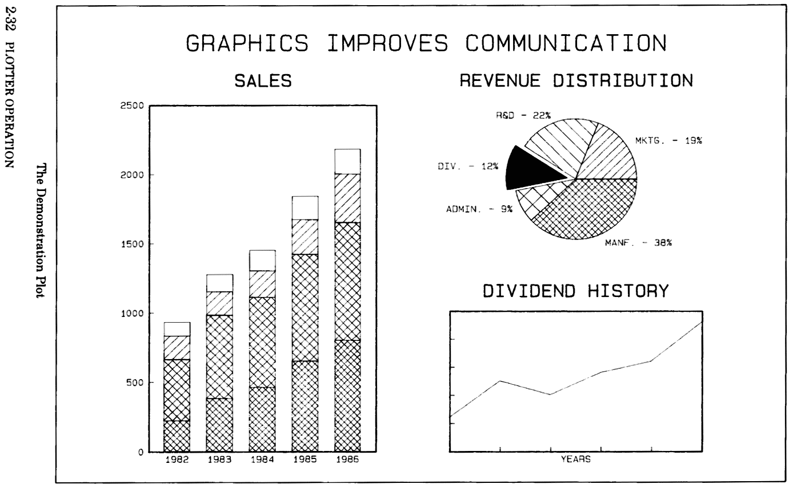


---

## 2. Testing Connectivity of a Mac to the HP7475A:

***Summary:*** *In this section we will make sure that we are able to send signals from our computer to the HP7475A plotter.*

***NOTE:*** *These instructions assume you are connecting to an* **RS-232** *version of the plotter, using a DB25 male cable. To connect with an* **HP-IB** *version of the HP7475A plotter, see* [**this document**](manuals/GPIB/README.md) *from the current repository.*

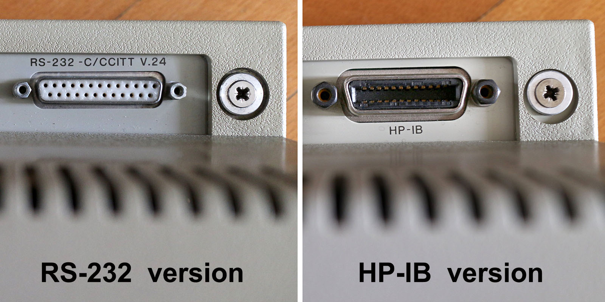

1. **Connect** the USB to Serial Cable Adapter (USB-A to DB9 male) to your Mac. We have a Sabrent cable which is known to work. (If your Mac uses USB-C, you may need to pre-pend a USB-C to USB-A adapter.)
2. **Verify** that the serial adapter is visible to your Mac's operating system, by opening the Terminal app and typing ```ls /dev/tty.*```. You should see something similar to ```/dev/tty.usbserial-A101768Y``` among the listed results.
3. **Connect** the serial adapter into the HP 24542G cable (DB9 female to DB25 male). This cable has the following wiring, according to page A-6 of the HP7475A [*Operation and Interconnection Manual*](manuals/7475A-OperationAndInterconnectionManual-07475-90002-102pages-Sep90.pdf) (or you can wire one yourself with [these instructions](manuals/SerialPlotterCable_Chiplotle.pdf)):<br />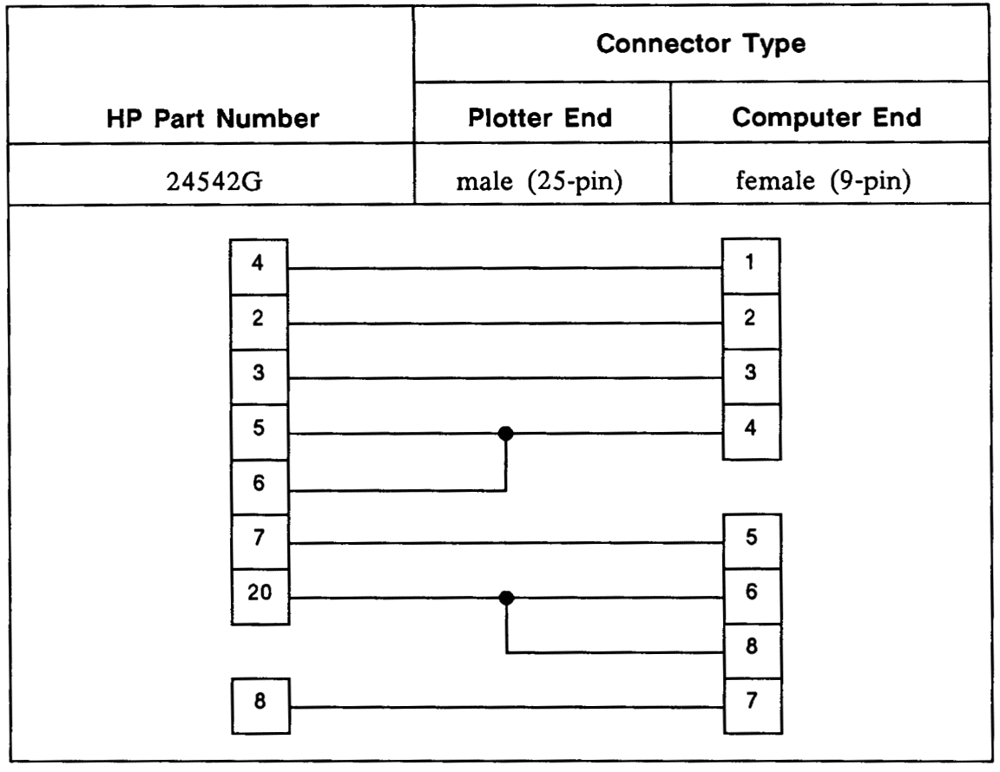 
4. **Ensure** that the DIP switches on the rear of the plotter are set to [9600/8-N-1](https://en.wikipedia.org/wiki/8-N-1), and US letter (8.5x11") paper, as described on page 2-21 of the HP7475A [*Operation and Interconnection Manual*](manuals/7475A-OperationAndInterconnectionManual-07475-90002-102pages-Sep90.pdf). Note that the DIP switches control the machine *defaults* for paper size and measuring system (imperial/metric), but these can be changed from the front panel as well. The switches should look like the following:<br />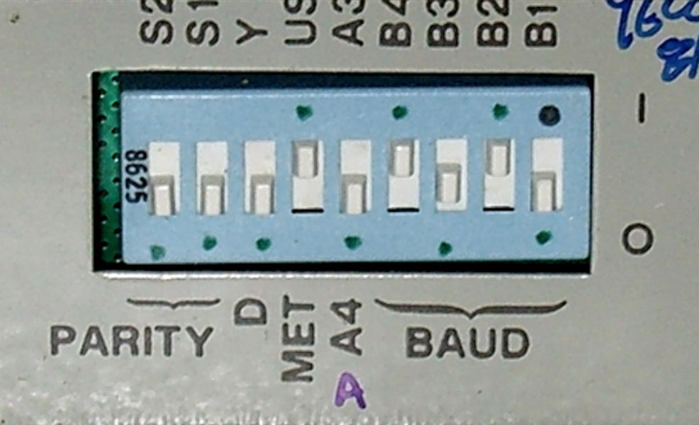. 
5. **Turn on** the plotter.
6. **Launch** a serial port terminal program, such as [CoolTerm](http://freeware.the-meiers.org/). (A list of other possible serial port apps can be found [here](https://pbxbook.com/other/mac-ser.html) and includes RealTerm, Screen, Minicom, ZTerm, goSerial, Serial Tools, etc.) CoolTerm is distributed for macOS, Windows, Linux, and Raspberry Pi; a backup copy of version 1.9.0 (5/31/2021) for Mac is stashed [here](tools/CoolTermMac_1.9.0.zip).
7. **Configure** the serial port terminal program so that it matches the communication settings of the plotter, 9600/8-N-1. For example, in CoolTerm, go: *Connection→Options*:<br />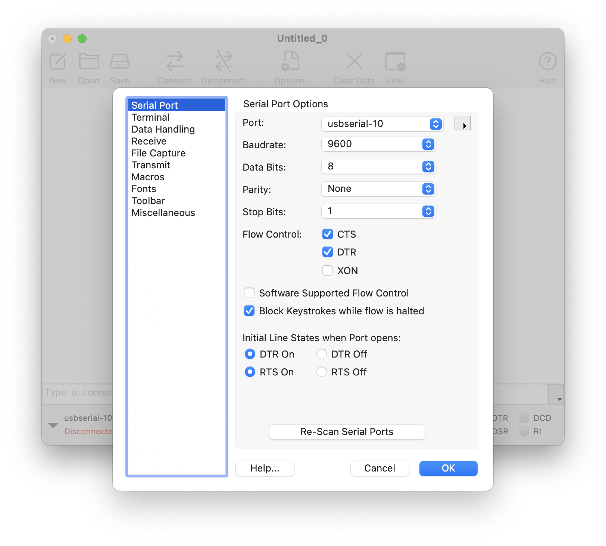
8. **Configure** (optionally) the serial port terminal program so that it is in "line mode", meaning that commands are transmitted when you press return:<br />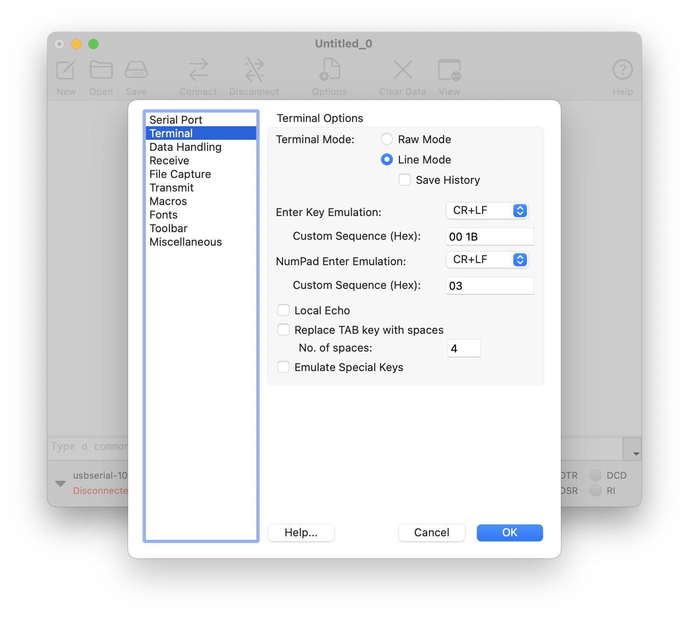<br />
In CoolTerm, go *Connection→Connect*. 
8. **Transmit** HPGL to the plotter. Type the command ```IN;SP1;``` into CoolTerm and press return:<br />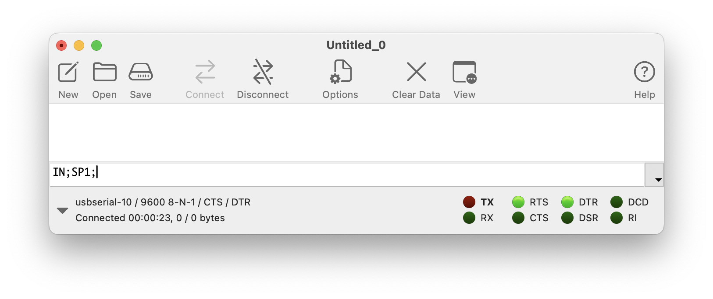
9. In response to the command, the HP7475A plotter should initialize itself and Select Pen #1.


---

## 3. Generate an SVG with Processing

***Summary:*** *[Processing](https://processing.org/) "is a flexible software sketchbook and a language for learning how to code within the context of the visual arts." In this section, we will generate an SVG file using Processing and its built-in [SVG Library](https://processing.org/reference/libraries/svg/index.html). Total time for this section is about 5-10 minutes.*

1. Download Processing from [here](https://processing.org/download/) and install it in your Applications folder. This tutorial was tested with [Processing v.3.5.4 on Mac OSX 10.15](https://download.processing.org/processing-3.5.4-macosx.zip). 
2. Create a new sketch (⌘N) and paste in the code below, or download the code from [here](processing/svg_lissajous/svg_lissajous.pde). Save your sketch (⌘S).  
3. Run the sketch (⌘R). This will generate and export an SVG file of a [Lissajous curve](https://en.wikipedia.org/wiki/Lissajous_curve). You can locate this SVG file by opening the folder containing your sketch (⌘K). 

```
// Generate a Lissajous curve, and export it as an SVG file.
// For more information on the Processing SVG library, see:
// https://processing.org/reference/libraries/svg/index.html

import processing.svg.*;

void setup() {
  size(1056, 816); // Letter: 11"x8.5" at 96 DPI.
  noLoop(); // Just execute once!
}

void draw() {
  background(255); 
  beginRecord(SVG, "lissajous.svg");
  
  stroke(0); 
  noFill(); // Don't create duplicate shapes.

  int nPoints = 100;
  float cx = width/2; 
  float cy = height/2; 
  float radius = width/4; 

  beginShape(); 
  for (int i=0; i<nPoints; i++) {
    float theta = map(i, 0, nPoints, 0, TWO_PI);
    float px = cx + radius * sin(2.0 * theta);
    float py = cy + radius * cos(3.0 * theta); 
    vertex(px, py);
  }
  endShape(CLOSE); 
  endRecord();
}
```

The resulting [SVG file](processing/svg_lissajous/lissajous.svg), when examined with a text editor, begins something like this:

```
<?xml version="1.0"?>
<!DOCTYPE svg PUBLIC '-//W3C//DTD SVG 1.0//EN'
          'http://www.w3.org/TR/2001/REC-SVG-20010904/DTD/svg10.dtd'>
<svg xmlns:xlink="http://www.w3.org/1999/xlink" 
<!-- etcetera -->
```

This SVG file depicts a vector graphic resembling the following: 

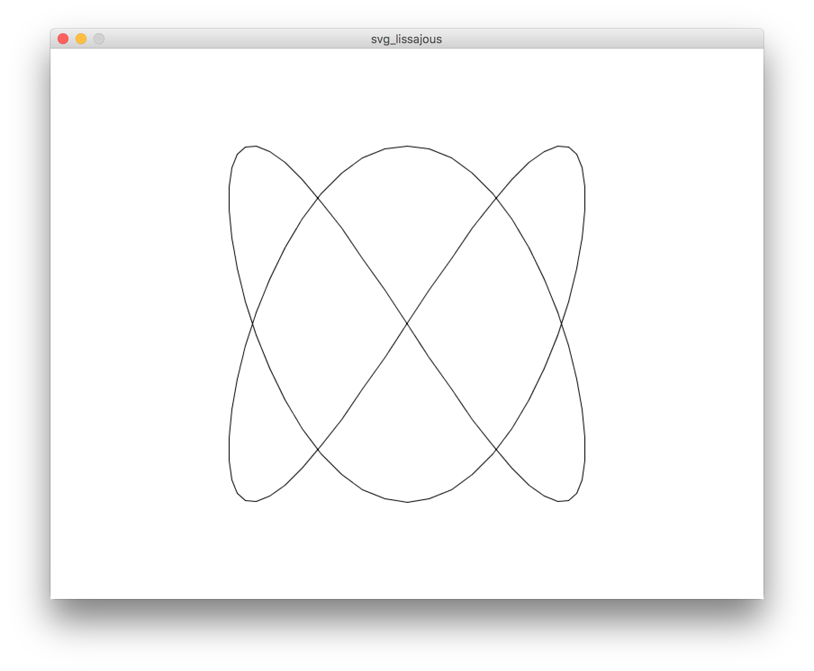

**Helpful tips** ([explained here](https://processing.org/reference/libraries/svg/index.html)): 

* When exporting shapes (like ellipses and rectangles, etc.) to an SVG file, you'll probably want to issue the command ```noFill()```. Otherwise, Processing will export the shape data *twice* (once for the stroke, once for the fill).
* You'll probably want to use ```noLoop()``` or ```exit()``` to terminate the program after you export the SVG.
* You can also export a single frame from an animation as an SVG. 
* Using Processing's 3D renderer, ```beginRaw()``` and ```endRaw()```, you can export SVG Files from 3D geometry.


---

## 4. Convert SVG to HPGL with vpype

***Summary:*** *[vpype](https://github.com/abey79/vpype), by [Antoine Beyeler](https://github.com/abey79/), "is an extensible CLI pipeline utility which aims to be the Swiss Army knife for creating, modifying and/or optimizing plotter-ready vector graphics." In this section, we will use vpype to convert the SVG to HPGL—in particular, using its export settings for the HP7475A as described [here](https://vpype.readthedocs.io/en/latest/cookbook.html#converting-a-svg-to-hpgl). For more information on the HPGL language, here's the complete [HPGL specification](hpgl/HPGL.pdf) (PDF).*

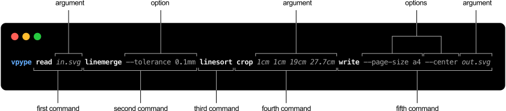

*This section should take about 10-15m.*

1. The preferred way to install vpype is in a dedicated virtual environment running Python 3.9+. We will follow the *vpype* installation instructions for end-users, [here](https://vpype.readthedocs.io/en/latest/install.html), which are duplicated below. Make sure your computer has at least 1GB of available hard drive space for this virtual environment.
2. For starters, in MacOS, you'll need to have the [Homebrew package manager](https://brew.sh/) installed. You can achieve this with: ```/bin/bash -c "$(curl -fsSL https://raw.githubusercontent.com/Homebrew/install/HEAD/install.sh)"```
3. Using your Mac's Terminal app, install Python 3.9: ```brew install python@3.9```
4. Change directory to the folder in which you'd like to create your virtual environment, e.g. ```cd /Users/golan/Desktop/myVpype```
5. Create a new virtual environment in that directory: ```python3.9 -m venv vpype_venv``` . This will create a subdirectory (*vpype_venv*) containing various files. 
6. Activate the newly created virtual environment: ```source vpype_venv/bin/activate```. (You can exit the virtual environment later by typing ```deactivate```.)
7. Within the virtual environment, install *pip*: ```pip install --upgrade pip```
8. Within the virtual environment, install *vype*: ```pip install vpype[all]```
9. You should now be able to run *vpype*: ```vpype --help```. This may take a moment the first time.
10. Move a copy of your SVG file into your *myVpype* directory. Verify that vpype can load and display your SVG: ```vpype read lissajous.svg show```. (Note that this viewer exclusively uses metric units.)<br />
11. In your Terminal, execute the *vpype* command to read the SVG and write HPGL formatted for the HP7475a. I used this command: ```vpype read lissajous.svg write --device hp7475a --page-size letter --landscape lissajous.hpgl``` but you can find a cookbook of additional recipes [here](https://vpype.readthedocs.io/en/latest/cookbook.html#converting-a-svg-to-hpgl).
12. This will produce an HPGL file ([lissajous.hpgl](vpype/lissajous.hpgl)), which, when examined with a text editor, contains: 

```
IN;DF;PS4;SP1;PU5213,1334;PD5565,1384,5911,1532,6247,1771,6566,2095,6863,2492,7135,2947,7376,3444,7583,3966,7753,4494,7883,5009,7971,5494,8015,5931,8015,6305,7971,6602,7883,6812,7753,6927,7583,6944,7376,6861,7135,6682,6863,6413,6566,6064,6247,5646,5911,5175,5565,4668,5213,4142,4861,3616,4515,3108,4180,2638,3861,2220,3563,1871,3291,1602,3050,1423,2843,1340,2673,1357,2543,1472,2455,1682,2411,1979,2411,2352,2455,2789,2543,3274,2673,3790,2843,4318,3050,4840,3291,5337,3563,5792,3861,6188,4180,6512,4515,6752,4861,6900,5213,6949,5565,6900,5911,6752,6247,6512,6566,6188,6863,5792,7135,5337,7376,4840,7583,4318,7753,3790,7883,3274,7971,2789,8015,2352,8015,1979,7971,1682,7883,1472,7753,1357,7583,1340,7376,1423,7135,1602,6863,1871,6566,2220,6247,2638,5911,3108,5565,3616,5213,4142,4861,4668,4515,5175,4180,5646,3861,6064,3563,6413,3291,6682,3050,6861,2843,6944,2673,6927,2543,6812,2455,6602,2411,6305,2411,5931,2455,5494,2543,5009,2673,4494,2843,3966,3050,3444,3291,2947,3563,2492,3861,2095,4180,1771,4515,1532,4861,1384,5213,1334;PU10365,7962;SP0;IN;
```

**Helpful *vpype* tips** ([explained here](https://github.com/abey79/vpype)): 

* The online documentation for vpype is [here](https://vpype.readthedocs.io/en/stable/).
* *vpype* can also layout existing vector files with precise control of position, scale and page format.
* *vpype* can also *optimize* existing SVG files for faster and cleaner plots.
* *vpype* can also be used to create generative artwork directly, generating HPGL from your own Python code.
* The *speed* of the HP7475A plotter can be adjusted from 0.38 to 38.1 centimeters/second, using the HPGL ```VS``` command. This is documented [here](https://support.hp.com/us-en/document/bpp01673) and in the HP7475A [programming manual](manuals/7475A-InterfacingAndProgrammingManual-07475-90001-274pages-Oct84.pdf) on page 3-3. Vpype allows for an (overall) speed command to be emitted with a file, as documented [here](https://vpype.readthedocs.io/en/stable/reference.html#cmdoption-write-vs), use ```-vs``` to emit a velocity value in cm/sec for the HPGL file. The HP7475A ignores the ```FS``` (Pen Force) command.
* Note that the HP7475A always aligns the internal X axis with the paper's long edge, *even though A4 is loaded landscape and A3 is loaded portrait*. So both are defined with their long edge as the first dimension.
* As usual, Paul Bourke has some excellent [HPGL documentation](http://paulbourke.net/dataformats/hpgl/).

---

## 5. Preview Your HPGL File

If desired, it is possible to test-preview your HPGL file using [ShareCad.org](https://sharecad.org/). Just drag the HPGL file into the ShareCad browser window. The purpose of this might be to check that the conversion from SVG to HPGL was successful. 

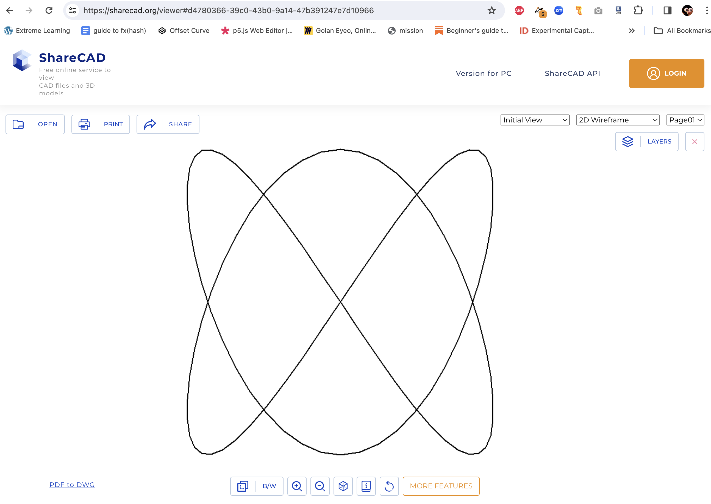

---

## 6. Transmit HPGL to HP7475A with CoolTerm

Here are instructions for executing the plot, by sending the HPGL file over the serial connection to the plotter using CoolTerm (on the Mac). A similar workflow exists for Windows with [RealTerm](https://realterm.sourceforge.io/).

1. Have your HPGL file already generated. 
2. Have the HP7475a connected to your computer. 
2. Launch CoolTerm. 
3. Under *Connections→Options→SerialPort*, enable CTS and DTR flow control, and turn off Software-Supported Flow Control:<br />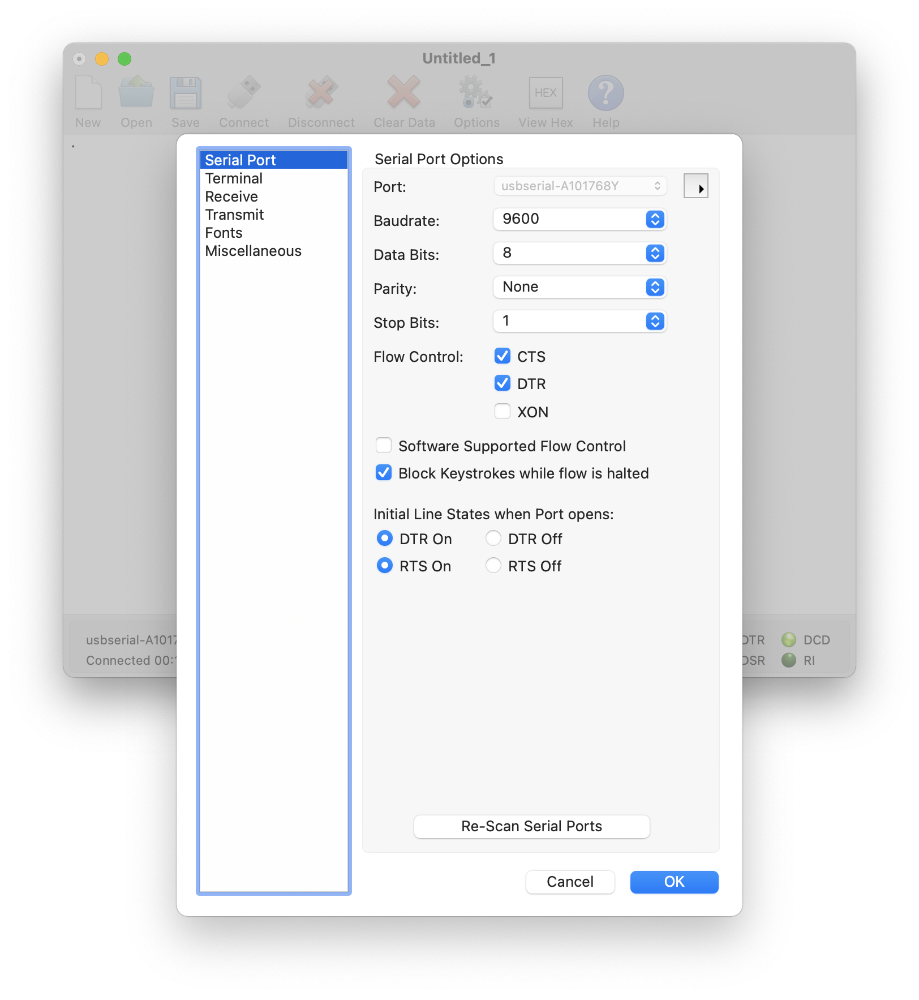
4. Activate the serial connection to the plotter using *Connections→Connect*.
5. Load and Transmit the HPGL file using *Connections→SendText/BinaryFile*:<br />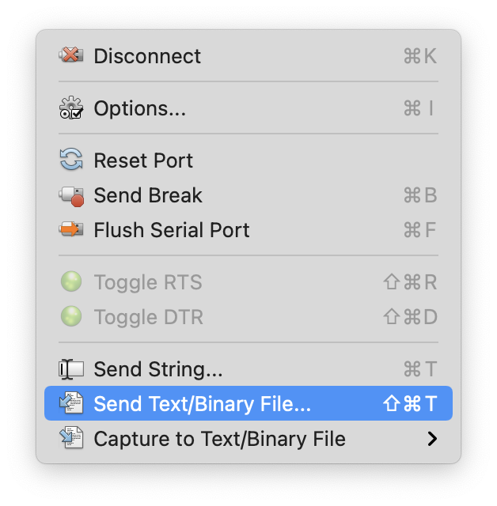
6. The plotter will plot the file!

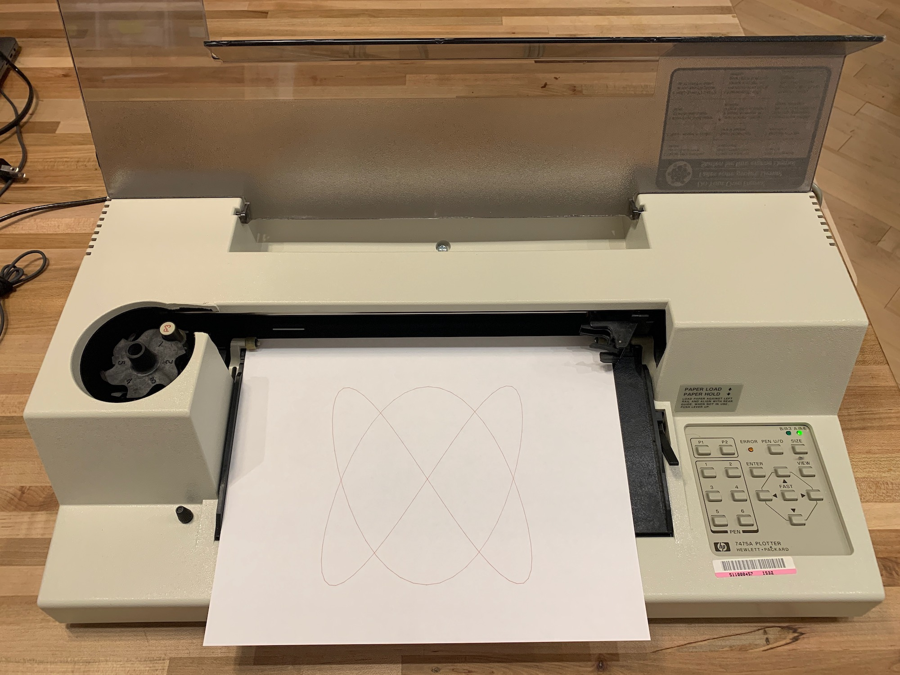


---

## Some Alternate Workflows

Vpype is an extremely powerful tool for SVG manipulation, but there are several alternative workflows, especially if you need real-time control of the HP74785a or if you prefer to work in Java or C++.

* **Real-time control of the HP7475A in Processing.** [Processing](https://processing.org/) can be used to directly control the HP7475A by sending HPGL commands over the serial port, effectively unifying steps 1,2,3 above. Critically, this also allows for the possibility of interactive (*real-time*) control of the plotter. An [**example of this is here**](processing/realtime_7475a/realtime_7475a.pde), in which the plotter copies the user's mouse drawings. 

**Less commonly:**

* Nick Hardeman's [ofxHPGL](https://github.com/NickHardeman/ofxHPGL) is an openFrameworks (C++) addon which can generate and/or load SVGs, and control the HP7475a directly (unifying steps 1,2,3 above). It can also allow for interactive real-time control of the HP7475A plotter. 
* [Inkcut](https://www.codelv.com/projects/inkcut/) is a standalone application, also available as an [InkScape extension](https://inkscape.org/~frmdstryr/%E2%98%85inkcut) extension, which can load SVG files and control plotters directly (unifying Steps 2 and 3 above). However, it may be challenging to install.
* [Chiplotle](https://pypi.org/project/Chiplotle/) is a mostly obsolete Python toolkit for controlling the HP7475A, last actively developed [around 2012](http://sites.music.columbia.edu/cmc/chiplotle/). A guide to controlling the HP7475A with Chiplotle can be found in this repository, [here](chiplotle/README.md). 

--- 

## Miscellaneous

* The drawingbots [Discord](https://drawingbots.net/) is a community with many HP7475A enthusiasts.
* @Beardicus maintains [Awesome-Plotters](https://github.com/beardicus/awesome-plotters), an excellent repository of helpful resources.
* Documents about the HP7475A can be found [at the HP Computer Museum website](http://www.hpmuseum.net/exhibit.php?hwdoc=74).
* Here is a [Raspberry Pi printserver for the HP7475A](https://github.com/hughpyle/penplot1.local), which also does SVG to HPGL conversion.
* [PiPlot](https://github.com/ithinkido/PiPlot): The PiPlot is a hardware shield that adds RS232 conectivity with full serial hardware flow control to the Raspberry Pi Zero.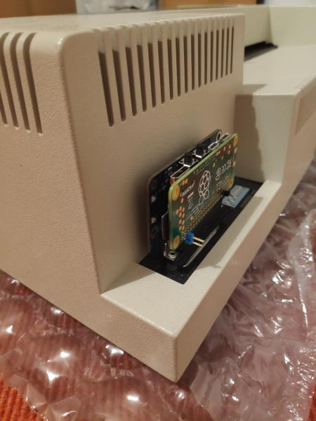

#### HP7475A Plotter Pens

* The HP7475A plotter uses HP "S Style" Fiber Tip Plotter Pens, and can accommodate pens made for the: 7090, 7220A, 7221 A, 7225A, 7440 HP Colorpro, 7470A, 7475A, 7550A, 7550B, 7570 HP Draftpro, 7580A, 7585A, 7586A, 7595A, 7595B, 7596A, 7596B, 7599A, 9872A, HP Draftmaster I, II, MX, RX, SX, HP Draftpro DXL (7575A); and the Roland DPX, DXY, and GRX Series.
* This [YouTube video](https://www.youtube.com/watch?v=h-oj4HrTH14) shows a method for refilling the ink in a vintage pen.
* Various persons have developed 3D-printed adapters to allow modern pens in the HP7475A: 
	* [thing:227985](https://www.thingiverse.com/thing:227985) 
	* [thing:2955469](https://www.thingiverse.com/thing:2955469) 
	* [thing:4720715](https://www.thingiverse.com/thing:4720715)
	* [thing:4813060](https://www.thingiverse.com/thing:4813060)
	* [plotter-oem-pen-body-mode](https://softsolder.com/2015/04/21/hp-7475a-plotter-oem-pen-body-model/)
	* [plotter-sakura-micron-pen-adapter](https://softsolder.com/2015/04/22/hp-7475a-plotter-sakura-micron-pen-adapter/)
	* [plotter-full-up-sakura-micron-pen-tests](https://softsolder.com/2015/04/23/hp-7475a-plotter-full-up-sakura-micron-pen-tests/)
	* [felt-tip-adapter-for-hp-style-plotters](https://www.printables.com/model/138334-felt-tip-adapter-for-hp-style-plotters)

