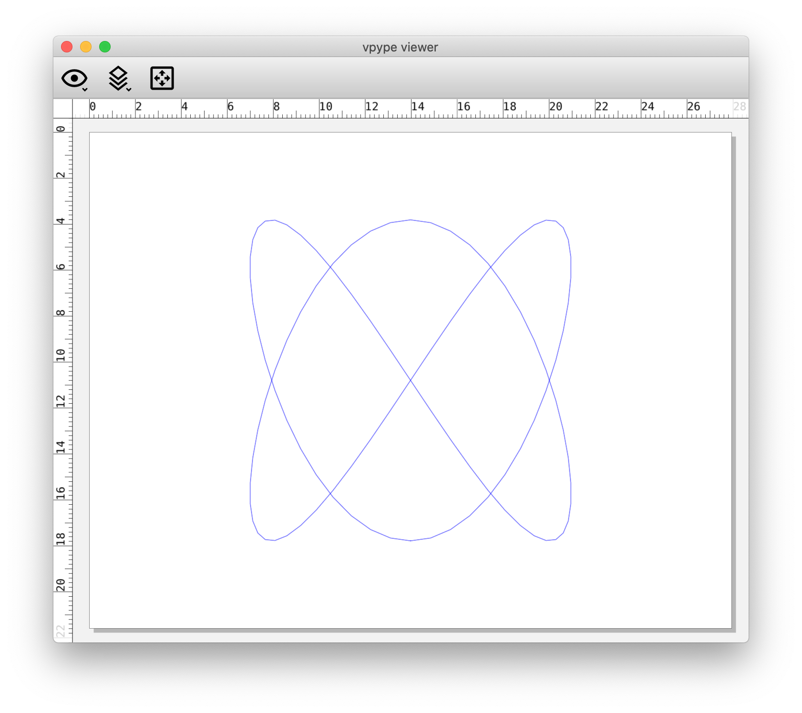

# Plotting with the HP7475A

***Summary:*** *This document outlines a workflow for offline (non-interactive) plotting with the STUDIO for Creative Inquiry's HP7475A, using Processing and from a Mac computer. This has been tested in OSX 10.15.*

#### Contents

* [HP7475A Tips](#hp7475a-tips)
* [Standalone Testing the HP7475A](#standalone-testing-the-hp7475a)
* [Testing Connectivity of a Mac to the HP7475A](#testing-connectivity-of-a-mac-to-the-hp7475a)

1. [**Generate an SVG with Processing**](#1-generate-an-svg-with-processing)
2. [**Convert SVG to HPGL with vpype**](#2-convert-svg-to-hpgl-with-vpype)
3. [**Transmit HPGL to HP7475A with Chiplotle**](#3-transmit-hpgl-to-hp7475a-with-chiplotle)

* [Some Alternate Workflows](#some-alternate-workflows)
* [Miscellaneous](#miscellaneous)

*(TO DO: Workflows for Inkcut and ofxHPGL.)*

---

## HP7475A Tips

* Don't leave pens in the plotter carousel, and especially don't leave pens in the plotter head. They dry out quickly.
* When the plotter is not in use, raise the paper clamp lever. 


---

## Standalone Testing the HP7475A:

***Summary:*** *In this section we will have the HP7475A execute a built-in test plot. For complete information about this device, see this repository of [manuals](manuals/).*

1. **Plug in** the HP7475A plotter to 120VAC wall power.
2. **Load** the plotter carousel with 6 pens. You'll need to depress the carousel's spring-loaded black rubber pen-caps in order to insert the pens.
3. **Load** the plotter with letter (8.5x11) paper. Push the paper load lever up; align the paper against the left edge; and push the paper just past the short white line in the upper left of the paper bed. Lower the lever.
4. **Execute** the plotter's "Demonstration Plot (Confidence Test)" as described on page 2-31 of the HP7475A [*Operation and Interconnection Manual*](manuals/7475A-OperationAndInterconnectionManual-07475-90002-102pages-Sep90.pdf). This is achieved by holding down the plotter's P1 and P2 buttons while powering it on, and continuing to hold them down "until the tapping noise begins". This should produce a multicolor plot which looks something like the following: 


---

## Testing Connectivity of a Mac to the HP7475A:

***Summary:*** *In this section we will make sure that we are able to send signals from our computer to the HP7475A plotter.*

1. **Connect** the USB to Serial Cable Adapter (USB-A to DB9 male) to your Mac. The STUDIO has a Sabrent cable which is known to work. (If your Mac uses USB-C, you may need to pre-pend a USB-C to USB-A adapter.)
2. **Verify** that the serial adapter is visible to your Mac's operating system, by opening the Terminal app and typing ```ls /dev/tty.*```. You should see something similar to ```/dev/tty.usbserial-A101768Y``` among the listed results.
3. **Connect** the serial adapter into the HP 24542G cable (DB9 female to DB25 male). This cable has the following wiring, according to page A-6 of the HP7475A [*Operation and Interconnection Manual*](manuals/7475A-OperationAndInterconnectionManual-07475-90002-102pages-Sep90.pdf) (or you can wire one yourself with [these instructions](manuals/SerialPlotterCable_Chiplotle.pdf)):<br /> 
4. **Ensure** that the DIP switches on the rear of the plotter are set to [9600/8-N-1](https://en.wikipedia.org/wiki/8-N-1), and US letter (8.5x11") paper, as described on page 2-21 of the HP7475A [*Operation and Interconnection Manual*](manuals/7475A-OperationAndInterconnectionManual-07475-90002-102pages-Sep90.pdf). Note that the DIP switches control the machine *defaults* for paper size and measuring system (imperial/metric), but these can be changed from the front panel as well. The switches should look like the following:<br />. 
5. **Turn on** the plotter.
6. **Launch** a serial port terminal program, such as [CoolTerm](http://freeware.the-meiers.org/). (A list of other possible serial port apps can be found [here](https://pbxbook.com/other/mac-ser.html) and includes Screen, Minicom, ZTerm, goSerial, Serial Tools, etc.) CoolTerm is distributed for macOS, Windows, Linux, and Raspberry Pi; a backup copy of version 1.9.0 (5/31/2021) for Mac is stashed [here](tools/CoolTermMac_1.9.0.zip).
7. **Configure** the serial port terminal program so that it matches the communication settings of the plotter, 9600/8-N-1:<br />
8. **Configure** (optionally) the serial port terminal program so that it is in "line mode", meaning that commands are transmitted when you press return:<br />
8. **Transmit** HPGL to the plotter. Type the command ```IN;SP1;``` into CoolTerm and press return:<br />
9. In response to the command, the HP7475A plotter should initialize itself and Select Pen #1.


---

## 1. Generate an SVG with Processing

***Summary:*** *[Processing](https://processing.org/) "is a flexible software sketchbook and a language for learning how to code within the context of the visual arts." In this section, we will generate an SVG file using Processing and its built-in [SVG Library](https://processing.org/reference/libraries/svg/index.html). Total time for this section is about 5-10 minutes.*

1. Download Processing from [here](https://processing.org/download/) and install it in your Applications folder. This tutorial was tested with [Processing v.3.5.4 on Mac OSX 10.15](https://download.processing.org/processing-3.5.4-macosx.zip). 
2. Create a new sketch (⌘N) and paste in the code below, or download the code from [here](processing/svg_lissajous/svg_lissajous.pde). Save your sketch (⌘S).  
3. Run the sketch (⌘R). This will generate and export an SVG file of a [Lissajous curve](https://en.wikipedia.org/wiki/Lissajous_curve). You can locate this SVG file by opening the folder containing your sketch (⌘K). 

```
// Generate a Lissajous curve, and export it as an SVG file.
// For more information on the Processing SVG library, see:
// https://processing.org/reference/libraries/svg/index.html

import processing.svg.*;

void setup() {
  size(1056, 816); // Letter: 11"x8.5" at 96 DPI.
  noLoop(); // Just execute once!
}

void draw() {
  background(255); 
  beginRecord(SVG, "lissajous.svg");
  
  stroke(0); 
  noFill(); // Don't create duplicate shapes.

  int nPoints = 100;
  float cx = width/2; 
  float cy = height/2; 
  float radius = width/4; 

  beginShape(); 
  for (int i=0; i<nPoints; i++) {
    float theta = map(i, 0, nPoints, 0, TWO_PI);
    float px = cx + radius * sin(2.0 * theta);
    float py = cy + radius * cos(3.0 * theta); 
    vertex(px, py);
  }
  endShape(CLOSE); 
  endRecord();
}
```

The resulting [SVG file](processing/svg_lissajous/lissajous.svg), when examined with a text editor, begins something like this:

```
<?xml version="1.0"?>
<!DOCTYPE svg PUBLIC '-//W3C//DTD SVG 1.0//EN'
          'http://www.w3.org/TR/2001/REC-SVG-20010904/DTD/svg10.dtd'>
<svg xmlns:xlink="http://www.w3.org/1999/xlink" 
<!-- etcetera -->
```

This SVG file depicts a vector graphic resembling the following: 


**Helpful tips** ([explained here](https://processing.org/reference/libraries/svg/index.html)): 

* When exporting shapes (like ellipses and rectangles, etc.) to an SVG file, you'll probably want to issue the command ```noFill()```. Otherwise, Processing will export the shape data *twice* (once for the stroke, once for the fill).
* You'll probably want to use ```noLoop()``` or ```exit()``` to terminate the program after you export the SVG.
* You can also export a single frame from an animation as an SVG. 
* Using Processing's 3D renderer, ```beginRaw()``` and ```endRaw()```, you can export SVG Files from 3D geometry.


---

## 2. Convert SVG to HPGL with vpype

***Summary:*** *[vpype](https://github.com/abey79/vpype), by [Antoine Beyeler](https://github.com/abey79/), "is an extensible CLI pipeline utility which aims to be the Swiss Army knife for creating, modifying and/or optimizing plotter-ready vector graphics." In this section, we will use vpype to convert the SVG to HPGL—in particular, using its export settings for the HP7475A as described [here](https://vpype.readthedocs.io/en/latest/cookbook.html#converting-a-svg-to-hpgl). For more information on the HPGL language, here's the complete [HPGL specification](hpgl/HPGL.pdf) (PDF).*


*This section should take about 10-15m.*

1. The preferred way to install vpype is in a dedicated virtual environment running Python 3.9+. We will follow the *vpype* installation instructions for end-users, [here](https://vpype.readthedocs.io/en/latest/install.html). Make sure your computer has at least 1GB of available hard drive space for this virtual environment.
2. Using your Mac's Terminal app, install Python 3.9: ```brew install python@3.9```
3. Change directory to the folder in which you'd like to create your virtual environment, e.g. ```cd /Users/golan/Desktop/myVpype```
4. Create a new virtual environment in that directory: ```python3.9 -m venv vpype_venv``` . This will create a subdirectory (*vpype_venv*) containing various files. 
5. Activate the newly created virtual environment: ```source vpype_venv/bin/activate```. (You can exit the virtual environment later by typing ```deactivate```.)
6. Within the virtual environment, install *pip*: ```pip install --upgrade pip```
7. Within the virtual environment, install *vype*: ```pip install vpype[all]```
8. You should now be able to run *vpype*: ```vpype --help```. This may take a moment the first time.
9. Move a copy of your SVG file into your *myVpype* directory. Verify that vpype can load and display your SVG: ```vpype read lissajous.svg show```. (Note that this viewer exclusively uses metric units.)<br />
10. In your Terminal, execute the *vpype* command to read the SVG and write HPGL formatted for the HP7475a. I used this command: ```vpype read lissajous.svg write --device hp7475a --page-size letter --landscape lissajous.hpgl``` but you can find a cookbook of additional recipes [here](https://vpype.readthedocs.io/en/latest/cookbook.html#converting-a-svg-to-hpgl).
11. This will produce an HPGL file ([lissajous.hpgl](vpype/lissajous.hpgl)), which, when examined with a text editor, contains: 

```
IN;DF;PS4;SP1;PU5213,1334;PD5565,1384,5911,1532,6247,1771,6566,2095,6863,2492,7135,2947,7376,3444,7583,3966,7753,4494,7883,5009,7971,5494,8015,5931,8015,6305,7971,6602,7883,6812,7753,6927,7583,6944,7376,6861,7135,6682,6863,6413,6566,6064,6247,5646,5911,5175,5565,4668,5213,4142,4861,3616,4515,3108,4180,2638,3861,2220,3563,1871,3291,1602,3050,1423,2843,1340,2673,1357,2543,1472,2455,1682,2411,1979,2411,2352,2455,2789,2543,3274,2673,3790,2843,4318,3050,4840,3291,5337,3563,5792,3861,6188,4180,6512,4515,6752,4861,6900,5213,6949,5565,6900,5911,6752,6247,6512,6566,6188,6863,5792,7135,5337,7376,4840,7583,4318,7753,3790,7883,3274,7971,2789,8015,2352,8015,1979,7971,1682,7883,1472,7753,1357,7583,1340,7376,1423,7135,1602,6863,1871,6566,2220,6247,2638,5911,3108,5565,3616,5213,4142,4861,4668,4515,5175,4180,5646,3861,6064,3563,6413,3291,6682,3050,6861,2843,6944,2673,6927,2543,6812,2455,6602,2411,6305,2411,5931,2455,5494,2543,5009,2673,4494,2843,3966,3050,3444,3291,2947,3563,2492,3861,2095,4180,1771,4515,1532,4861,1384,5213,1334;PU10365,7962;SP0;IN;
```

**Helpful *vpype* tips** ([explained here](https://github.com/abey79/vpype)): 

* The online documentation for vpype is [here](https://vpype.readthedocs.io/en/stable/).
* *vpype* can also layout existing vector files with precise control of position, scale and page format.
* *vpype* can also *optimize* existing SVG files for faster and cleaner plots.
* *vpype* can also be used to create generative artwork directly, generating HPGL from your own Python code.
* The *speed* of the HP7475A plotter can be adjusted from 
0.38 to 38.1 centimeters/second, using the HPGL ```VS``` command. Pen force can be adjusted with the ```FS``` command. This is documented [here](https://support.hp.com/us-en/document/bpp01673) and in the HP7475A [programming manual](manuals/7475A-InterfacingAndProgrammingManual-07475-90001-274pages-Oct84.pdf) on page 3-3.
* As usual, Paul Bourke has some excellent [HPGL documentation](http://paulbourke.net/dataformats/hpgl/).


---

## 3. Transmit HPGL to HP7475A with Chiplotle

***Summary:*** *[Chiplotle](http://sites.music.columbia.edu/cmc/chiplotle/) "is an HPGL plotter driver that implements and extends the HPGL (Hewlett-Packard Graphics Language) plotter control language. It provides direct control of your hardware via a standard usb-to-serial port interface." In this section, we will transmit our HPGL data to the HP7475A plotter using Chiplotle's "HPGL Pipeline", as described [here](http://sites.music.columbia.edu/cmc/chiplotle/manual/chapters/tutorial/intro.html#hpgl-pipeline). Chiplotle was developed by  by Víctor Adán and Douglas Repetto, but we are using a version updated for Python3 by [Will Price](https://github.com/willprice). This section should take about 10-15m.*

1. We will need a version of Python of 3.7 or greater. Using your Mac's Terminal app, install Python 3.9 if you haven't already: ```brew install python@3.9```
2. Change directory to the folder in which you'd like to create your virtual environment, e.g. ```cd /Users/golan/Desktop/myChiplotle```
3. Create a new virtual environment in that directory: ```python3.9 -m venv chip_venv``` . This will create a subdirectory (*chip_venv*) containing various files.
4. Activate the newly created virtual environment: ```source chip_venv/bin/activate``` (you can exit the virtual environment later with ```deactivate```).
5. From the virtual environment, install *pip*: ```pip install --upgrade pip```. My machine reports that it "Successfully installed pip-21.1.2". 
6. To fix a small bug, do: ```pip install six```. My machine reports that it "Successfully installed six-1.16.0".
6. From [this GitHub repository](https://github.com/golanlevin/chiplotle), click on the green "CODE" button in the upper right, and download the ZIP file, chiplotle-master.zip. (A backup copy is stashed [here](chiplotle/chiplotle-master.zip).) 
7. Place the chiplotle-master.zip file in your *myChiplotle* directory, and unzip it.   
8. Change into the directory that was just created, e.g. ```cd chiplotle-master```
9. Install the Chiplotle bundle using: ```sudo python setup.py install```. You'll need to type your machine's admin password. At the end, it should report "Finished processing dependencies for chiplotle==0.4.2".
10. Connect the HP7475A to your computer and power it on, making sure that it has pens in the carousel. In your Terminal, change directory back up one level (```cd ..```) to the *myChiplotle* directory. As per the instructions at [here](http://sites.music.columbia.edu/cmc/chiplotle/manual/chapters/tutorial/intro.html#), enter the command: ```chiplotle```. You should see a report that looks like this, followed by the ```chiplotle>``` prompt:<br />
11. Let's test our installation of Chiplotle by picking up a pen. At the Chiplotle prompt, enter the following: ```plotter.write(hpgl.SP(1))```. You can also use the equivalent command ```plotter.select_pen(1)```. Now put the pen back in the carousel with the command ```plotter.select_pen(0)```.
12. Move a copy of the *lissajous.hpgl* HPGL file into your *myChiplotle* directory. We will now use the Chiplotle HPGL Pipeline, described [here](http://sites.music.columbia.edu/cmc/chiplotle/manual/chapters/tutorial/intro.html#hpgl-pipeline), to execute the drawing. Issuing the following command at the Chiplotle prompt should cause your HPGL file to be plotted by the HP7475A: ```plotter.write_file('lissajous.hpgl')```


**Helpful *Chiplotle* tips**: 

* The complete Chiplotle manual is [here](http://sites.music.columbia.edu/cmc/chiplotle/manual/index.html) and [here](https://chiplotle.readthedocs.io/_/downloads/en/latest/pdf/), with a backup stashed [here](chiplotle/chiplotle-0.4.2-documentation.pdf). 
* Some other helpful diagnostic Chiplotle [commands](http://sites.music.columbia.edu/cmc/chiplotle/manual/chapters/api/plotters.html):
	* ```plotter.goto_bottom_left()```
	* ```plotter.goto_top_right()```
	* ```print(plotter.actual_position)```
	* ```print(plotter.output_p1p2)```
* You can write Python code to make generative designs, and call Chiplotle from your Python code to execute them; this is described [here](http://sites.music.columbia.edu/cmc/chiplotle/manual/chapters/tutorial/intro.html#running-chiplotle-from-a-python-script), and there's an example [here](https://gist.github.com/ednisley/0df674e7ece624250dcb).


---

## Some Alternate Workflows

* Processing can be used to directly control the HP7475A by sending HPGL commands over the serial port, effectively unifying steps 1,2,3 above. This also allows for the possibility of interactive (real-time) control. An example of this is [here](https://github.com/tobiastoft/SymbolicDisarray/blob/master/SymbolicDisarray.pde) and discussed at length [here](https://medium.com/quarterstudio/an-intro-to-pen-plotters-29b6bd4327ba).
* Nick Hardeman's [ofxHPGL](https://github.com/NickHardeman/ofxHPGL) is an openFrameworks (C++) addon which can generate and/or load SVGs, and control the HP7475a directly (unifying steps 1,2,3 above). It can even allow for interactive real-time control of the HP7475A plotter. 
* [Inkcut](https://www.codelv.com/projects/inkcut/) is a standalone application, also available as an [InkScape extension](https://inkscape.org/~frmdstryr/%E2%98%85inkcut) extension, which can load SVG files and control plotters directly (unifying Steps 2 and 3 above). However, it may be challenging to install.


--- 

## Miscellaneous

* The drawingbots [Discord](https://drawingbots.net/) is a community with many HP7475A enthusiasts.
* @Beardicus maintains [Awesome-Plotters](https://github.com/beardicus/awesome-plotters), an excellent repository of helpful resources.
* Documents about the HP7475A can be found [at the HP Computer Museum website](http://www.hpmuseum.net/exhibit.php?hwdoc=74).
* Here is a [Raspberry Pi printserver for the HP7475A](https://github.com/hughpyle/penplot1.local), which also does SVG to HPGL conversion.

#### HP7475A Plotter Pens

* The HP7475A plotter uses HP "S Style" Fiber Tip Plotter Pens, and can accommodate pens made for the: 7090, 7220A, 7221 A, 7225A, 7440 HP Colorpro, 7470A, 7475A, 7550A, 7550B, 7570 HP Draftpro, 7580A, 7585A, 7586A, 7595A, 7595B, 7596A, 7596B, 7599A, 9872A, HP Draftmaster I, II, MX, RX, SX, HP Draftpro DXL (7575A); and the  Roland DPX, DXY, and GRX Series.
* This [YouTube video](https://www.youtube.com/watch?v=h-oj4HrTH14) shows a method for refilling the ink in a vintage pen.
* Some experts, such as Paul Rickards, have [cut the case of their HP7475A](https://twitter.com/paulrickards/status/696067774469271552) in order to allow taller pens. 
* Various persons have developed 3D-printed adapters to allow modern pens in the HP7475A: 
	* [thing:227985](https://www.thingiverse.com/thing:227985) 
	* [thing:2955469](https://www.thingiverse.com/thing:2955469) 
	* [thing:4720715](https://www.thingiverse.com/thing:4720715)
	* [thing:4813060](https://www.thingiverse.com/thing:4813060)
	* [plotter-oem-pen-body-mode](https://softsolder.com/2015/04/21/hp-7475a-plotter-oem-pen-body-model/)
	* [plotter-sakura-micron-pen-adapter](https://softsolder.com/2015/04/22/hp-7475a-plotter-sakura-micron-pen-adapter/)
	* [plotter-full-up-sakura-micron-pen-tests](https://softsolder.com/2015/04/23/hp-7475a-plotter-full-up-sakura-micron-pen-tests/)