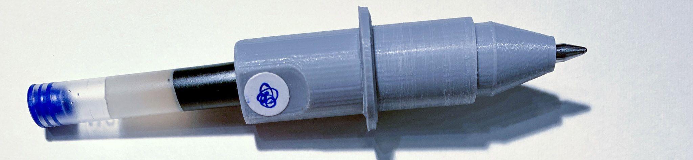

# Plotting on HP7475A from Debian MacMini

### 1. Convert SVG to HPGL with *vpype*

* **Open** a terminal window and **activate** your *vpype* virtual environment. On the Debian MacMini, do this with: `source ~/vpype-venv/bin/activate`
* **Ensure** *vpype* is working: ```vpype --help```
* **Move** a copy of your SVG file into your current working directory. (On the Debian MacMini, you might wish to do this with a thumb drive, or `wget`, `rsync`, etc.)
* **Execute** a *vpype* command like the one below to convert the SVG into HPGL formatted for the HP7475a. (You can **preview** your HPGL file in the browser using [ShareCad.org](https://sharecad.org/).)

`
vpype read input.svg write --device hp7475a --page-size letter --landscape output.hpgl 
`

* The *speed* of the HP7475A plotter can be adjusted from 0.38 to 38.1 cm/second, using the *vpype* ```-velocity``` command.
* A more elaborated *vpype* command can also scale, crop, and do complex optimizations on your design, as shown below. Consult the *vpype* docs to use these commands wisely! 

`
vpype read input.svg scale 0.9 0.9 crop 0.5in 0.5in 10.0in 7.5in linesimplify reloop linemerge --tolerance 0.1mm linesort --no-flip write --device hp7475a --velocity 3 --page-size letter output.hpgl 
`

---

### 2. Prepare the HP7475A Plotter



* **Install** your pen cartridge into one of our [custom adapters](https://github.com/golanlevin/DrawingWithMachines/tree/main/machines/hp7475a/3d_pen_adapter); it works with Pilot G-2 and many other pens. In order to insert and secure the cartridge, you'll need to adjust the M3 set screw with a 1.5mm hex wrench. The pen tip should protrude 3-4mm from the adapter.
* **Load** the plotter carousel with your pen(s). You'll need to depress the carousel's spring-loaded black rubber pen-caps in order to insert the pens.
* **Load** the plotter with letter-sized (A4, 8.5x11) paper as follows: Push the paper load lever (on the right side) upwards; align the paper against the left edge; and push the paper just up to the short white line in the upper left of the paper bed. Lower the lever.

---

### 3. Transmit HPGL to HP7475A via CuteCom on Debian

* On the Debian MacMini machine, **launch** the [**CuteCom**](https://cutecom.sourceforge.net/) terminal program.
* **Select** the correct USB interface where it lists *Devices* — probably `/dev/ttyUSB0`.
* **Click** on *Settings* in the upper right and **configure** CuteCom: Baudrate = 9600; Data Bits = 8; Flow Control = Hardware; Parity = None; Stop Bits = 1; Open Mode = Read/Write.
* **Close** the Settings panel and **click** *Open* on the main UI. Once the connection to the serial adapter has been established, the *Send file* button will become un-greyed. You can then **choose** your HPGL file, and it will be sent to the plotter!
* **IMPORTANT**: When you're done using the plotter, **raise** the paper load lever.

