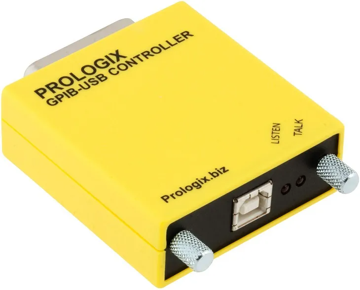
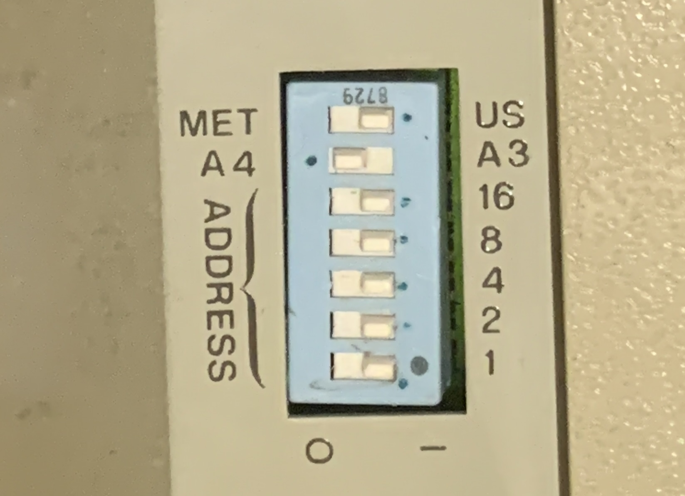
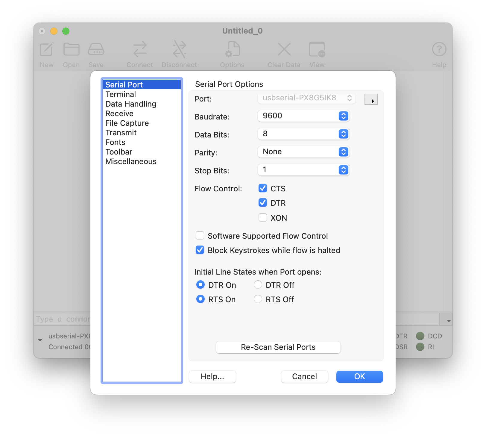
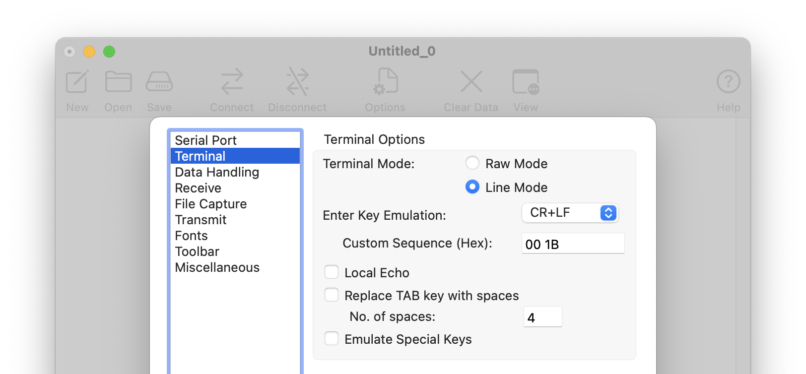
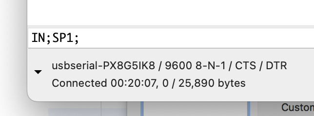
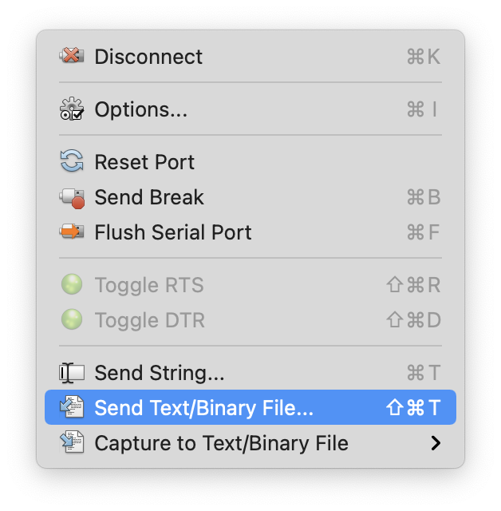

# Configuring HP7475A with GP-IB/HP-IB 

This documents the installation and configuration of a GPIB/HPIB interface for a HP 7475A pen plotter using MacOS Sonoma 14.1.2. For more information beyond the scope of this page, see the following resources:

* [**Plotting with the HP7475A**](../../README.md). This document is from this (Drawing with Machines) repository and discusses how to configure an RS-232 7475A, as well as providing more information about converting SVGs to HPGL. 
* [**Restoring HP7475a Plotter**](https://www.patreon.com/posts/restoring-58323966) by Maks Surguy, 11/2021. Deals with the GPIB interface, as well as some details about physical restoration of a 7475A plotter. 

---

### 1. Install the USB-to-GPIB Adaptor

Some versions of the HP 7475A plotter ship with a GPIB (General Purpose Interface Bus, [IEEE-488](https://en.wikipedia.org/wiki/IEEE-488)) port, instead of a 25-pin RS-232 port. Such plotters require a special adaptor; we are using a [Prologix GPIB-USB (HPIB-USB) Controller](https://prologix.biz/product/gpib-usb-controller/) ($299, available [from SparkFun](https://www.sparkfun.com/products/549)), which converts a computer with a USB port into a GPIB (HPIB) Controller. This adaptor connects to the Mac via USB A-to-B cable, and it plugs directly into the rear of the HPIB 7475A plotter. 

We install the "VCP" (Virtual COM Port) driver, which emulates a standard serial port on the host computer such that the Prologix GPIB-USB computer can be communicated with as a standard serial (RS-232) device: 

* Download drivers for FT245R chip from the [FTDI VCP drivers page](https://ftdichip.com/drivers/vcp-drivers/) at ftdichip.com.
* I downloaded [FTDIUSBSerialDextInstaller_1_5_0.dmg](FTDIUSBSerialDextInstaller_1_5_0.dmg) (that's a local copy). The version I downloaded is for ARM processors, as I'm using an M1 laptop. The [driver I downloaded](https://ftdichip.com/wp-content/uploads/2022/06/FTDIUSBSerialDextInstaller_1_5_0.dmg) is dated 2022-06-13 and is listed as working for OSX 11/12, but appears to work in OSX 14.
* Note that in order to be properly installed, the .dmg needs to be launched from inside the OSX Applications folder. You may need to modify your security settings to allow the installation. 

Note that the dipswitches on our GPIB HP7475A are configured as follows: 

According to page 2-23 of the [7475A-OperationAndInterconnectionManual-07475-90002-102pages-Sep90.pdf](../7475A-OperationAndInterconnectionManual-07475-90002-102pages-Sep90.pdf): 

> *The HP7475A plotter is set to "listen-only mode" when all five of the address switches are set to "1". In this mode, the plotter does not have an address, but listens to all data transmitted on the bus. In listen-only mode the plotter cannot be placed in a talker-active state and will not respond to a serial or parallel poll.*

Page 2-23 gives instructions for setting the address of the plotter if necessary, but "listen-only mode" seems to work fine for simple plotting. 

### 2. Proceed as Usual

If the FTDI driver is installed correctly, there should now be a new COM port available in your serial port terminal program. In my particular case, the Prologix GPIB controller appears as `usbserial-PX8G5IK8`: 

* In CoolTerm's "Serial Port" page (via *Connection->Options*), configure the (GPIB) COM port for the HP7475A: 9600 baudrate, 8 data bits, None parity, 1 stop bit. *Enable* CTS and DTR. *Disable* "Software Supported Flow Control". In the "Terminal" page, select "Line Mode" for the "Terminal Mode". 

* Activate the serial connection to the plotter using *Connections→Connect*. 
* Test the plotter by sending a command to Select Pen #1: `IN;SP1;`

* If that works, you can now plot a test file; here is a [lissajous.hpgl](lissajous.hpgl) file you can use. Load and transmit the HPGL file using *Connections→SendText/BinaryFile*:

* More information on converting SVG to HPGL can be found in this repository here, [**Plotting with the HP7475A**](../../README.md). 
