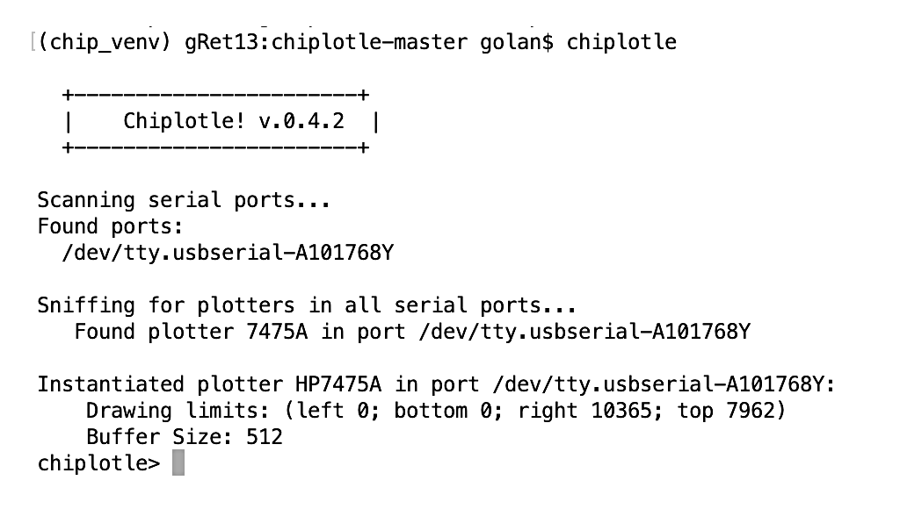

# Controlling HP7475A with Chiplotle

***Summary:*** *This document outlines a workflow for plotting with the HP 7475A using [Chiplotle](http://sites.music.columbia.edu/cmc/chiplotle/). Chiplotle has not been updated since 2012 and has been supplanted by vpype. For this reason, this page is now frozen and maintained for historical purposes only.*

---

## Transmit HPGL to HP7475A with Chiplotle

***Summary:*** *This is an alternative method for transmitting HPGL to the plotter with Chiplotle, a full-featured HP7475a controller. This is rather more involved, but this workflow is more powerful.*

*[Chiplotle](http://sites.music.columbia.edu/cmc/chiplotle/) "is an HPGL plotter driver that implements and extends the HPGL (Hewlett-Packard Graphics Language) plotter control language. It provides direct control of your hardware via a standard usb-to-serial port interface." In this section, we will transmit our HPGL data to the HP7475A plotter using Chiplotle's "HPGL Pipeline", as described [here](http://sites.music.columbia.edu/cmc/chiplotle/manual/chapters/tutorial/intro.html#hpgl-pipeline). Chiplotle was developed by  by Víctor Adán and Douglas Repetto, but we are using [a version updated for Python3](https://github.com/golanlevin/chiplotle) by Will Price. This installation section should take about 10-15m.*

1. We will need a version of Python of 3.7 or greater. Using your Mac's Terminal app, install Python 3.9 if you haven't already: ```brew install python@3.9```
2. Change directory to the folder in which you'd like to create your virtual environment, e.g. ```cd /Users/golan/Desktop/myChiplotle```
3. Create a new virtual environment in that directory: ```python3.9 -m venv chip_venv``` . This will create a subdirectory (*chip_venv*) containing various files.
4. Activate the newly created virtual environment: ```source chip_venv/bin/activate``` (you can exit the virtual environment later with ```deactivate```).
5. From the virtual environment, install *pip*: ```pip install --upgrade pip```. My machine reports that it "Successfully installed pip-21.1.2". 
6. To fix a small bug, do: ```pip install six```. My machine reports that it "Successfully installed six-1.16.0".
6. From [this GitHub repository](https://github.com/golanlevin/chiplotle), click on the green "CODE" button in the upper right, and download the ZIP file, chiplotle-master.zip. (A backup copy is stashed [here](chiplotle/chiplotle-master.zip).) 
7. Place the chiplotle-master.zip file in your *myChiplotle* directory, and unzip it.   
8. Change into the directory that was just created, e.g. ```cd chiplotle-master```
9. Install the Chiplotle bundle using: ```sudo python setup.py install```. You'll need to type your machine's admin password. At the end, it should report "Finished processing dependencies for chiplotle==0.4.2".
10. Connect the HP7475A to your computer and power it on, making sure that it has pens in the carousel. In your Terminal, change directory back up one level (```cd ..```) to the *myChiplotle* directory. As per the instructions at [here](http://sites.music.columbia.edu/cmc/chiplotle/manual/chapters/tutorial/intro.html#), enter the command: ```chiplotle```. You should see a report that looks like this, followed by the ```chiplotle>``` prompt:<br />
11. Let's test our installation of Chiplotle by picking up a pen. At the Chiplotle prompt, enter the following: ```plotter.write(hpgl.SP(1))```. You can also use the equivalent command ```plotter.select_pen(1)```. Now put the pen back in the carousel with the command ```plotter.select_pen(0)```.
12. Move a copy of the *lissajous.hpgl* HPGL file into your *myChiplotle* directory. We will now use the Chiplotle HPGL Pipeline, described [here](http://sites.music.columbia.edu/cmc/chiplotle/manual/chapters/tutorial/intro.html#hpgl-pipeline), to execute the drawing. Issuing the following command at the Chiplotle prompt should cause your HPGL file to be plotted by the HP7475A: ```plotter.write_file('lissajous.hpgl')```


**Helpful *Chiplotle* tips**: 

* The complete Chiplotle manual is [here](http://sites.music.columbia.edu/cmc/chiplotle/manual/index.html) and [here](https://chiplotle.readthedocs.io/_/downloads/en/latest/pdf/), with a backup stashed [here](chiplotle-0.4.2-documentation.pdf). 
* Some other helpful diagnostic Chiplotle [commands](http://sites.music.columbia.edu/cmc/chiplotle/manual/chapters/api/plotters.html):
	* ```plotter.goto_bottom_left()```
	* ```plotter.goto_top_right()```
	* ```print(plotter.actual_position)```
	* ```print(plotter.output_p1p2)```
* You can write Python code to make generative designs, and call Chiplotle from your Python code to execute them; this is described [here](http://sites.music.columbia.edu/cmc/chiplotle/manual/chapters/tutorial/intro.html#running-chiplotle-from-a-python-script), and there's an example [here](https://gist.github.com/ednisley/0df674e7ece624250dcb).

