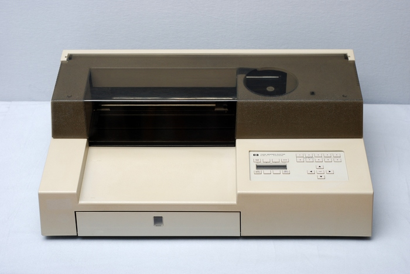
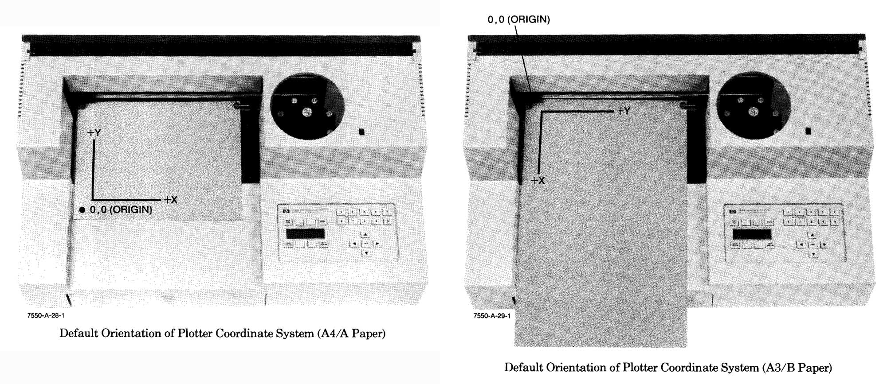
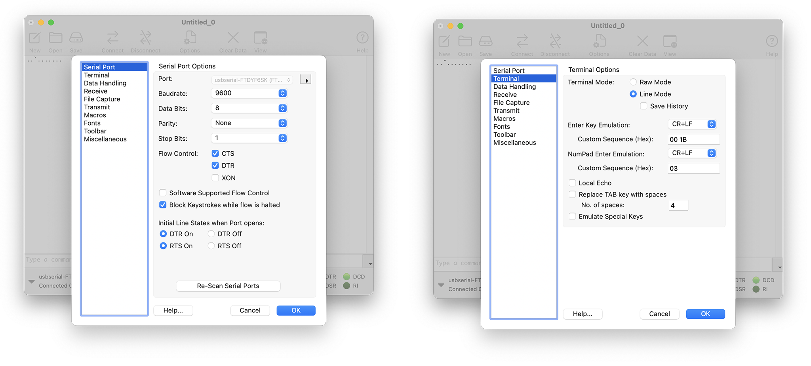
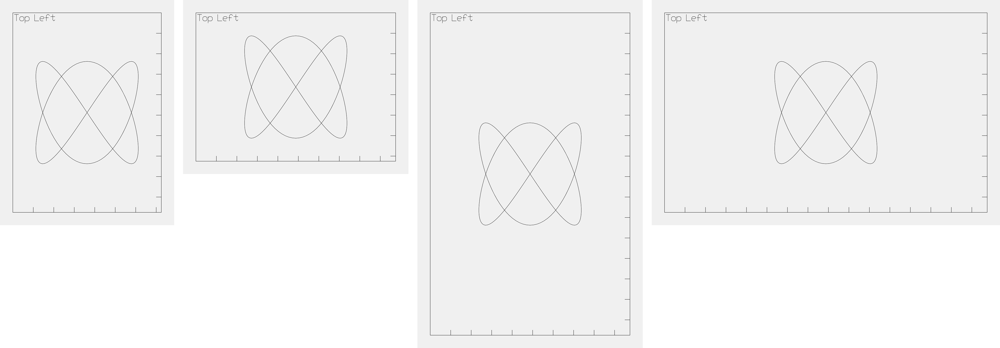

# HP7550A

## **Overview**

* [About HP7550A Coordinates]()
* [Plotting with the HP7550A]()
* [HP7550A Reference Manuals]()

The [HP Computer Museum writes](https://www.hpmuseum.net/display_item.php?hw=75): 

> The 7550 was the most advanced small plotter ever built. It had an incredible acceleration of 6g, making it one of the fastest plotters ever (and the most fun to watch). The 7550 had 8 pens and could plot on many types of media including paper, transparency film, vellum and polyester film. It was also the first plotter to include a sheet feeder, which allowed for unattended plotting. The 7550 had some minor limitations: its replot buffer was too small to be useful, it was big and it had a noisy fan. Overall, the product never had a peer in the marketplace and it had a ten-year product life.

Our lab's 7550A was manufactured in 1988.

---

## About HP7550A Coordinates

The HP7550A uses "plotter units", which are the units used in all HPGL drawing commands. There are 1016 plotter units to the inch, i.e. each plotter unit is 0.025mm. (Note that [*vpype* reports this size as 0.02488mm](https://github.com/abey79/vpype/blob/master/vpype/vpype_config.toml#L27C24-L27C33)). 

The plotter-unit coordinate system is oriented on the paper so that the origin `(0,0)` always lies inside the lower-left corner of the paper, with the **Y**-axis extending upward along the short side of the paper, and the **X**-axis extending to the right along the long side of the paper. The orientation of the coordinate axes relative to the paper is the same, regardless of what direction the paper is loaded in the plotter.

#### HP7550A Default Scaling Points (in Plotter Units): 

| Paper Size          | P1x,P1y  | P2x,P2y      |
| ------------------- | -------- | ------------ |
| A4 (210×297 mm)     | 430, 200 | 10430, 7400  |
| A3 (297×420 mm)     | 380, 430 | 15580, 10430 |
| ANSI-A (8.5×11 in.) | 80, 320  | 10080, 7520  |
| ANSI-B (11×17 in.)  | 620, 80  | 15820, 10080 |

#### HP7550A Hard-Clip Limits (Maximum Plotting Ranges, in Plotter Units) 

| Paper Size          | X-axis                        | Y-axis                        |
| ------------------- | ----------------------------- | ----------------------------- |
| A4 (210×297 mm)     | 0–10870 (271.75 mm/10.65 in.) | 0–7600 (190.00 mm/7.45 in.)   |
| A3 (297×420 mm)     | 0–15970 (399.25 mm/15.65 in.) | 0–10870 (271.75 mm/10.65 in.) |
| ANSI-A (8.5×11 in.) | 0–10170 (254.25 mm/9.97 in.)  | 0–7840 (196.00 mm/7.68 in.)   |
| ANSI-B (11×17 in.)  | 0–16450 (411.25 mm/16.12 in.) | 0–10170 (254.25 mm/9.97 in.)  |

---

## Plotting with the HP7550A

The information here is abbreviated. Before proceeding with the HP7550A, please review the workflows described here: 

* [Plotting with the HP7475A](../hp7475a/README.md)
* [Prepping SVGs for Plotting with *vpype*](../../generating_svg/vpype_svg_prep/README.md)

#### Technical Notes

* In addition to the HP 24542G cable (DB9 female to DB25 male), connecting to the HP7550A also requires a [25-pin female-to-female](https://www.amazon.com/dp/B0B7LYGX1P) "Gender Changer" adapter.
* When connecting the plotter to your computer, note that the HP7550A has *two* RS-232 ports and an HPIB port. Your 25-pin data cable should be connected to the (middle) RS-232 port labeled "COMPUTER/MODEM", and **not** "TERMINAL". It shouldn't be necessary to adjust these, but here are the settings for the plotter's serial configuration:

| Setting                  | Value      |
| ------------------------ | ---------- |
| REMOTE / LOCAL / STANDBY | REMOTE     |
| EAVESDROP / STANDALONE   | STANDALONE |
| BYPASS                   | OFF        |
| HANDSHAKE MODE           | HARDWIRE   |
| MODEM / DIRECT           | DIRECT     |
| DUPLEX                   | FULL       |
| BAUD RATE                | 9600       |
| PARITY                   | OFF        |
| DATA BITS                | 8 BITS     |
| STOP BITS                | 1          |

On the computer side, here are the CoolTerm settings for communication with the HP7550A: 

The *vpype* SVG-to-HPGL workflow includes built-in calibration information for the HP7550A, which is accessed using the flag: `--device hp7550`. Valid *vpype* arguments for `pagesize` on the HP7550A are: 

* `ansi_a` or `letter` or `a` 
* `ansi_b` or `tabloid` or `b`
* `a3` or `A3`
* `a4` or `A4`

<!--
`--page-size a4 --letter
--> 

In *vpype*, portrait orientation is the default, unless `--landscape` is used. Thus: 

* To set the page size to letter: `vpype […] pagesize letter […]`
* To set the page size to landscape letter: `vpype […] pagesize --landscape letter […]`

Here are 4 sample SVG files, created with [this p5 test program](https://editor.p5js.org/golan/sketches/OaNCLhcUr). These files can be used to test HPGL generation and plotting with standard US paper sizes (letter and tabloid) in both portrait and landscape orientations. Minimal *vpype* commands for generating HPGL from these SVGs are included below:

* [test_letter_portrait.svg](svg/test_letter_portrait.svg) 
`vpype read test_letter_portrait.svg write --device hp7550 pagesize ansi_a --absolute test_letter_portrait.hpgl`
* [test_letter_landscape.svg](svg/test_letter_landscape.svg) 
`vpype read test_letter_landscape.svg write --device hp7550 pagesize ansi_a --landscape --absolute test_letter_landscape.hpgl`
* [test_tabloid_portrait.svg](svg/test_tabloid_portrait.svg) 
`vpype read test_tabloid_portrait.svg write --device hp7550 pagesize ansi_b --absolute test_tabloid_portrait.hpgl`
* [test_tabloid_landscape.svg](svg/test_tabloid_landscape.svg) 
`vpype read test_tabloid_landscape.svg write --device hp7550 pagesize ansi_b --landscape --absolute test_tabloid_landscape.hpgl`

---

## HP7550A Reference Manuals

The following PDF manuals for the HP7550A [have been provided by the HP Computer Museum](https://www.hpmuseum.net/exhibit.php?hwdoc=75) for research and education: 

* [**7550A Interfacing And Programming Manual**](pdf/7550A-InterfacingAndProgrammingManual-07550-90001-483pages-Jan86.pdf)
* [**7550A Operation And Interconnection Manual**](pdf/7550A-OperationAndInterconnectionManual-07550-90002-163pages-Oct84.pdf)

Additional HP7550A Documents: 

* [7550A Technical Data](pdf/7550A_TechnicalData_5954-7084_4pages_Feb89.pdf)
* [7550A Service Manual](pdf/7550A-ServiceManual-07550-90000-175pages-Jan86.pdf)
* [7550B Hardware Support Manual](pdf/7550B_HardwareSupportManual_07550-90050_111pages_Sep93.pdf)
* [HP Journal, April 1985 issue](pdf/HPJournal1985Apr-7550-15pages.pdf)