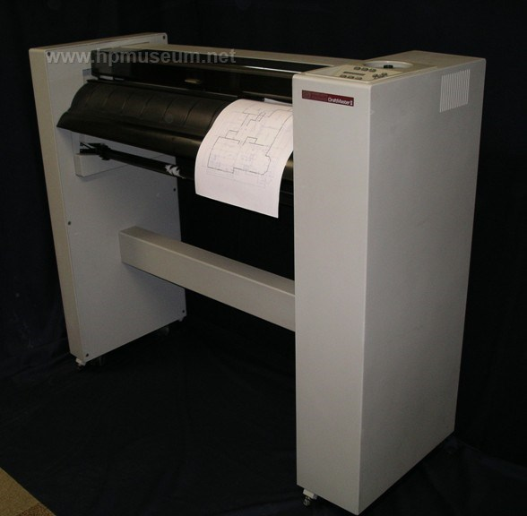
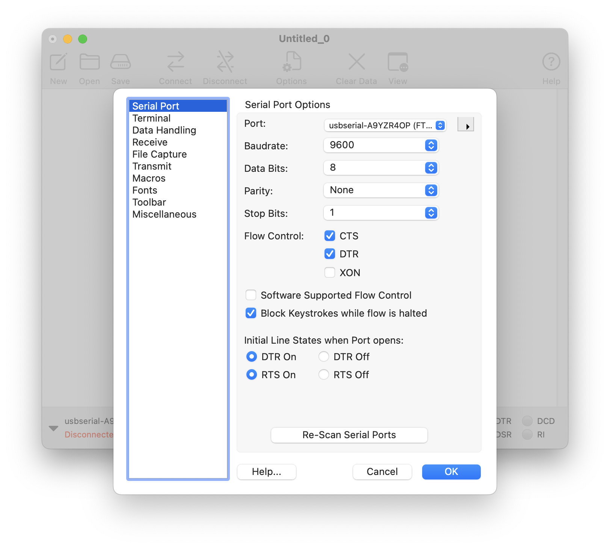
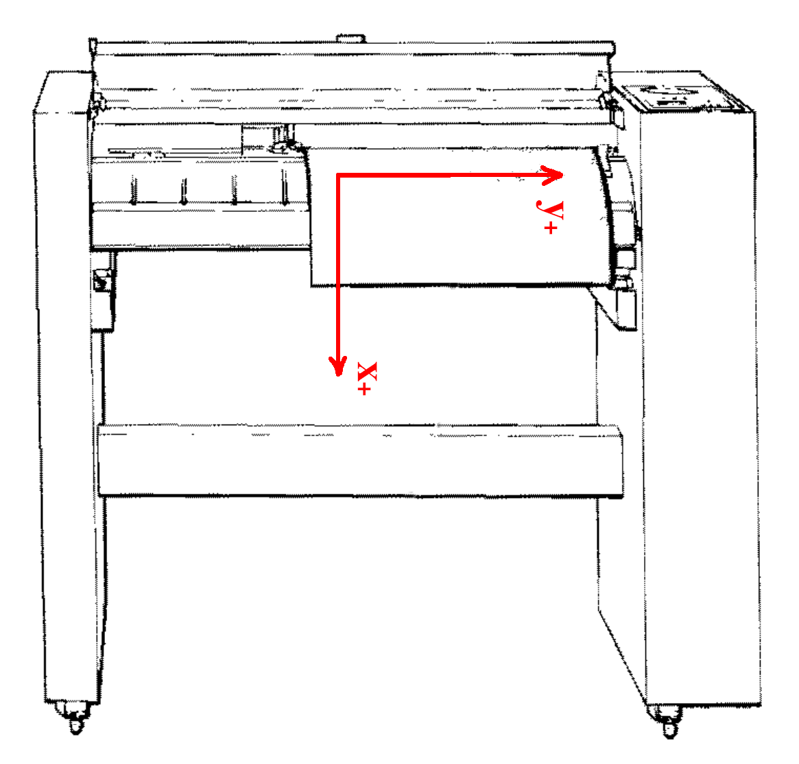
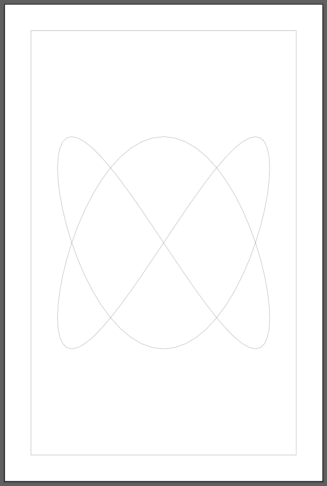
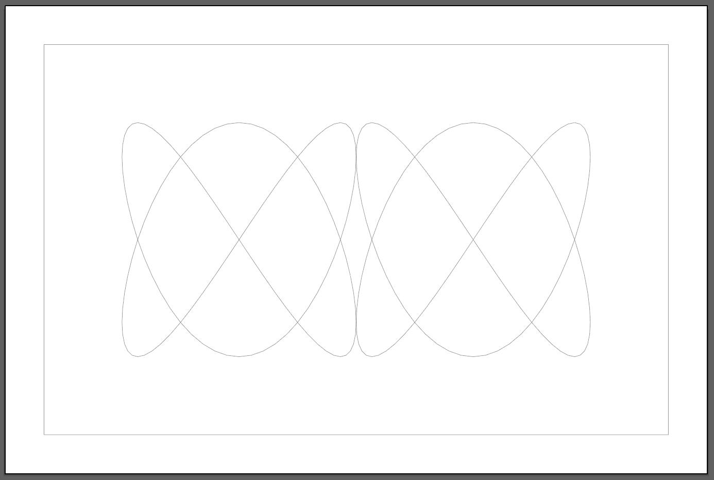

# HP DraftMaster II, Model 7596A

> *"The Draftmaster II was among the most advanced pen plotters ever made by HP. They handled media sizes up to E/A0 size and plotted at 60 cm/s with acceleration up to 5.7g. The DraftMaster II (P/N 7596A - $10995) also plotted on continuous rolls."*

**Contents**:

* [Quickstart](#quickstart)
* [About DraftMaster Coordinates](#about-draftMaster-coordinates)
* [Custom vpype config for HP DraftMaster](#custom-vpype-config-for-hp-draftmaster)
* [Complete Workflow Test](#complete-workflow-test) (Lissajous)
* [Official DraftMaster Documentation](#official-draftmaster-documentation)
* [Other Hardware Information](#other-hardware-information)

You're probably looking for these User's Guides & Programmer's Manuals:

* [HP DraftMaster Plotter: User's Guide (1988)](pdf/DraftMasterPlotter-UsersGuide-07595-90002-220pages-Feb88_OCR.pdf)
* [HP DraftMaster Plotter: Programmer's Reference (1987)](pdf/DraftMaster_ProgrammersReference_07595-90001_505pages_Jan87_OCR.pdf)



---

## Quickstart

*This document assumes you are familiar with the use of the HP7475A plotter. Students are strongly discouraged from using the HP DraftMaster until they have had experience with the HP7475A.*

* As with the HP7475A: Connect USB-to-DB9 FTDI serial cable to the gray HP 24542G (DB9-to-DB25) cable. Plug the USB connector to your laptop; plug the 25-pin HP 24542G to the **upper** RS-232 serial port on the DraftMaster. *Note:* The upper RS-232 port is specifically for connecting to a computer; **don't use the lower ("terminal") port**, which is wired differently.

In CoolTerm, under *Connection > Options > Serial Port*: 

* **Select** the correct port (you should see an option for the FTDI usbserial)
* **Set** the connection to 9600 baud, 8 data bits, Parity: None, 1 stop bit. 
* **Enable** CTS and DTR under Flow Control. 
* **Disable** "Software Supported Flow Control". 
* **Set** the Initial Line States: DTR On, RTS On. 

Under Connection > Options > Terminal:

* **Enable** "Line Mode" for Terminal Mode 

Then,

* **Open** the (correctly configured) serial port by executing Connection > Connect.
* To plot the file, **go** Connection > Send Text/Binary File > **choose** your HPGL file. 



The following HPGL file draws a rectangle that extends to the "default scaling points" (soft limits) on a 36×24" ([Architecture-D Horizontal](https://monograph.com/blog/architectural-paper-sizes)) sheet, plotted on a 24" wide roll of paper: 


```
IN;IP-17488,-10912,17488,10912;SP1;

PA-17488,-10912;
PD;PA17488,-10912;PA17488,10912;PA-17488,10912;PA-17488,-10912;PU;

PA-15456,8896;
PD;PA-14440,8896;PU;
PA-14948,8896;PD;PA-14948,7880;PU;
PA-14240,8896;
PD;PA-14240,7880;PA-13240,7880;PU;

SP0;IN;
```

The above HPGL should produce the following, a rectangle 34.4×21.5", with the "letters" `TL` in the top left of the design, drawn using one-inch-long line segments:


---

## About DraftMaster Coordinates

The DraftMaster uses "plotter units", which are the units used in all HPGL drawing commands. There are 1016 plotter units to the inch, i.e. each plotter unit is 0.025mm. (Note that [*vpype* reports this size as 0.02488mm](https://github.com/abey79/vpype/blob/master/vpype/vpype_config.toml#L27C24-L27C33)). The **X** axis is in the **long** direction of the paper roll (!), and the **Y** axis is in the side-to-side direction across the plotter. **X** increases coming out of the plotter, and **Y** increases rightwards, towards the pen carousel. 

The DraftMaster's native coordinate system is symmetrically centered on the page (i.e. for an Architecture-D (36×24") landscape plotted on a 24" roll, the (hard-clip) X-axis range is -18088 to +18088, and the Y-axis range is -11512 to +11512, with (0,0) at the center of the plotting area. 



For a 36×24" document, within the hard clip dimensions, the maximum drawable region is 35.6×22.6". This is calculated from `(18088*2)/1016, (11512*2)/1016`.

We will mostly use 24" rolls in our class, but unit dimensions for other paper sizes are available, both for hard-clip limits and for default scaling points, on page 3-10 of the [*DraftMaster Programmer's Reference*](pdf/DraftMaster_ProgrammersReference_07595-90001_505pages_Jan87_OCR.pdf)


---

## Custom *vpype* Config for HP DraftMaster

This document assumes you have experience using *vpype* to optimize SVGs and convert them into HPGL, especially for the popular HP7475A plotter. If not, you should review: 

* [Prepping SVGs for Plotting with vpype](https://github.com/golanlevin/DrawingWithMachines/blob/main/generating_svg/vpype_svg_prep/README.md)
* [Convert SVG to HPGL with vpype](https://github.com/golanlevin/DrawingWithMachines/tree/main/machines/hp7475a#4-convert-svg-to-hpgl-with-vpype)

Thus you are already familiar with *vpype* commands for the HP7475A, such as:

```
$ vpype read input.svg reloop linemerge linesort --page-size letter write --device hp7475a output.hpgl
```

The flag `--device hp7475a` in this formula demonstrates that the author of *vpype*, Antoine Beyeler has helpfully made a [config file for the HP7475A](https://github.com/abey79/vpype/blob/master/vpype/vpype_config.toml), and a few other widely available HPGL devices. This config file massages the HPGL for the dimensions and coordinate systems of those plotters. Alas, there is no readymade config file for the DraftMaster, so we will have to follow [Beyeler's instructions](https://vpype.readthedocs.io/en/latest/cookbook.html#faq-custom-config-file) to make our own.

Below is a *vpype* config file for the DraftMaster II (HP7596A), for plotting 36×24" or 24×36" artworks on a 24" roll of paper. As you can see, it defines a `device.hp7596a` plotter, as well as a new paper size called `archdh` (for Architecture-D Horizontal).

In order to install the configuration [on your Mac], create a file called `~/.vpype.toml` (e.g. with `nano ~/.vpype.toml`), paste in the `.toml` data below, and save the file. *vpype* automatically seeks this file whenever it runs. Note that this is a "[dot file](https://en.wikipedia.org/wiki/Hidden_file_and_hidden_directory)" which is ordinarily hidden, but is listable with the command `ls -l -a`. 


```toml
[device.hp7596a]
name = "HP DraftMaster II (HP 7596A)"
plotter_unit_length = "0.02488mm"
pen_count = 8

[[device.hp7596a.paper]]
name = "archdh"
aka_names = ["arch-d-horizontal", "arch-d", "architectural-d", "ansi-d"]
info = "Expects a 24-inch roll."
paper_size = ["36in", "24in"]
paper_orientation = "landscape"
origin_location = ["18in", "12in"]
origin_location_reference = "topleft"
x_range = [-18088, 18088]
y_range = [-11512, 11512]
y_axis_up = true
final_pu_params = "-18000,11500"

```

You can verify that *vpype* now supports the DraftMaster device with the command, `vpype write --help`. Amidst the (lengthy) response, you should see text that now includes **`hp7596a`**, e.g.:

```
The following devices are currently available:
      hp7475a, designmate, hp7440a, artisan, dmp_161, hp7550, dxy, sketchmate,
      hp7596a
```

---

## Complete Workflow Test

Let's do a complete workflow: We will generate a lissajous SVG with p5.js; convert it to HPGL with *vpype* (assuming we have our custom `~/.vpype.toml` installed); and plot it on "Architecture D" (24×36") paper. 

Here are complete programs in p5.js: 

* **Portrait**, 24×36": [hp7596_24x36_lissajous_p5js/sketch.js](workflow/hp7596_24x36_lissajous_p5js/sketch.js): [in repo](workflow/hp7596_24x36_lissajous_p5js/sketch.js) • [at editor.p5js.org](https://editor.p5js.org/golan/sketches/uPp8yZXs6X)
* **Landscape**, 36×24": [hp7596_36x24_lissajous_p5js/sketch.js](workflow/hp7596_36x24_lissajous_p5js/sketch.js): [in repo](workflow/hp7596_36x24_lissajous_p5js/sketch.js) • [at editor.p5js.org](https://editor.p5js.org/golan/sketches/WKvuseR3M)

Running these programs, press 's' to export an SVG. You should get: 

* [hp7596_24x36_lissajous.svg](workflow/hp7596_24x36_lissajous.svg)
* [hp7596_36x24_lissajous.svg](workflow/hp7596_36x24_lissajous.svg)

Convert these to HPGL using *vpype* at the command line. For the tall/portrait plot, use the first command; for the wide/landscape portrait, note how the second command adds the **`--landscape`** flag in order to correctly rotate the artwork: 

* `vpype read hp7596_24x36_lissajous.svg  write --device hp7596a --page-size archdh --absolute hp7596_24x36_lissajous.hpgl`
* `vpype read hp7596_36x24_lissajous.svg  write --device hp7596a --page-size archdh --landscape --absolute hp7596_36x24_lissajous.hpgl`

You should get: 

* [hp7596_24x36_lissajous.hpgl](workflow/hp7596_24x36_lissajous.hpgl)
* [hp7596_36x24_lissajous.hpgl](workflow/hp7596_36x24_lissajous.hpgl)

Before you plot, it's always a good idea to preview all HPGL files with a tool like [ShareCad](https://sharecad.org/). You should see previews resembling this. (Note that my landscape design has two Lissajous figures.)

<table>
  <tr>
    <td></td>
    <td></td>
  </tr>
</table>

---

## Official DraftMaster Documentation

You're probably looking for these User's Guides & Programmer's Manuals from the HP Computer Museum:

* [**HP DraftMaster Plotter: User's Guide** (1988)](pdf/DraftMasterPlotter-UsersGuide-07595-90002-220pages-Feb88_OCR.pdf)
* [**HP DraftMaster Plotter: Programmer's Reference** (1987)](pdf/DraftMaster_ProgrammersReference_07595-90001_505pages_Jan87_OCR.pdf)

Other PDFs from the HP Computer Museum, duplicated here, include:

* [HP 7595/6 Drafting Plotters: Hardware Support Manual](pdf/7595-7596_HardwareSupportManual_07595-90025_168pages_Feb90.pdf)
* [HP Journal 1992: Plotter Engineering](pdf/HPJournal_1992-Dec_DraftMasterPlus_26pages.pdf)
* [DraftMaster MX User's Guide (1989)](pdf/DraftMasterMX_UsersGuide_07599-90001_319pages_Dec89.pdf)
* [DraftMaster SX/RX User's Guide (1989)](pdf/DraftMasterSX-RX_UsersGuide_07595-90051_287pages_Oct89.pdf)
* [HP DraftMaster I and II Technical Data (1989)](pdf/DraftMasterIandII_TechnicalData_5957-3783_4pages_Feb89.pdf)
* [HP DraftMaster Large-Format Pen Plotters: Technical Data (1989)](pdf/DraftMasterSeries_TechData_5952-0658_7pages_Dec89.pdf)
* [HP DraftMaster Large-Format Pen Plotters: Technical Data (1991)](pdf/DraftMasterSeriesTechData-5091-1505-6pages-Dec91.pdf)

Key pages about the HP DraftMaster II at the HP Computer Museum:

* [HP Computer Museum: Page for HP DraftMaster II](https://www.hpmuseum.net/display_item.php?hw=81)
* [HP Computer Museum: DraftMaster documentation](https://www.hpmuseum.net/exhibit.php?hwdoc=81)

---

## Other Hardware Information

* [Here are STL files for pen-holders](https://github.com/golanlevin/DrawingWithMachines/tree/main/machines/hp7475a/3d_pen_adapter) that adapt the G-2 mini refill for the HP Draftmaster.
* [Here are binary images](firmware/7595Afirmware.zip) of the Processor EPROMs in the HP Computer Museum's 7596A plotter to use in creating replacement EPROMs. Note that these EPROMs are used on the 07595-60100 Processor PCA and may not work on the newer 07595-60200 version of the Processor PCA.
* [Refilling or Replacing Vintage HP Plotter Pens](https://www.youtube.com/watch?v=h-oj4HrTH14)
* Here's a [replacement STL for the Y-Axis Driven Pulley](3d/hp_draftmaster_rx_y-axis_pulley.zip) on the DraftMaster RX. This was created by PartierSP and is originally downloaded from Thingiverse, [here](https://www.thingiverse.com/thing:6521894). 
* Replacement drive belts:
	* If you need to replace the drive belt that goes between the Y-drive motor and the Y-axis pulley on your Draftmaster SX, the specifications of the belt are: Pitch - 0.080" MXL; Pitch(Belt) length - 8.4"; Number of teeth - 105; Belt width - 0.25". The HP part number for this belt is 1500-0687, but the equivalent Kevlar part from Small Parts and Bearings is [B-MXL-0105-0064-PKB timing belt: 105 tooth - 213.36x6.4 mm](https://smallparts.com.au/products/105-213-36mm-polyurethane-belts-timing-2-032mm-pitch-mxl-6-4mm-widebelts-bmxl01050064pkb?variant=44336115548456)
	* The belt between the X-Drive motor and the Grit roller has the following specifications: Pitch - 0.080" MXL; Pitch(Belt) length - 11.6"; Number of teeth - 145; Belt width - 0.375". The HP part number for this belt is 1500-0689, but the equivalent Kevlar part from Small Parts and Bearings is [B-MXL-0145-0095-PKB timing belt: 145 Teeth x 294.64 mm x 9.5 mm](https://smallparts.com.au/products/145-294-64mm-polyurethane-belts-timing-2-032mm-pitch-mxl-9-5mm-widebelts-bmxl01450095pkb?variant=44354477457704)

---
