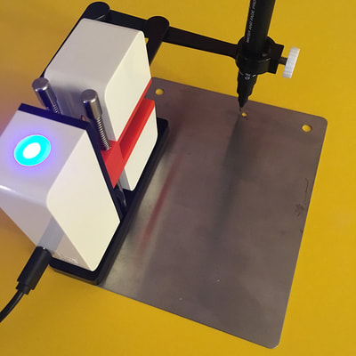
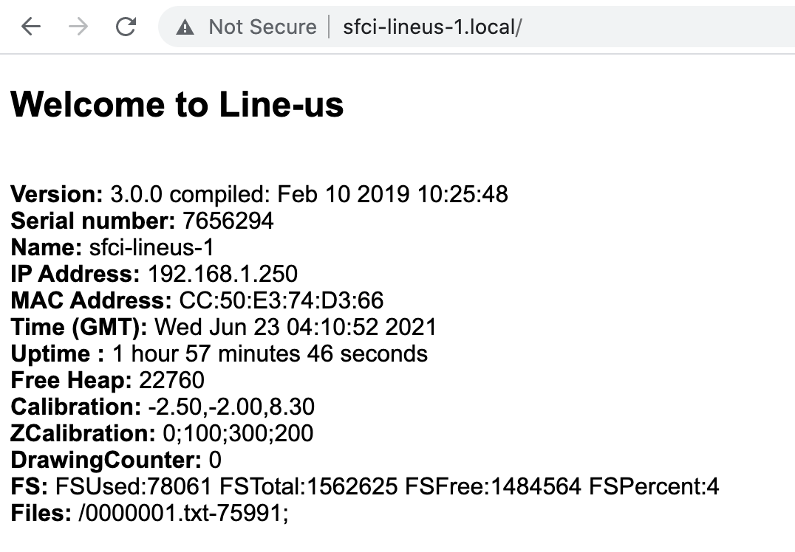
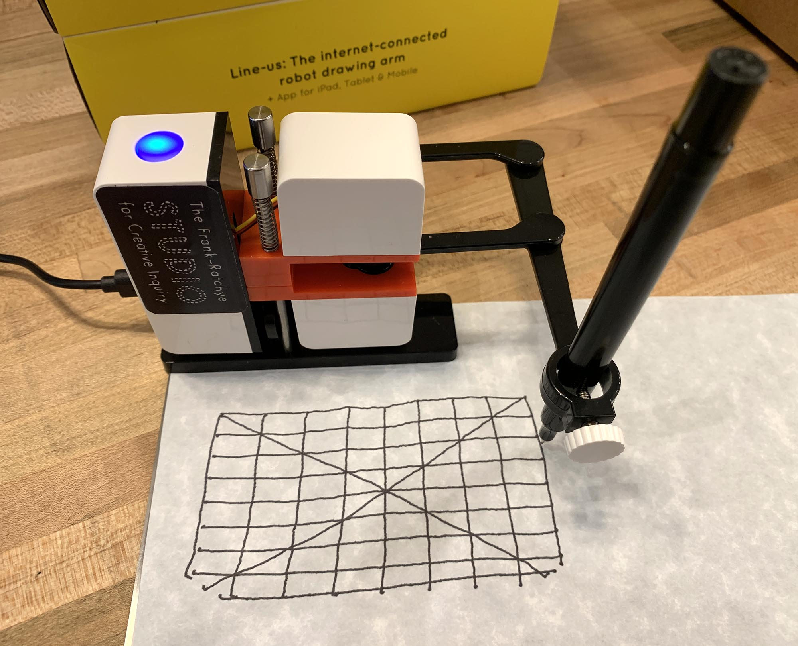
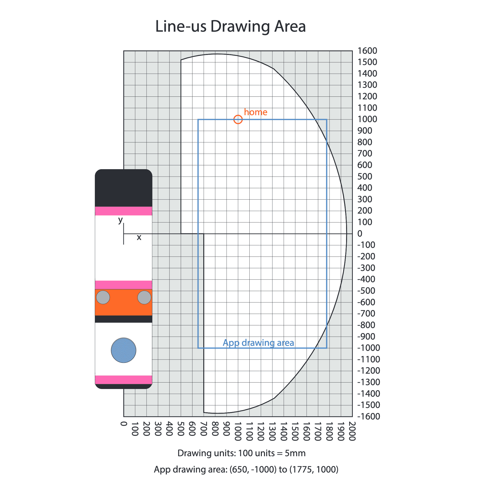

# Plotting with Line-Us

"[Line-us](https://www.line-us.com) is an internet connected robot drawing arm. It's small, portable and draws with a nice wobbly line using a real pen on paper."

#### Contents

* [Important Links](#important-links)
* [Line-Us Setup](#line-us-setup)
* [Programming Line-Us with p5.js](#programming-line-us-with-p5js)
* [Programming Line-Us with Processing (Java)](#programming-line-us-with-processing-java)
* [Programming Line-Us with Python](#programming-line-us-with-python)
* [Other Helpful Information](#other-helpful-information)

---

## Important Links

* [**First time Line-us set up**](https://www.line-us.com/help.html): Instructional information and video from the manufacturer.
* [**Getting Started with Line-us Programming**](https://github.com/Line-us/Line-us-Programming): The central source for programming Line-Us.
* [**Readymade SVG plotter for Line-Us**](https://github.com/golanlevin/DrawingWithMachines/tree/main/machines/line-us/processing/line_us_svg_converter_plotter), built in Processing v3/v4.


## Line-Us Setup



* **Download** and install the Line-Us app for your operating system from [line-us.com/software.html](https://www.line-us.com/software.html). (I've stashed a backup of the MacOS v3.0.0.33 app [here](tools/line-us-3.0.0build33.dmg), current as of 6/2001.) Don't launch the app yet. 
* **Arrange** Line-Us on its magnetic plate as shown above. When the pen is in its 'neutral' (home) position, it should be over the small hole.
* **Connect** Line-Us into a USB power supply or USB port, and wait for its light to flash blue.
* Hold its button down for 2 seconds until the light flashes red (putting the robot in "setup mode"). 
* **Connect** your computer to the new "Line-us-Setup" WiFi network. (Line-Us is now broadcasting a new temporary WiFi network called "Line-us-Setup" and is waiting for your computer to join this network. If necessary, you can also use this network when there is no local WiFi.)
* **Launch** the Line-Us app, and **instruct** Line-us how to join your local WiFi. You can now reconnect your computer to the local WiFi, too. See [here](https://www.line-us.com/help.html) for more detailed instructions on connecting to the WiFi. (The next time you turn Line-Us on it will automatically connect to the last WiFi it was on.) The light on Line-Us should be solid blue. 
* **Verify** that Line-Us is able to communicate and draw by making a scribble in the app (with the "Draw"/pencil mode), and then execute the drawing with the "Play" button in the upper right. 
* You can access more settings by horizontally dragging/sliding the buttons at the top of the Line-Us app. There you can access controls for **setting the pen height**. More information on setting the pen height is [here](https://www.line-us.com/help.html#3).
* You can also check to see if Line-Us is reachable on your local network, by typing its name correctly in the address bar of your browser. For example, one of our robots is named *sfci-lineus-1*, and you can see its vital information at: [http://sfci-lineus-1.local/](http://sfci-lineus-1.local/), which should look something like the following: 




---

## Programming Line-Us with p5.js

This section describes workflows for controlling Line-Us from p5.js. These workflows all use the JavaScript [Line-Us library by @beardicus](https://github.com/beardicus/line-us), which controls the Line-us robot via its websocket interface, and works in both Node.js and the browser. The examples below establish a work area of 1125 (w) x 2000 (h) units, with approximately 20 units per millimeter. 

*Note: p5.js cannot run Line-Us from sketches served online at https://editor.p5js.org, because Line-Us does not support secure web sockets, and browsers require secure websocket connections for secure (https) sites like the p5 Editor. This issue is discussed [here](https://forum.line-us.com/t/https-secure-websockets-only/586).*

#### Example projects 

* [**Calibration Grid**](p5js/lineus_p5js_calibration): a calibration grid (see image below). *Expect some nonlinearities*. 
* [**Lissajous Figure**](p5js/lineus_p5js_lissajous): a simple Lissajous figure.
* [**Mouse Playback**](p5js/lineus_p5js_mouserecording): a single mouse gesture is recorded into an array of points, and then rendered by the robot when the user presses a key.
* [**Realtime Control**](p5js/lineus_p5js_realtime): control Line-Us in real-time with the cursor.
* [**Line-Us via Node.js example**](https://github.com/pandrr/line-us): sends an array of commands to the line-us drawing machine via a net.Socket connection.



#### Instructions using p5.js Mode in the Processing IDE

*This workflow has been tested with Processing IDE versions 3.5.4 and 4.0a4 in MacOS 10.15.7.*

1. If you have not already done so, download and install the Processing IDE from [here](https://processing.org/download/). Launch the Processing IDE.
2. If you have not already done so, install the "p5.js Mode" for the Processing IDE. To do this, look for the *modes* menu on the top right corner of the IDE and select *Add mode…*. Select the p5.js Mode from the list and click *Install* to get it. Make sure it is the current mode. 
3. Download the complete directories for the examples you want to run (for example, in [this .zip](https://github.com/golanlevin/DrawingWithMachines/archive/refs/heads/main.zip)).
4. In the Processing IDE, File->Open the sketch you want to run. Navigate to its directory and open (for example) the file ```lineus_p5js_lissajous.js```.
5. Click the Run button in the upper left of the IDE. Your preferred browser should open up the sketch, hosted in a local server. The Line-Us robot should be controlled by the sketch. 

#### Instructions with a local server

1. Download the complete directories for the examples you want to run (for example, in [this .zip](https://github.com/golanlevin/DrawingWithMachines/archive/refs/heads/main.zip)). 
2. In MacOS Terminal, ```cd lineus_p5js_lissajous``` (or whichever directory your sketch is in).
3. In Terminal, launch a local server, as described [here](https://github.com/processing/p5.js/wiki/Local-server), with the command: ```python -m http.server```
4. In your browser, visit [```http://localhost:8000```](http://localhost:8000). The sketch should run, and the Line-Us robot should be controlled by the sketch. 

---

## Programming Line-Us with Processing (Java)

* [Processing code for a very simple example](https://github.com/Line-us/Line-us-Programming/blob/master/Processing/HelloWorld/HelloWorld.pde)
* [SVG loader/plotter for Line-Us, built in Processing](https://github.com/golanlevin/DrawingWithMachines/tree/main/machines/line-us/processing/line_us_svg_converter_plotter)

---

## Programming Line-Us with Python

* [The Official Line-us Python Module](https://github.com/Line-us/Line-us-Programming#official-python-module-for-line-us). It includes machine discovery via DNS-sd and access to all of the Line-us GCodes. There is a [quickstart guide](https://lineuspythonmodule.readthedocs.io/en/latest/#quickstart), full [documentation](https://lineuspythonmodule.readthedocs.io/en/latest/#module-lineus), and its [GitHub repository](https://github.com/Line-us/LineUsPythonModule).
* ["Hello World" Python example](https://github.com/Line-us/Line-us-Programming/blob/master/Python/HelloWorld.py)
* [WebSockets Python example](https://github.com/Line-us/Line-us-Programming/blob/master/Python/HelloWorldWebsockets.py)

---

## Other Helpful Information

* Line-Us may throw errors when receiving high-precision floating-point coordinates. It's recommended to transmit integer coordinates instead. 
* Here's a view of the Line-Us Drawing Area:


