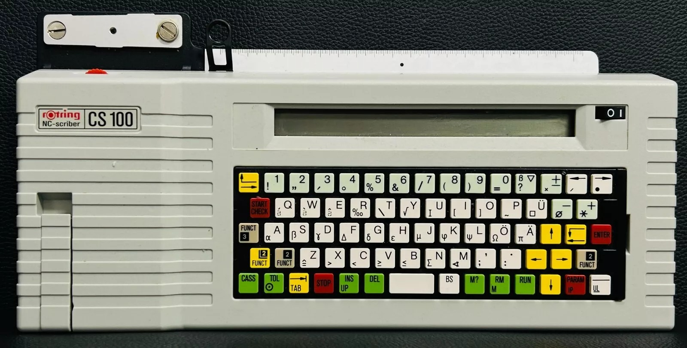
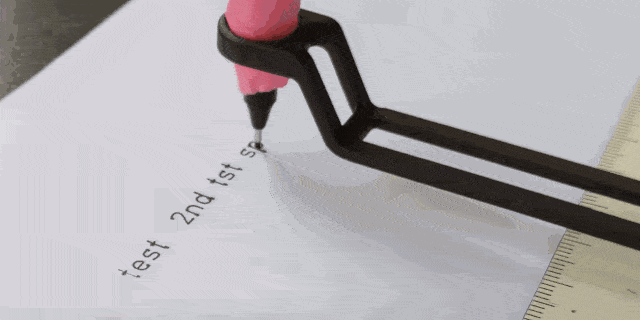
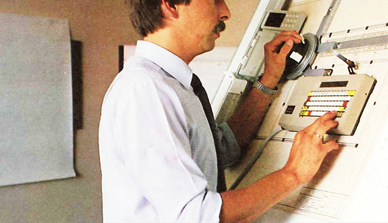

# Rotring NC-Scriber CS 100

* [**Operating Manual**](rotring_nc_scriber_cs_100_operating_instructions.pdf)
* [**Commercial Brochure**](rotring_nc_scriber_cs_100_brochure_1990.pdf)

The Rotring NC-Scriber CS-100 is a standalone electronic lettering machine developed in the 1980s for technical drafting applications. It combines a membrane keyboard with a precision plotting arm that moves a pen to draw typed text onto paper, creating consistent, mechanically-rendered lettering.

To operate it, place a sheet of paper under the plotting head, select a lettering size, and type on the built-in keyboard. The CS-100 draws each character in sequence using vector strokes, and includes controls for spacing and centering. There is no external communications port; the device is used manually.



---

### Links

* [Restoration of a Rotring NC-Scriber CS-50](https://nippard.com/2018/12/08/the-niche-80s-pen-plotter/)
* [Hacked NC-Scriber controlled by an Arduino](https://www.hackster.io/news/semi-autonomous-whiteboard-plotter-from-1980s-rotring-lettering-machine-48dae5276cab)
* [CS 100 Commercial brochure at Archive.org](https://archive.org/details/rotring-nc-scriber-cs-100-1990)
