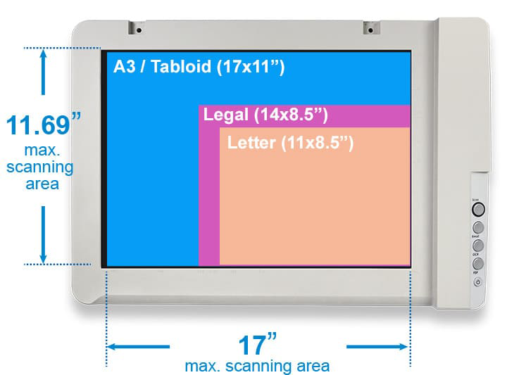

# Using the Plustek Scanner (2025)

*Instructions for using our classroom scanner: a [Plustek OpticSlim 1680](https://plustek.com/sa/products/flatbed-scanners/opticslim-1680/support.php), able to scan paper up to 11.69"x17" (tabloid). A PDF manual for the scanner is available [here](UG_Mac_OpticSlimA3Series_EN_v1.3.pdf).*

--- 

1. **Place** your artwork in the lower-right corner of the scanner. (You will observe markings for common paper sizes.) **Note**: the default orientation for scanning is *rotated 90°!* If your design is portrait, you will want to rotate it into a landscape orientation.
2. **Turn on** the scanner using the ⏻ power button in its lower-right corner. The button should glow blue.
3. **Launch** the "Image Capture" app on the Mac using the desktop shortcut named *"SCAN!"*. The program will immediately do a quick overview (preview) scan of your artwork. 
4. **Adjust** the size of the scanning area if necessary, in the "Size:" field of the Image Capture app. (You can also select a custom size, and modify the scanning area manually.)
5. **Choose** your scanning settings, such as color, resolution, file format, etc. I recommend scanning in Color, 600dpi, JPG. 
6. **Click** "Scan" in the lower right. Your file will be saved to the Mac's desktop.
7. **Move** your file to the thumb drive or upload it to an online location.
8. **Remove** your artwork from the scanner now that you're done. 

---
