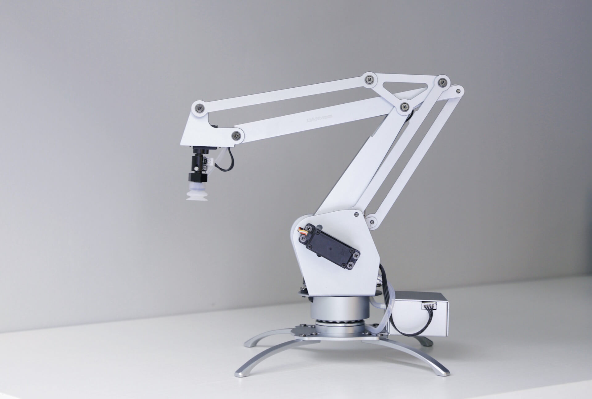

# uArm Metal

Documentation: 

* [uArm Metal Developer Guide](docs/uarm_metal_developer_guide.pdf)
* [uArm Metal Documentation](docs/uarm_metal_documentation.pdf)

Code to Control the uArm Metal: 

* [Manufacturer's repository](https://github.com/uArm-Developer/UF_uArm_Metal)
* [Crude realtime control in Processing](uarm_processing/uarm_processing.pde)

Some art that uses the uArm Metal: 

* Sougwen Chung, [*D.O.U.G.*](https://www.youtube.com/watch?v=jngkUu-aBz8) (2015)
* Simone Giertz, [*The Breakfast Machine*](https://www.youtube.com/watch?v=E2evC2xTNWg) (2015)
* Geoffrey Lillemon & Neil Mendoza, [*The Chronicles of Peen-Eye*](https://vimeo.com/112406583) (2015)