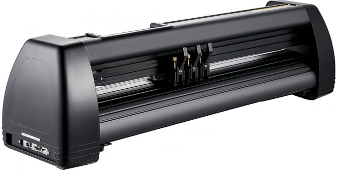
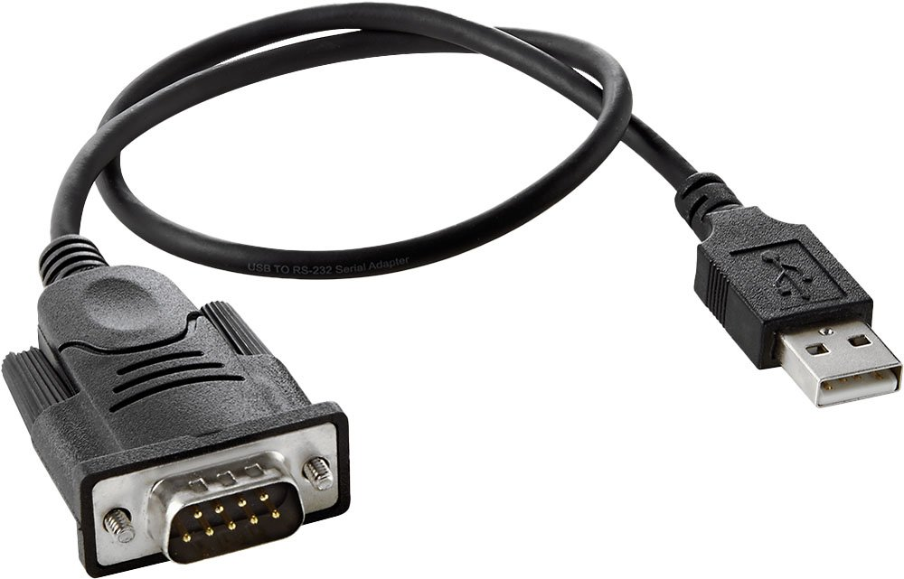
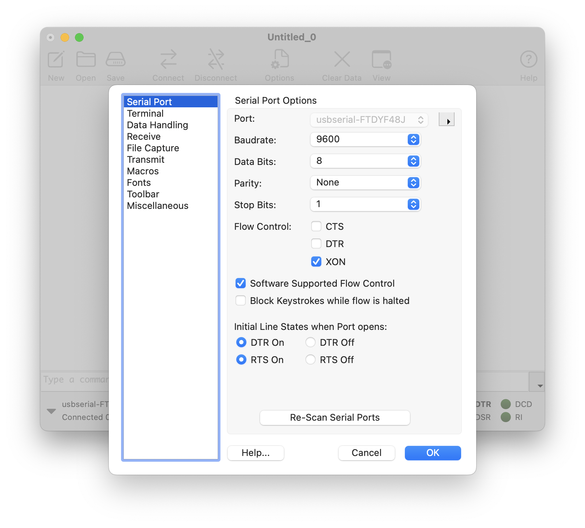

# Plotting with the USCutter MH871-MK2

*Adapted from [instructions](https://github.com/benfordslaw/uscutter-MH871-MK2-plotting/tree/main) kindly written by DwM2021 student, Benford Krummenacher.*

---

## 1. Convert SVG into HPGL using *vpype*

The USCutter’s axes are not very intuitive. It's sometimes helpful to stand on the right side of the machine and read the axes taped to the top. The y-direction runs parallel the machine, so you must generate an SVG with a height less than the width of the machine: 34 inches. 30 inches is generally the most you want to go. The plotter is fed in the x-direction, sometimes via a spool, so your SVG can have any width as long as it is smaller than your paper's width. If it is not, your paper will fall out of the plotter. Another size limitation on the fed paper is in the y-direction. If your paper cannot be securely held by the rollers, it will not properly move. One way to plot on smaller paper is to attach it on top of a larger sheet of paper which is able to be held by the rollers (thank you Hima for this suggestion).

As with the HP7475A ([instructions here](../hp7475a/README.md)), the USCutter MH871-MK2 uses HPGL files, but it wants a very slightly different format. Download this config file, [**MH871-MK2.toml**](MH871-MK2.toml) into your project’s directory. This is a user-provided configuration file required to build the right kind of HPGL file. For more information or to modify this file, [this link](https://vpype.readthedocs.io/en/latest/cookbook.html#faq-custom-hpgl-config) provides helpful reference.

Note on the machine and in the configuration file that **1 inch is equivalent to 1000 units**. Therefore your plot should be under 30,000 units tall.

You should have a working *vpype* virtual environment. For information on how to set that up, see the document, [*Prepping SVGs for Plotting with vpype*](../../generating_svg/vpype_svg_prep/README.md). Now In a VPYPE environment, run:

`vpype --config MH871-MK2.toml read PATH/TO/SVG.svg write -d MH871-MK2 -p MH871-MK2 OUTPUT_HPGL.hpgl`

This will create an HPGL file named `OUTPUT_HPGL.hpgl`, or whatever you rename it to.

You can open and check your outputted HPGL in InkScape. Don't worry about the bounds of the A4 paper that InkScape defaults to, but **do** make sure that your sketch is to the right of the paper’s left edge and above the paper’s bottom edge. This is because the origin is at the bottom left of the HPGL file. If you care to, it is completely fine to manually move your drawing in InkScape and save it. Alternatively, you can translate your drawing with *vpype*, or modify the origin location's y-coordinate in the .toml file.

---

## 2. Set up the USCutter

*Official USCutter manuals can be found here:*

* [mh871-manual.pdf](mh871-manual.pdf)
* [mh-manual-09172019.pdf](mh-manual-09172019.pdf)

Turn on the plotter by flipping the power switch on the left side of the machine. 

To load your roll of paper, flip all three of the anchor levers into the vertical position. This raises the rollers, allowing you to slide the paper under them. Load from the back of the machine, as it will pull paper from that direction as it plots. If you are loading from a spool, make sure the plotter is parallel to the spool and that nothing will interfere with the machine's ability to pull paper from it smoothly. Once your paper is perpendicular to the pen's range (it can be useful to line up one side of the paper with one of the ruler marks on the plotter), lower the rollers such that one is 1-2 inches from each edge of the paper and one is in the center of the paper. Heavier paper works best.

Loosen the screw on the pen-holder and push the pen-holder down. Load your drawing instrument so that it touches the paper firmly and tighten the screw. If your drawing instrument is too small, wrap tape around it until it is thick enough to be held securely in the pen-holder. Release the pen-holder into the pen-up position and press `Test` on the USCutter. This should plot a star in a square. Manually adjust your pen’s height in the holder if necessary. 

Unlike the AxiDraw, the USCutter’s origin is in the bottom left corner. Accordingly, slide the plotter head all the way to the right of the machine. This is going to be the ‘bottom’ of the page according to its axes. When the plotter head is where you want the bottom boundary of your drawing to be, press `Origin.` This will push the pen down briefly, leaving a little dot. Put a piece of artist-tape or scrap paper under the pen when setting the origin to protect your plot if you need to, otherwise you'll have a dot on your nice paper. You can also pull the paper further out after setting the origin.

Connect your laptop via USB to the serial port on the USCutter before opening CoolTerm or other terminal program. You'll need a USB-to-DB9 serial cable, potentially with an USBA-to-USBC adaptor for your laptop: 

---

## 3. Transmit HPGL to the USCutter from your Laptop

* Download [CoolTerm (Mac)](https://www.freeware.the-meiers.org/). Some backup installers for CoolTerm can be found [here](../hp7475a/tools/).
* Your laptop may not allow you to open the application. If this happens, go to `Settings > Security & Privacy`, click the lock, and press `Open Anyway`.
* In the CoolTerm menu, go to `Connection > Options`. For `Port`, select the usb port connected to the USCutter. For `BaudRate`, choose `9600`. For `Flow Control`, select `XON only`. Be sure to select `Software Supported Flow Control`.
* Press `Connection > Connect`, then `Connection > Send Text/Binary File`. Select your HPGL file and press OK. 
* **Before plotting**, make sure to `Test` with any new settings or any new pen!
* **Do not let your laptop sleep!** — The plotter will stop and sometimes draw random lines. If there are any issues while plotting, press `Reset` on the USCutter, then press `Cancel` on your device. If you do not press `Cancel`, your device is still transmitting instructions to the plotter. If the pen is stuck in the down position, press `Reset` again on the USCutter.
* If you would like to change the `Cut Speed` or `Cut Pressure`, both are possible by pressing `Setup` and using the arrows as marked. Do not do so while the plot is in progress; it will freeze and draw random lines.

---

#### *Addendum: Transmitting to the USCutter with the "STUDIO Pinky Toe" Mini-PC (2021)*

*The STUDIO for Creative Inquiry has a tiny WindowsXP PC that can be used to control the USCutter (instead of using your laptop). This is helpful for long plots. Thanks to Perry Naseck for setting up this computer.*

* Unplug the USB drive from the USB Hub on the computer next to the plotter. Plug it into your device and copy your HPGL files. Plug it back into the USB hub.
* Verify that the LED in the dedicated serial cable is glowing blue. If it is not, verify that all cables are fully plugged in.
* Open CoolTerm from the Desktop. The default settings should be as shown in the above section, with `COM3` as the `Port`, but it doesn't hurt to double-check. 
* Press `Connection > Connect`, then `Connection > Send Text/Binary File`. Navigate to the USB drive, select `All Files (*.*)`, select your HPGL file, and press OK. If there are any issues while plotting, press `Reset` on the USCutter, then press `Cancel` on your device. If you do not press `Cancel`, your device is still transmitting instructions to the plotter. If the pen is stuck in the down position, press `Reset` again on the USCutter.
* If you would like to change the `Cut Speed` or `Cut Pressure`, both possible by pressing `Setup` and using the arrows as marked, do not do so while the plot is in progress. It will freeze and draw random lines. Make sure to `Test` with any new settings or any new pen before plotting!
