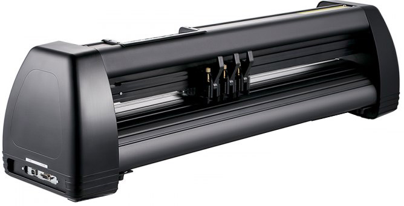
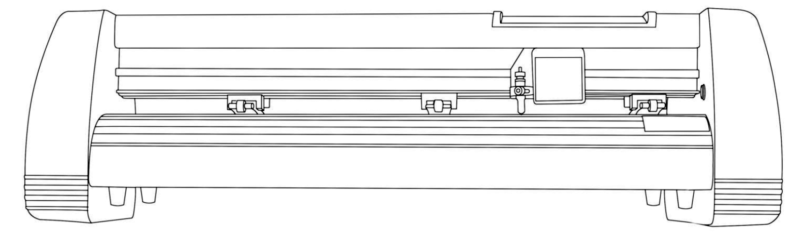
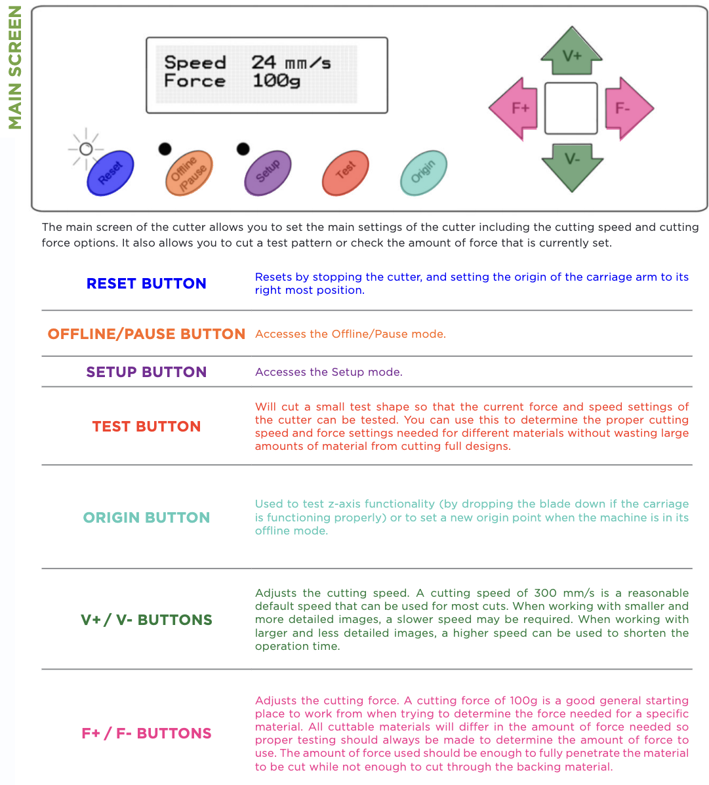
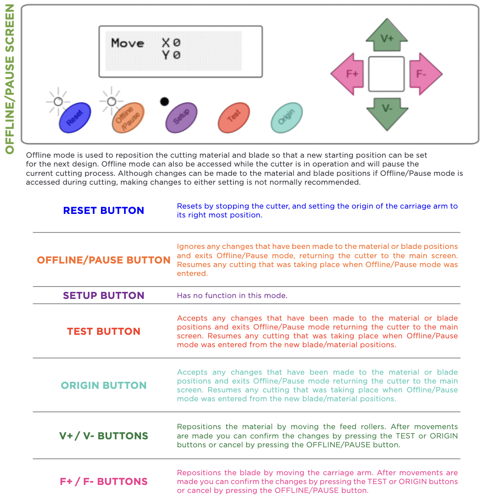
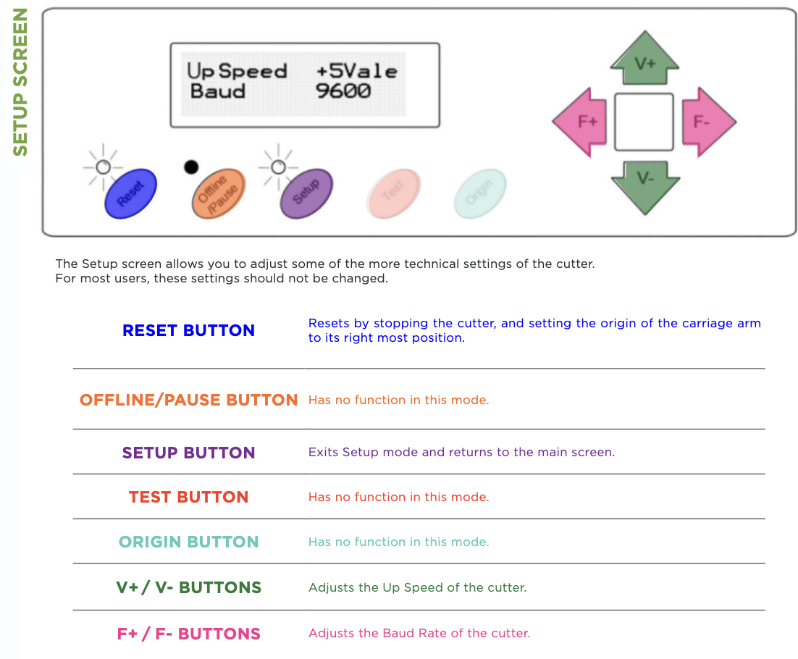
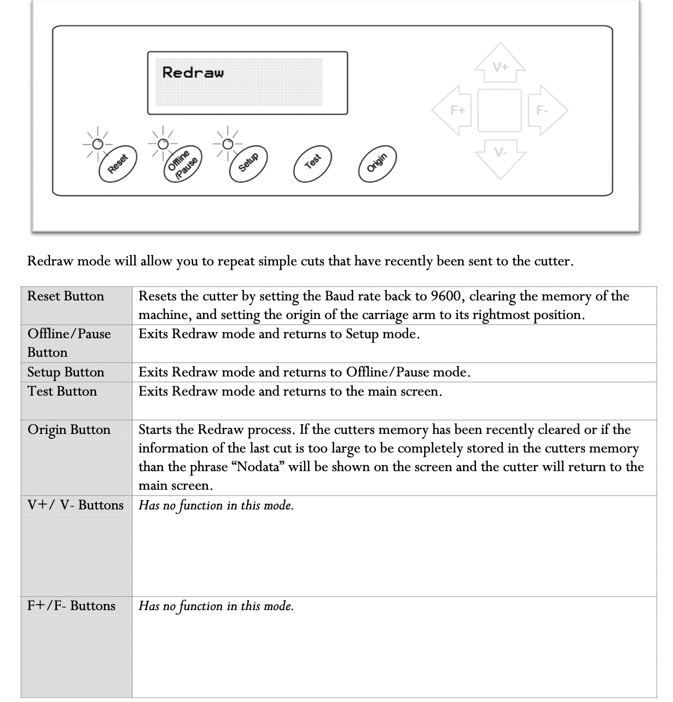
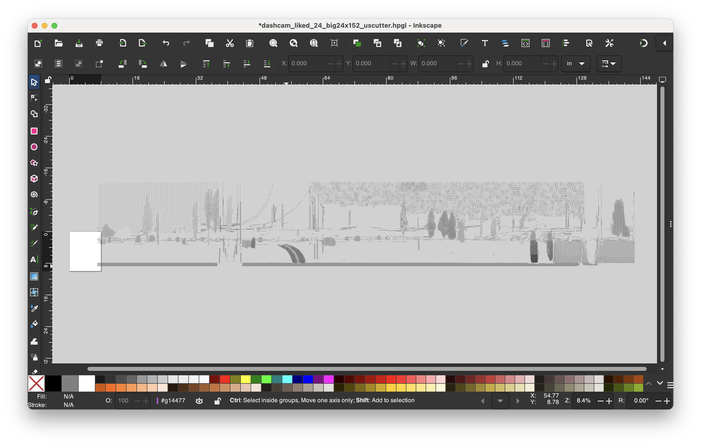

# USCutter MH871-MK2



This document provides instructions for plotting with a **USCutter MH871-MK2**. It is adapted from [work by Lorie Chen](https://github.com/ylchen333/USCutter_MH871-MK2_Instructions) (BCSA '26) and [work by Benford Krummenacher](https://github.com/benfordslaw/uscutter-MH871-MK2-plotting) (BSA '23), both former DwM students. This document supercedes [this older version](README_2024.md).

**The official USCutter manuals are here:**

* [mh871-manual.pdf](pdf/mh871-manual.pdf)
* [mh-manual-09172019.pdf](pdf/mh-manual-09172019.pdf)

**Contents:**

* [Introduction to the USCutter](#introduction-to-the-uscutter)
* [Configuring vpype for USCutter files](#configuring-vpype-for-uscutter-files)
  * [Plotting Non-standard Page Sizes](#plotting-non-standard-page-sizes)
  * [SVG to HPGL conversion commands](#svg-to-hpgl-conversion-commands)
* [Setting up the USCutter](#setting-up-the-uscutter)
* [Transmitting to the USCutter from your laptop](#transmitting-to-the-uscutter-from-your-laptop)
* [Notes from experience](#notes-from-experience)

---

## Introduction to the USCutter



Orient the plotter as shown in the diagram above, with the top-buttons on the right side. These buttons have different functions based on the current state of the machine, as indicated by the lights above the buttons. **Read the following** (I beg you, it's absolutely necessary to operate this thing):

### Main Screen



### Offline/Pause Screen



### Setup Screen



### Redraw Screen

The "redraw" functionality is useful if you need to produce many copies of a plot.



---

## Configuring *vpype* for USCutter files

As with the HP7475A ([instructions here](../hp7475a/README.md)), the USCutter MH871-MK2 uses HPGL files, but it wants a very slightly different format. Be sure to have a working *vpype* virtual environment to convert SVG files to HPGL; for information on how to set that up, see the document, [*Prepping SVGs for Plotting with vpype*](../../generating_svg/vpype_svg_prep/README.md).

The USCutter’s axes are not very intuitive. It's sometimes helpful to stand on the right side of the machine and read the axes taped to the top. The y-direction runs parallel the machine, so you must generate an SVG with a height less than the width of the machine: 34 inches. 30 inches is generally the most you want to go. The plotter is fed in the x-direction, sometimes via a spool, so your SVG can have any width as long as it is smaller than your paper's width. If it is not, your paper will fall out of the plotter. Another size limitation on the fed paper is in the y-direction. If your paper cannot be securely held by the rollers, it will not properly move. One way to plot on smaller paper is to attach it on top of a larger sheet of paper which is able to be held by the rollers (thank you Hima for this suggestion). If you do this, try to ensure that you are securing the smaller sheet of paper completely parallel to the larger sheet of paper. Doing otherwise will cause unwanted warping due to two different curved planes.

Download [MH871-MK2.toml](MH871-MK2.toml) into your project’s directory. This is a user-provided configuration file required to build the right kind of HPGL file. For more information or to modify this file, [this link](https://vpype.readthedocs.io/en/latest/cookbook.html#faq-custom-hpgl-config) provides helpful reference. The contents of MH871-MK2.toml look like this: 

```
[device.MH871-MK2]
name = "MH871-MK2"
plotter_unit_length = "0.001in"
pen_count = 1
[[device.MH871-MK2.paper]]
name = "MH871-MK2"
paper_orientation = "portrait"
origin_location = ["0in", "0in"]
origin_location_reference = "topleft"
y_range = [0, 30000]
y_axis_up = false
rotate_180 = false
```

**Note**: on the machine and in the configuration file, 1 inch is equivalent to 1000 units. Therefore your plot should be under 30,000 units tall (along the +y-axis of the plotter).

### Plotting Non-standard Page Sizes

As long as you have +inf paper, you can theoretically plot from 0 to +inf along the x-axis of the plotter. If you want to plot multiple smaller plots, its beneficial to plot side by side across the y-axis of the plotter rather than continuing down the x-axis. You could format this in your SVG/HPGL file but I'm lazy and the following method works fine.

For some X-AXIS-LENGTH > 0 and 30 > Y-AXIS-LENGTH > 0 (assume units to be inches), we can **modify** our [MH871-MK2.toml](./MH871-MK2.toml) configuration file to strictly plot within the bounds of [0, X-AXIS-LENGTH] along the x-axis and [0, Y-AXIS-LENGTH] along the y-axis.

~~~
[device.MH871-MK2]
name = "MH871-MK2"
plotter_unit_length = "0.001in" 
pen_count = 1 

[[device.MH871-MK2.paper]]
name = "MH871-MK2"

# ---------- DO NOT CHANGE above this line
paper_orientation = "portrait" 
# changing ^ this to landscape 
# supposedly "landscape" means the X-axis is along the long edge
# if you format the SVG to the specific dimensions 
# X-AXIS-LENGTH x Y-AXIS-LENGTH, you don't need to change this

origin_location = ["0in", "Y-AXIS-LENGTHin"]
# ^ change this to your specific dimensions

# ---------- DO NOT CHANGE the following 3 lines 
origin_location_reference = "topleft"
y_range = [0, 30000]
y_axis_up = true

# change this if you want, it will rotate 
# the entire page 180 degrees including all geometries:
rotate_180 = false
~~~


### SVG-to-HPGL conversion commands

I would recommend that you do the following two steps:

1. First use *vpype* to explicitly set the resulting plot size
2. Then, convert to HPGL

Specifically, in a *vpype* environment, run the two commands:

1. ```vpype read PATH/TO/SVG.svg scaleto X-AXIS-LENGTHin Y-AXIS-LENGTHin layout --landscape X-AXIS-LENGTHxY-AXIS-LENGTHin write --page-size X-AXIS-LENGTHxY-AXIS-LENGTHin -c PATH/TO/FORMATTED_SVG.svg show```
2. ```vpype --config MH871-MK2.toml read PATH/TO/FORMATTED_SVG.svg write -d MH871-MK2 -p MH871-MK2 OUTPUT_HPGL.hpgl```

These commands will create an HPGL file named `OUTPUT_HPGL.hpgl`, or whatever you rename it to. This should plot strictly in the rectangle with a bottom left corner at the origin you set and top-right corner `(X-AXIS-LENGTH, Y-AXIS-LENGTH)`.

**Note:** Doing *only* step 2 can result in incorrect geometries! For example, if you have the `rotate_180=true`, the geometries will be rotated with respect to the entire paper rotating and same logic goes for `paper_orientation = "portrait"`. This can result in mirrored plot results and/or plotting off the page.

You can open and **SHOULD** check your outputted HPGL in InkScape. Pay little attention to the bounds of the A4 paper that InkScape defaults to, but **do** make sure that your sketch is to the right of the paper’s left edge and above the paper’s bottom edge! This is because the origin is at the bottom left of the HPGL file. If you care to, it is completely fine to manually move your drawing in InkScape and save it. Alternatively, you can modify the origin location's y-coordinate in the `.toml` file.

If you'd like your USCutter to return to it's 'origin' after plotting, run
```&& sed -i '' 's/PA;PU;SP0;IN;$/PA;PU0,0;SP0;IN;/' OUTPUT_HPGL.hpgl```
This just hard codes "return to origin" in the HPGL.

Here are some examples of what you *do* and *don't* want to see in InkScape:

#### **DO:**



Things to check:

- the y-axis ruler along the left side of InkScape can be changed to in by right/two-finger clicking on the ruler. Check that the y-axis length of the HPGL is less than 30 in. Observe that in the above example, our HPGL ranges from -10in to +13/14in, which aligns with the expected Y-AXIS-LENGTH = 24in. 
- Also note that the plot doesn't start below the A4 paper's bottom edge or left of the A4 paper's left edge.

#### **DON'T:**

![X-AXIS-LENGTH = 152in, Y-AXIS-LENGTH = 24in (with 1.25in margins, along y-axis). Bad config file with incorrect origin_location at [0in, 15in]](img/inkscape_example_incorrect.png)

---


## Setting up the USCutter

Turn on the plotter by flipping the power switch on the left side of the machine.

To load paper, flip all three of the anchor levers into the vertical position. This raises the rollers, allowing you to slide the paper under them. Load from the back of the machine, as it will pull paper from that direction as it plots. If you are loading from a spool, make sure the plotter is parallel to the spool and that nothing will interfere with the machine's ability to pull paper from it smoothly. Once your paper is perpendicular to the pen's range (it can be useful to line up one side of the paper with one of the ruler marks on the plotter), lower the rollers such that one is 1-2 inches from each edge of the paper and one is in the center of the paper. Heavier paper works best, but there is plenty of thin paper available, either on the ground or hanging behind the machine.

Loosen the screw on the pen-holder and push the pen-holder down. Load your drawing instrument so that it touches the paper firmly and tighten the screw. If your drawing instrument is too small, wrap tape around it until it is thick enough to be held securely in the pen-holder. Release the pen-holder into the pen-up position and press Test on the USCutter. This should plot a star in a square. Manually adjust your pen’s height in the holder if necessary.

Unlike the AxiDraw, the USCutter’s origin is in the bottom left corner. Accordingly, slide the plotter head all the way to the right of the machine. This is going to the ‘bottom’ of the page according to its axes. When the plotter head is where you want the bottom boundary of your drawing to be, press Origin. This will push the pen down briefly, leaving a little dot. Put a piece of tape or scrap paper under the pen when setting the origin to protect your plot if you need to. You can also pull the paper further out after setting the origin.

---

## Transmitting to the USCutter from your laptop

*Always check before plotting*: For the USCutter to properly receive data, you must ensure that the plotter is configured at the correct baud rate — generally, 9600. You can check this by hitting `F+` / `F-` from the Setup Screen (see below for more details).

* If you have a Mac, CoolTerm is the recommended terminal program for transmitting HPGL to the USCutter. You can [download it here)](https://www.freeware.the-meiers.org/), and here is [an example CoolTerm configuration file](./us_cutter_coolterm_config.CoolTermSettings).
* Your Mac may not allow you to open the CoolTerm application. If this happens, go to ```Settings > Security & Privacy```, click the lock, and press ```Open Anyway```. It's safe!
* Connect your laptop via USB to the serial port on the USCutter before opening CoolTerm.
* In the CoolTerm menu, go to ```Connection > Options```. 
  * For ```Port```, select the usb port connected to the USCutter. 
  * For ```BaudRate```, choose ```9600```. 
  * For ```Flow Control```, select ```XON``` only. 
  * Be sure to select ```Software Supported Flow Control```.
* **Check during setup**: For the USCutter to properly receive data, you must ensure that the plotter is also receiving at a 9600 baudrate. 
* Press ```Connection > Connect```, then ```Connection > Send Text/Binary File```. Select your HPGL file and press ```OK```.

---

## Notes from experience

* **Get good alignment.** Try to make the paper roll at the bottom completely aligned with the left side of the plotter. Check this by using the `V+` / `V-` to roll the paper back and forth a couple of times.
* **Do not let your laptop sleep**! Turn off your screensaver and/or power saver. If this happens, the plotter may stop and draw random lines due to faulty data transmission. If there are any issues while plotting, press *Reset* on the USCutter, then press *Cancel* on your laptop. If you do not press *Cancel*, your laptop is still transmitting instructions to the plotter. If the pen is stuck in the down position, press *Reset* again on the USCutter.
* **You can pause, briefly.** In the middle of a plot, hitting *Offline Mode* will pause the plot and then hitting *Offline/test/origin* will unpause the plot. Caution when doing this for extremely long plots, though; data may get overwritten and cause the coordinates to get displaced.
* **Thin paper may suffer.** If you observe the rolling mechanism of the USCutter carefully, you'll see that it consists of a pinch rollers (the three small plastic rollers on top) and the feed roller (longer roller with pointed teeth that runs across the drawing plane of the plotter). With this, thinner paper becomes more prone to tearing due to the rollers embossing a bunch of little divits in the paper, which can warp the paper.
* [**Yupo paper is great**](https://www.amazon.com/Yupo-Polypropylene-Roll-60Inch-10Yds/dp/B0149HFLAI/), as it's heavyweight and made of plastic. Vinyl should work too (it's a vinyl cutter after all).

---
