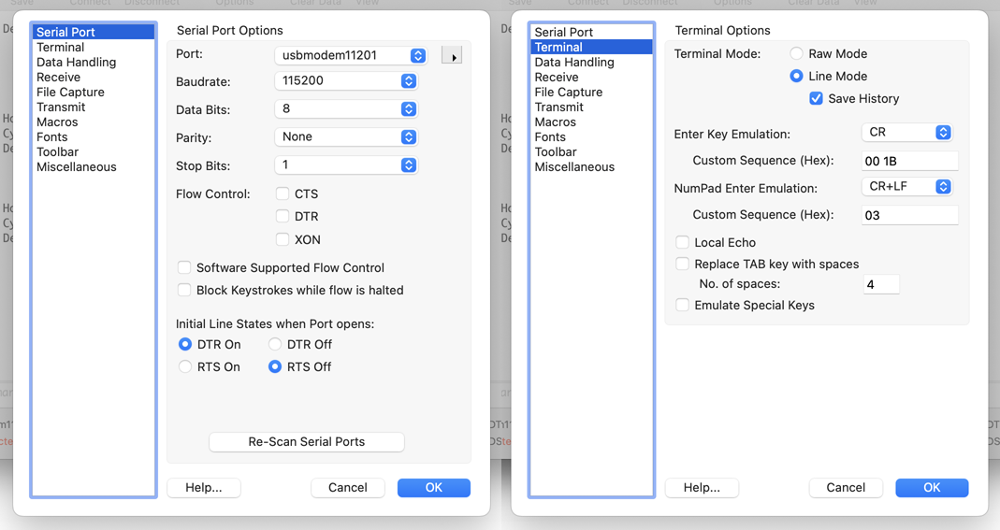
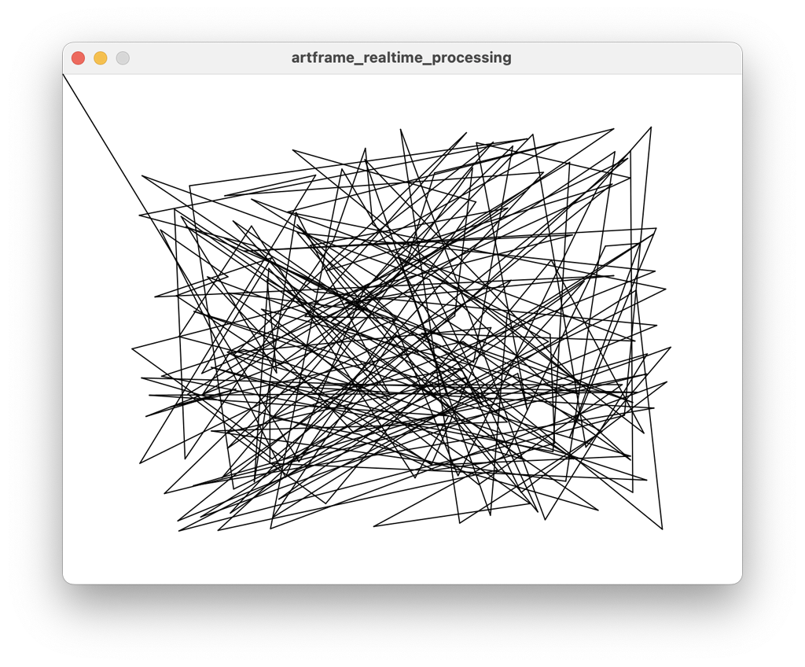

# Realtime: Bantam ArtFrame 1824 

This page presents some resources for controlling the Bantam ArtFrame 1824 in real-time, using GCode: 

* [Realtime GCode via the `fluidterm.py` Terminal Program](#realtime-gcode-via-the-fluidtermpy-terminal-program)
* [Realtime GCode via CoolTerm](#realtime-gcode-via-coolterm)
* [Realtime GCode via Processing (Java)](#realtime-gcode-in-processing-java)


---

## Realtime GCode via the `fluidterm.py` Terminal Program

Bantam provides [fluidterm.py](fluidterm.py), a terminal program coded in Python which allows realtime GCode communications with the ArtFrame. This software can send GCode interactively, and can also stream GCode files to the plotter. [This version of fluidterm.py](fluidterm.py) is customized for the ArtFrame. 

As always when using Python, [working within a virtual environment](https://docs.python.org/3/library/venv.html) is very strongly recommended. The following workflow is known to work in a Python 3.10 virtual environment. Note that Fluidterm.py requires the following installs: 

```
pip install pyserial
pip install xmodem
```

Once Fluidterm.py and its dependencies are installed, connect the ArtFrame via USB-B serial cable and in your virtual environment, run:

```
python3 fluidterm.py -
```

This will list available serial ports. Then re-run the program with the name of the ArtFrame's serial port as an argument (such as, for example): 

```
python3 fluidterm.py /dev/cu.usbmodem11201
```

Fluidterm will connect to the plotter (*the default serial configuration is 115200kbps with 8,N,1*). Hit 'return' a couple of times on your keyboard until you see the `ok` response. Then type the following to home the plotter: 

```
$H
```

You can then execute typical GCode commands in real time, such as the following: 

```
G90
G1 X300.0 Y250.0 Z30.0 F5000
```

Note: 

* The units here are millimeters. Decimal fractions of millimeters are fine.
* On the ArtFrame 1824, the acceptable range for `X` is 0 to 18"x25.4mm/in = 457.2
* The acceptable range for `Y` is 0 to 24"x25.4mm/in = 609.6
* The acceptable range for `Z` is 0 to 60.0, where Z+ is upwards. 
* The acceptable range for `F` (feed speed) is 0-15000 mm/min. For
ballpoint pens, a recommended feedrate is 10000 mm/min.
* Exceeding any of the XYZ workspace ranges will trigger alarms that stop the plotting process and require you to reboot the plotter.
* The plotter will continually interpolate from one point to the next. If you need a pen up between two different pen downs, do it with four commands, or else you will end up streaking your pen across the page. For example: 

```
G1 X200 Y300 Z10 F5000 (the pen is down)
G1 X200 Y300 Z50 F5000 (in the same spot, lift the pen)
G1 X345 Y678 Z50 F5000 (move the pen -- but keep it raised!)
G1 X345 Y678 Z10 F5000 (in the same spot, NOW lower the pen)

```


The following GCode commands are well-supported by the Bantam ArtFrame. (More information about the GCodes supported by the Bantam ArtFrame are available in the [Bantam Tools ArtFrame User Guide](../../machines/bantam_artframe_1824/ArtFrame_Guide_v1-1-1.pdf), Chapter 6, pp 45-50.)

* `$H` to tell the machine to home itself
* `F` for feed rate
* `G0` Rapid motion
* `G1` Motion at feed rate
* `G2`, `G3` Arc motion at feedrate
* `I` `J` `K` `R` for arc parameters
* `G4` Dwell
* `G21` Specify units in mm
* `G53` Use machine coordinates
* `G90` Absolute distance mode
* `G91` Relative distance mode
* `M0`, `M2`, `M30` for pausing and program end

Here is an example GCode program. Note that the ArtFrame prefers the style of GCode comments which are written in parentheses.

```
$H (home the machine)
G21 (set units to millimeters)
G90 (set to absolute positioning mode)
G0 Z5 (raise the pen 5mm, using rapid motion)
G1 X 300.0 Y 250.0 Z 10.0 F 5000 (go to 300,500,10 at 5000mm/min)
G1 X250Y350Z10 (spaces are optional)
G1 Y150 (only new information is necessary)
G0 Z55 (lift the pen close to the max height when we're done)
G0 X0 Y0 (move to origin when we're done)
M2 (end of program)
```

### Streaming a GCode file to ArtFrame using `fluidterm.py`

It is also possible to use `fluidterm.py` to stream a GCode file to the plotter. Here are instructions: 

* While your computer is running `fluidterm.py` and is connected to the ArtFrame:
* Press **Ctrl+S** to invoke the `stream_file()` function.
* This will open a file picker dialog (on macOS it uses AppleScript; on other platforms Tkinter).
* Select your GCode file (e.g., `program.gcode`) and hit 'return' to proceed through the dialogues. 
* Fluidterm then streams the file line-by-line to the plotter. You'll observe that it waits for an `ok` response from the plotter after each GCode command before sending the next one. 
* Fluidterm ignores empty lines, GCode comments, and `M0` commands.


---

## Realtime GCode via CoolTerm

A CoolTerm configuration file for realtime communication with the Bantam ArtFrame plotter can be found here ([artframe_coolterm_config.stc](coolterm_config/artframe_coolterm_config.stc)) and is also documented below. It is possible to use this to send individual GCode commands to the plotter, as well as complete GCode files. 



**Summary of settings:**

* Baud Rate:	**115200**
* Data Bits:	**8**
* Parity:	**None**
* Stop Bits:	**1**
* CTS flow control: **Disable**.
* DTR flow control: **Disable**.
* XON flow control: **Disable**.
* Software Supported Flow Control: **Disable**.
* Block keystrokes while flow is halted: **Disable**.
* Initial line states when Port opens: **DTR = ON**.
* Initial line states when Port opens: **RTS = OFF**.
* Terminal Mode: **Line Mode**.
* Enter Key Emulation: **CR**.

---

## Realtime GCode in Processing (Java)

Here is a minimal [Processing](https://processing.org/) (Java) program that moves the toolpoint to a random location every 5 seconds. There is no closed-loop feedback. 


```java
import processing.serial.*;
Serial myPort;

final int maxX = 609; // mm: 24"*25.4mm/in
final int maxY = 457; // mm: 18"*25.4mm/in
int period = 5000;  // milliseconds
int lastExecutionTime = 0; 

void setup(){
  size(609, 457); 
  myPort = new Serial(this, "/dev/cu.usbmodem11201", 115200);
  myPort.clear();
  
  delay(1000);             // Wait for the port to settle
  sendGCodeCommand("$H");  // Home the machine
  delay(10000);            // Wait for homing to complete
  
  sendGCodeCommand("G21"); // Set units to millimeters
  sendGCodeCommand("G90"); // Set to absolute positioning mode
}

void draw(){
  background(255); 
  int now = millis(); 
  if ((now - lastExecutionTime) > period){
    float randomX = maxX * random(0.1, 0.9);
    float randomY = maxY * random(0.1, 0.9);
    
    String gcodeCommand = "G1 ";
    gcodeCommand += "X " + randomX + " "; 
    gcodeCommand += "Y " + randomY + " ";
    gcodeCommand += "Z 20" + " ";
    gcodeCommand += "F 10000" + " ";
     
    sendGCodeCommand(gcodeCommand);
    lastExecutionTime = now; 
  }
}

void sendGCodeCommand(String cmd){
  // println("Sending: " + cmd);
  myPort.write(cmd + "\r"); // FluidNC expects CR line endings
}
```



[Here](artframe_realtime_processing/artframe_realtime_processing.pde) is a better, more elaborated Processing program which waits for an "`ok`" message after each action, and cleans up after itself properly: 

```java
import processing.serial.*;

Serial myPort = null;
String serialBuffer = "";
boolean bVerbose = true; 
boolean bWaitingForOK = true;
float px,py; // prev point

final int maxX = 609; // 24x18" in mm
final int maxY = 457; 

void setup(){
  size(609, 457); 
  background(255); 
  
  String portName = "/dev/cu.usbmodem1301"; 
  try {
    myPort = new Serial(this, portName, 115200);
    myPort.clear();
  } catch (RuntimeException e) {
    println("Could not open serial port: " + portName);
    println("Available ports are:");
    printArray(Serial.list());
  }
  
  delay(1000);             // Wait for the port to settle
  if (myPort != null){
    sendGCodeCommand("$H");  // Home the machine
    delay(10000);            // Wait for homing to complete
    sendGCodeCommand("G90"); // Absolute positioning mode
    String cmd = createG1MotionCommand(maxX/2, maxY/2, 20, 10000); 
    sendGCodeCommand(cmd);
  }
}

void draw(){
  checkForOK(); // poll for return value
  if (!bWaitingForOK) {
    
    // Generate a random destination
    float randomX = maxX * random(0.1, 0.9);
    float randomY = maxY * random(0.1, 0.9);
    
    // Draw a debug view line
    line(px,py, randomX,randomY); 

    // Construct and transmit the GCode command
    String gcodeCommand = createG1MotionCommand(randomX, randomY, 20, 10000); 
    sendGCodeCommand(gcodeCommand);
    
    // Update state machine
    bWaitingForOK = true;
    px = randomX; 
    py = randomY; 
  }
}

void keyPressed(){
  bWaitingForOK = false; 
}


void checkForOK() {
  // The ArtFrame returns the String "ok" when an action completes.
  if (myPort != null){
    while (myPort.available() > 0) {
      char inChar = myPort.readChar();
      if (inChar == '\n' || inChar == '\r') {
        if (serialBuffer.trim().length() > 0) {
          if (bVerbose){
            println("Received: " + serialBuffer.trim());
          }
        }
        if (serialBuffer.trim().equals("ok")) {
          bWaitingForOK = false;
        }
        serialBuffer = "";
      } else {
        serialBuffer += inChar;
      }
    }
  } else {
    bWaitingForOK = false; 
  }
}

String createG1MotionCommand(float x, float y, float z, float f){
  String cmd = "G1 ";
  cmd += "X" + nf(x, 0, 3) + " "; 
  cmd += "Y" + nf(y, 0, 3) + " ";
  cmd += "Z" + nf(z, 0, 3) + " ";
  cmd += "F" + int(f);
  return cmd; 
}

void sendGCodeCommand(String cmd){
  if (myPort != null){
    if (bVerbose){
      println("Sending: " + cmd);
    }
    myPort.write(cmd + "\r");
  }
}

void dispose() {
  if (myPort != null) {
    println("Closing serial port.");
    myPort.stop();
    myPort = null;
  }
}

void exit() {
  dispose();
  super.exit();
}
```