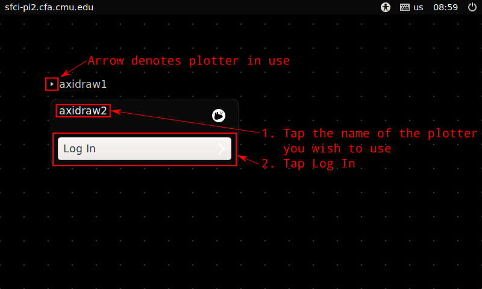
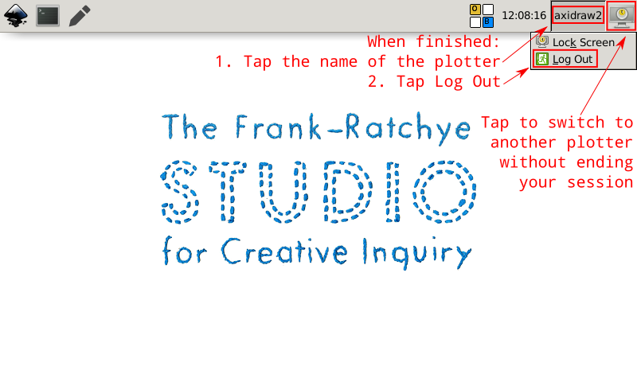
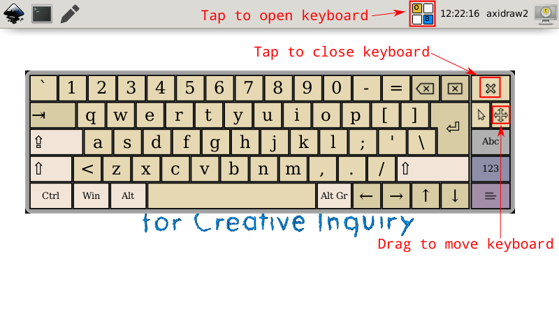

Plotter Station Configs
=======================
We are using a number of Raspberry Pi computers to manage our AxiDraw plotters. This is helpful, especially for time-consuming plots, as it frees up your own laptop :)

The system consists of a master and minions running Debian stable and Saltstack. Any device that can run Debian, with or without a touchscreen, will work.

The master performs these functions:
 - SaltStack master
 - Guacamole VNC server
 - NFS file server and web file upload
 - Central web server with authentication
 - HTTPS via certbot and Let's Encrypt

The minions perform these functions:
 - Run Inkscape w/ Axidraw plugin, Axidraw CLI, and Taxi
 - Axidraw CLI automatically selects device based on user/machine
 - One user account per each axidraw so that multiple machines may be used simultaneously
 - Stripped-down and locked-in desktop and window manager that is consistent and touchscreen-friendly
 - Management of multiple axidraw machines per machine (i.e. an exact USB port is always used per each machine for consistency)
 - On-screen keyboard button for touchscreen accessibility with Onboard
 - Central NFS file server and web interface for uploading with Filebrowser
 - Remote desktop connections to each machine through the master with x11vnc and Guacamole

## TODO
 - License
 - Control screen timeout via SaltStack variable
 - Lock down XFCE a bit more
 - Some sort of interface (maybe) on the master machine

## Usage

### Accessing

To login to an axidraw machine, approach the machine and tap on the name of the machine that you wish to control (i.e. "axidraw1" or "axidraw3-se"). Then tap "Login."

If someone else is currently using a plotter, an arrow will appear next to the plotter name until they log out. Do not us a plotter in use by someone else.



Once you have logged in or approach a machine not in use, **always double-check the name in the top right corner to ensure you know which physical plotter you are controlling.**

### Switching Plotters & Logging Off

Locking the screen allows for your programs to continue running while another plotter on the machine may be used. To lock the screen, tap on the button in the top right corner.

When you are finished with your plotting session, you should log off of the machine. This will remove the little triangle next to the plotter's name and indicate that someone else may use it. To do so, click on the plotter name in the top right corner and then tap "Log Off."



### Onscreen Keyboard

You may wish to use the onscreen keyboard. This allows you to tap to type. To bring up the onscreen keyboard, tap the tiled icon in the top bar. You can then click the X in the top right corner of the keyboard to close it, or drag on the 4-way arrow icon to move the keyboard.



### Managing Files

The web interface may be accessed at [https://sfci-pi1.cfa.cmu.edu/](https://sfci-pi1.cfa.cmu.edu/). You should login with your AndrewID (the text before the @ in your andrew.cmu.edu email address) and the password provided to you by the machine administrator.

### Managing Files

Once logged in to the web interface, click on "Manage" in the "Files" box.

### Controlling Remotely

Once logged in to the web interface, click on "Manage" in the "Files" box.

### Using the CLI

## Setup Instructions

1. If using a Raspberry Pi, install Raspbian Lite to get started. Also remember to change the `pi` user password. If using an x86 machine, install Debian stable with the CLI installer (do not install any additional packages, services, or GUIs).
2. TBD

Grain example:
```yaml
roles:
  - axidraw
axidraws:
  - name: axidraw7           # Should be accross all machines
    id: 7                    # Should be accross all machines
    kernel_port: '1-1.3:1.0' # Linux USB port address. Can also address USB hubs if needed
    kernel_type: 'ttyACM*'   # How it shows up normal in /dev/tty...
  - name: axidraw8
    id: 8
    kernel_port: '1-1.4:1.0'
    kernel_type: 'ttyACM*'
```

## Notes

This system was originally created by [Perry Naseck](https://perrynaseck.com/) in 2021 for the F21 _Drawing with Machines_ course at CMU.
