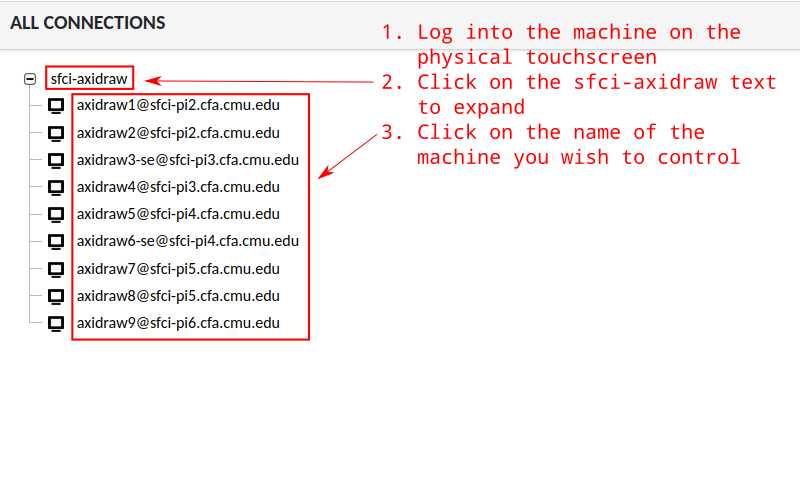
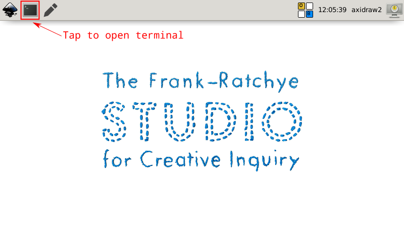

Plotter Station Configs
=======================
We are using a number of Raspberry Pi computers to manage our AxiDraw plotters. This is helpful, especially for time-consuming plots, as it frees up your own laptop :)

The system consists of a master and minions running Debian stable and Saltstack. Any device that can run Debian, with or without a touchscreen, will work.

The master performs these functions:
 - SaltStack master
 - Guacamole VNC server
 - NFS file server and web file upload
 - Central web server with authentication
 - HTTPS via certbot and Let's Encrypt

The minions perform these functions:
 - Run Inkscape w/ Axidraw plugin, Axidraw CLI, and Taxi
 - Axidraw CLI automatically selects device based on user/machine
 - One user account per each axidraw so that multiple machines may be used simultaneously
 - Stripped-down and locked-in desktop and window manager that is consistent and touchscreen-friendly
 - Management of multiple axidraw machines per machine (i.e. an exact USB port is always used per each machine for consistency)
 - On-screen keyboard button for touchscreen accessibility with Onboard
 - Central NFS file server and web interface for uploading with Filebrowser
 - Remote desktop connections to each machine through the master with x11vnc and Guacamole

## TODO
 - License
 - Control screen timeout via SaltStack variable
 - Lock down XFCE a bit more
 - Some sort of interface (maybe) on the master machine

## Usage

### Accessing

To login to an axidraw machine, approach the machine and tap on the name of the machine that you wish to control (i.e. "axidraw1" or "axidraw3-se"). Then tap "Login."

If someone else is currently using a plotter, an arrow will appear next to the plotter name until they log out. Do not us a plotter in use by someone else.


Once you have logged in or approach a machine not in use, **always double-check the name in the top right corner to ensure you know which physical plotter you are controlling.**

### Switching Plotters & Logging Off

Locking the screen allows for your programs to continue running while another plotter on the machine may be used. To lock the screen, tap on the button in the top right corner.

When you are finished with your plotting session, you should log off of the machine. This will remove the little triangle next to the plotter's name and indicate that someone else may use it. To do so, click on the plotter name in the top right corner and then tap "Log Off."


### Onscreen Keyboard

You may wish to use the onscreen keyboard. This allows you to tap to type. To bring up the onscreen keyboard, tap the tiled icon in the top bar. You can then click the X in the top right corner of the keyboard to close it, or drag on the 4-way arrow icon to move the keyboard.


### Web Interface

The web interface may be accessed at [https://sfci-pi1.cfa.cmu.edu/](https://sfci-pi1.cfa.cmu.edu/). You should login with your AndrewID (the text before the @ in your andrew.cmu.edu email address) and the password provided to you by the machine administrator.

### Managing Files

Once logged in to the web interface, click on "Manage" in the "Files" box. This will open an online file manager. You can drag files in to upload or click on the upload icon in the top right corner.

Files uploaded to this interface will appear on the machines in the following path:

```
/mnt/axidraw/users/<andrewid>
```

So, if user `acarnegie` uploads `mydrawing.svg`, it will exist on the axidraw machines as `/mnt/axidraw/users/acarnegie/mydrawing.svg`.

### Controlling Remotely (VNC)

Rather than using the touch screen and on-screen keyboard, it is much easier to control the machine from your own computer. With this method, you can see the screen, move the mouse, and type on the keyboard from your own computer.

Once logged in to the web interface, click on "Control" in the "Machines" box. This will bring you to the machine selection page. Expand the "sfci-axidraw" group by clicking on the text and then click on the text of the plotter you wish to control.

**NOTE:** Important cautions and caveats:

 - You must physically approach the machine and login to the account you wish to access remotely prior to controlling it. The account must be logged in and viewed on the physical screen for the remote access to work.
 - You can copy and paste to and from your computer and the axidraw machine. Do not copy and paste sensitive information on your computer while connected to the plotter machine, as this will copy to its clipboard as well.
 - The screen streamed to your computer may have a slight delay or lag. Be patient. Mouse and keyboard movements may not be lagged/delayed by the same amount the screen is delayed.

If you see a blank/black screen or the remote access page fails to connect, try locking the screen and unlocking the machine (tap the monitor button on the top right corner of the touchscreen) and then try again.



### Using the CLI

To plot with an axidraw machine, it is recommended to use the axidraw CLI tool, `axicli`.

To open the terminal, tap on the terminal icon in the top left of the screen. A terminal will open that starts in the `/mnt/axidraw` directory.



Recall from the [Managing Files section](#managing-files) that your user directory is `/mnt/axidraw/users/<andrewid>`. To change to this directory, type:

```
cd users/<andrewid>
```
and then press enter. You can now access the files that you uploaded online. You can type `ls` and press enter to list the files and folder in your user directory.

When you use the axidraw plotter, there are a few steps that must be performed in order:

1. Create and upload your plot file.
2. Run `cd users/<andrewid>` to go to your user directory.
3. Run `axicli -m align` to raise the drawing implement and unlock the plotter motors.
4. Manually move the axidraw to the intended start position (with your hands). Unlike a CNC machine or 3D printer, the axidraw does not have a concept of a predefined home location. When you start your plot, (0,0) will start from the point the plotter is currently positioned.
5. Run `axicli -m toggle` to lower the drawing implement.
6. Attach your pen or drawing implement to the axidraw, whith the pen touching the drawing surface.
7. Run `axicli -m align` to raise the drawing implement again.
8. Run `axicli <svgfilename>` to begin plotting.

If you need to stop your plot, press `control` + `c` from the terminal.

## Notes

This system was originally created by [Perry Naseck](https://perrynaseck.com/) in 2021 for the F21 _Drawing with Machines_ course at CMU.
