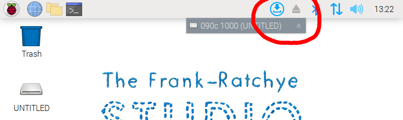

# AxiDraw RPi Instructions (2024)

[PDF version](README_assets/instructions_2024.pdf)

---

### Putting your file onto the RPi:

1. Plug the thumb drive into the RPi. You will see a window ("Removable medium is inserted"). Use the mouse or touchpad to select "Open in File Manager" and OK.
2. Copy your SVG file onto the RPi desktop by dragging it from the thumbdrive window. 
3. Once you have moved the file, eject the flashdrive using the eject icon in the top right of the menu bar. Click the eject icon once to open the menu and then click on your device.
  
4. If a terminal window is not already open, then open a terminal by clicking the black icon in the top left of the menu bar. 
5. After you've finished making your plot, right-click on your file and select "Move to Trash" to delete your file from the RPi desktop.

---

### There are 5 main commands: 

* `axicli -m align` — unlocks the motors so you can home the device
* `axicli -m toggle` — moves the pen up and down
* `axicli filename.svg` — plots the file called *filename.svg*
* `axicli --help` — for all other help
* Control-C — terminates an active plot

Also, 

* If you are using the larger SE/A3 plotter, use `axicli --model 2 filename.svg`
* If you are using the giant SE/A1 plotter, use  `axicli --model 5 filename.svg`

---

### Plotting Instructions: 

1. Type `axicli -m align` to unlock the motors, and set your plot's origin by moving the plotter's pen location all the way to the top left corner. 
2. Place your paper by the plotter such that the paper's top left corner is under the pen. Affix the paper with magnets and/or painter's tape. 
3. Put some painter's tape on the paper under the pen. Type `axicli -m toggle` to raise and lower the pen. Make sure the pen is touching the paper when it's in the *down* position. The tape will keep you from accidentally marking the paper at the origin.
4. Type `axicli filename.svg` to plot the SVG called *filename.svg*.
5. When you have finished making your plot, right-click on your file and select "Move to Trash" to delete your file from the RPi desktop.