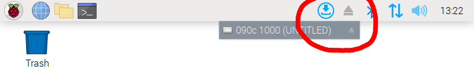

Axidraw Standalone Kiosk
========================

1. Plug in your flashdrive and it will appear on the Desktop. Double click it to open. Move your file to the desktop. Users comfortable with the terminal may also move the file with that method.
  
2. Once you have moved the file, eject the flashdrive using the eject icon in the top right. Click it once to open the menu and then click on your device.
  
3. Next, open a terminal by clicking the black icon in the top left. To plot on an Axidraw V2 or V3, type `axicli filename.svg` where `filename.svg` is the name of the file that you moved to the Desktop. To plot on other devices, skip to step 4.
  TIP: You may start typing the first few letters of the file and press `TAB` to autocomplete the filename.
  
4. To plot on another model of Axidraw device, append `--model NUMBER` in between `axicli` and `filename.svg` where `NUMBER` is the correct number for your device. See the terminal for a reference of which number goes to which device.
  
5. For more information about the `axicli` command, run `axicli --help` or see the [online documentation](https://axidraw.com/doc/cli_api/#introduction).

This documenation may be accessed at [https://github.com/golanlevin/DrawingWithMachines/tree/main/rpi_standalone](https://github.com/golanlevin/DrawingWithMachines/tree/main/rpi_standalone) or the QR code below:

