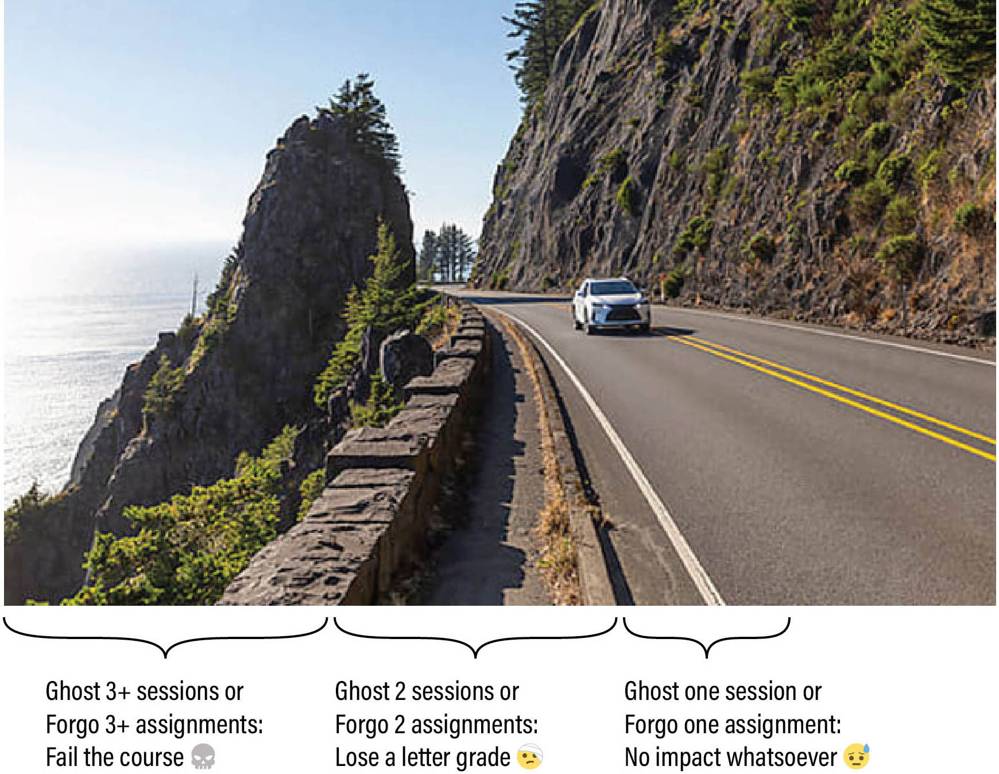
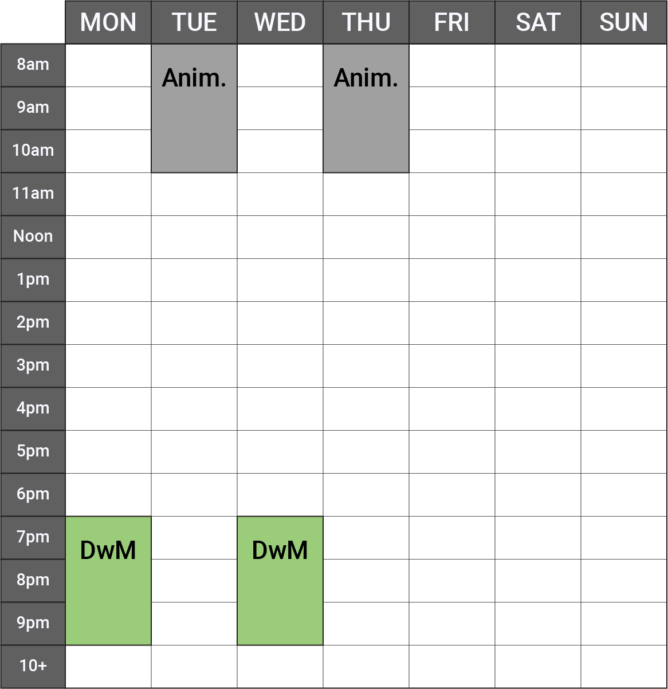

# *Drawing with Machines* Syllabus, Fall 2025

**Key Information:**

* Course: *Drawing with Machines* (60-428/728, 12 Units, In-Person-Only)
* Carnegie Mellon University School of Art + IDeATe Program
* Times: Mondays/Wednesdays, 7:00–9:50pm
* Dates: August 25 – December 3, 2025
* Location: CMU College of Fine Arts, Room CFA-303
* Professor: [Golan Levin](https://art.cmu.edu/people/golan-levin/), golan@andrew...
* Teaching Assistant: Santi Salazar, ssalazar@andrew...

---

#### CONTENTS

* [TL,DR](#tldr)
	* Assignment Policy
	* Attendance Policy
* [ABOUT THIS COURSE](#about-this-course)
	* Summary 
	* Course Description
	* Learning Objectives
	* Unit Topics and Assignments
	* Prerequisite Knowledge
	* Extra Time Commitments
* [TOOLS, MATERIALS, AND SPACE](#tools-materials-and-space)
	* Required Tools
	* Communication Tools
	* Art Supplies
	* Access to Plotting Equipment
	* Our Studio Space, CFA-303
* [ATTENDANCE POLICIES](#attendance-policies)
	* Excused Absences
	* Ghosting (No-Call, No-Show Absences)
	* Partial Attendance
	* Malingering On Critique Days
	* Health-Related Absences
	* Classroom Streams/Recordings
* [GRADING AND EVALUATION POLICIES](#grading-and-evaluation-policies)
	* Grades
	* Evaluations
	* Expectations of Professionalism
	* Policies for Late Work
	* Feedback and Critique
* [ACADEMIC INTEGRITY](#academic-integrity)
	* Use of Free and Open-Source Code in Projects
	* Policies Regarding Informal Collaboration
	* Policies Regarding Formal Collaboration
* [ACCOMMODATIONS](#accommodations)
	* Inclusivity Statement
	* Content Considerations
* [CODE OF CONDUCT](#code-of-conduct)
	* Discrimination and Harassment
	* Take Care of Yourself
* [APPENDICES](#appendices)
	* [Policies for Our Class Instagram](instagram_policies.md)
	* [Guidelines for Our Studio Classroom](room_policies.md)

---

## TL,DR

Your grade in this course is straightforwardly calculated based on your professionalism in completing work and attending class, subject to the policies summarized below:

### Summary of Assignment Policy:

* 😓 Forgo 1 set of assignments: no impact on your grade whatsoever.
* 🤕 Forgo 2 sets of assignments: lose a letter grade.
* 💀 Forgo 3+ sets of assignments: fail the class.

There will be 10 sets of assignments this semester. Each set of assignments has a clearly defined checklist of subtasks, whose purpose is to help you develop discipline in creating and documenting your work. Your grade is based on your fulfillment of these checklists. A set of assignments is "forgone" if it is more than one week late, or if it is less than 15% completed.

### Summary of Attendance Policy:

* 😓 Ghost 1 session: no impact whatsoever.
* 🤕 Ghost 2 sessions: lose a letter grade.
* 💀 Ghost 3+ sessions: fail the class.

Attendance is important, but if you need to miss class — which can happen, within reason — you are expected to be responsible about **communicating** with me about your attendance. Here, *"ghosting"* refers specifically to "No-call, No-show" attendance events — not excused absences. That said, this flexibility should not be abused; additional policies (see below) may take effect if you incur more than 3 excused absences.

---

## ABOUT THIS COURSE

### Summary 

*In this course, we will use our brains to control machines to do new things with art supplies.*

### Course Description

This is an intermediate/advanced studio course in experimental drawing, generative art, computational design, and mechatronic mishegoss. Working at the boundaries of creative code, automation, physical materials, and gestural mark-making, we will explore personal and peculiar new approaches to digital imaging; the development of ultra-niche workflows as a mode of creative practice; and the use of algorithms and machine collaborators as nontraditional intermediaries between mind, hand, and paper. Drawings will be created using AxiDraw plotters and a variety of other specialized machinery. 

Topics in this course include: rule-based art and conditional design; computational and generative form; synthetic automatism, chance and stochastic composition; animation and real-time interaction. Through rigorous exercises in freestyle computing, participants will develop skills in the control of machines to govern line, texture, tone, shape and mass in a variety of dry and wet drawing media. Participating students must have JavaScript and/or Python programming experience equivalent to an introductory course such as 15-104, 15-110 or 15-112.

### Learning Objectives

At the conclusion of this course, students will be able to:

* Be proficient in creating programs to execute drawings with plotting machines.
* Demonstrate familiarity with the repertoire of artists, designers, works and activities centered around generative art with drawing machines.
* Understand the role of algorithms in making drawings that explore concepts of procedurality and generativity.
* Understand how to document and present creative work online and in person.

### Unit Topics and Assignments

This semester, there will be 10 sets of Assignments. These include 7 *weekly assignment sets* prior to the mid-semester break; a 2-week *Experiment*, with a proposal stage; a 4-week *Investigation*, with proposal and check-in stages; and a culminatory *Portfolio Review* during Finals Week. The themes of the assignment sets will be:

1. Physical and Conceptual Drawing Machines `8/27`
2. Introductory Tooling: Creative Coding and Pen Plotting `9/3`
3. Line and Line Weight `9/10`
4. Tone and Hatching `9/17`
5. Pattern/Modularity `9/24`
6. Field/Distribution `10/1` 
7. Material Conditions `10/8`
8. Self-Directed Experiment `11/3`
9. Self-Directed Investigation `12/3`
10. Portfolio Review `12/TBA`

### Prerequisite Knowledge

*What prior knowledge must students have in order to be successful in this course?*

* This is an intermediate/advanced studio course, intended for arts students who have already had at least one semester of elementary programming (in any language). Students must be familiar and comfortable with computer programming fundamentals, such as iteration, conditional testing, functional abstraction, static and dynamic memory structures, and object-oriented programming, as taught in a course like 15-104, 15-110, or 15-112.
* Students are expected to have had some prior experience with a creative coding toolkit for the arts, such as p5.js or Processing. 
* This is a *polyglot* course, taught using a combination of JavaScript, Java, and Python. In general, students may work in their preferred programming language. However, students who are fluent in only one language may need to do some additional preparation.
* A strong foundation in mathematics, especially including geometry, algebra, and trigonometry, will be helpful.
* A strong foundation in markmaking, especially including drawing, painting, diagramming or drafting, will be helpful. 

### Extra Time Commitments

There are no *specific* extra time committments outside of regularly posted meeting times. However, students should plan to use specialized plotting equipment outside of class time. Note that, just as with a hand-drawing, some plots can take a very long time (e.g. 10 hours) to execute.

---

## TOOLS, MATERIALS, AND SPACE

### Required Tools

* **Laptop**. Students should have access to a personal laptop. 
* **Software**. Recent, well-updated installations of Mac OSX, Windows or Linux are all acceptable operating systems. However, although all of the programming toolkits with which we work are free and cross-platform, it is possible that demonstrations or example projects may only be provided for Mac OSX. 
* **Camera**. Students must have access to some sort of camera to document their work. A smartphone with a camera is acceptable.
* **Personal Sketchbook**. It is extremely wise to plan your projects on paper before writing any code. And some ideas can only be worked out on paper itself. Above all, this is a drawing course. In support of this, you are *strongly advised* to maintain a personal sketchbook for this course. 
* **Thumb Drive**. It may be easiest to move files around on thumb drives and I strongly encourage (but don't require) you to get one. If you do, I recommend getting a [dual USB-C/USB-A thumb drive](https://www.amazon.com/JOIOT-Portable-Keychain-Smartphone-Computer/dp/B0CSW6375K/)

### Communication Tools

This course uses the following software tools to share information:

* [**Github repository**](https://github.com/golanlevin/DrawingWithMachines), for lectures, assignments, readings, and tutorials.
* **Discord server**, for posting your work, announcements, and informal communication.
* **Email**, for additional important announcements by the professor.
* **Google Forms**, for collecting official assignment docmentation.
* [**Shared Instagram account**](https://www.instagram.com/drawingwithmachines/), for public sharing. **Note**: Please see this special appendix on [Policies for Our Class Instagram](instagram_policies.md), which should be considered an addendum to our *Code of Conduct*.
* *In the unlikely event that the professor is sick/quarantined, Zoom may be used for a remote lecture.*

### Art Supplies

*Please be sure to put your name on your belongings.*

All students in *Drawing with Machines* will be given a free, standard kit containing a variety of paper and pens. This kit is a *minimum baseline* of a few common supplies you will need. Apart from this kit and some additional open supplies in our classroom, you will be expected to obtain your own art supplies, such as pens, ink, paint, markers, and paper, according to your individual interests. For recommended supplies for pen-plotting, please see [the excellent list at Drawingbots.net](https://drawingbots.net/knowledge/supplies). 

Obtaining art supplies should not present a financial hardship. Last year, the CMU Student Senate, led by undergraduates from the School of Art, made it possible for students to get support for art supplies. The CMU HUB is now funding consumable art supplies, online learning resources, and much more. To apply for funding for these items, please follow the following instructions:

* Access [this link](https://fao.andrew.cmu.edu/forms.html#/). Go to "Academic Year 2025-26". Under *Additional Resources* and *My Forms*, click on the "2025-26 Special Financial Circumstances" form. You can also [try this link instead](https://www.cmu.edu/sfs/financial-aid/special-circumstance-request/index.html).
* Scroll to Section 1 ("Reduced Income"), and select "Other changes to income, employment, or size of a family since filing the FAFSA". 
* Scroll to Section 2 ("Additional Education-Related Expenses"), and select “Other” under the "Type of Expense" in the dropdown menu.
* Fill out the "Amount" section with the total cost of the course expenses (including tax). 
* For "How is this related to your education?", please type the course number that you are buying materials for (60-428 or 60-728). 
* For Section 3 ("Additional Information"), list again the course number and total cost of supplies purchased. 
* Later, your HUB liaison should contact you with a request for you to email the receipt.
* You should receive your reimbursement, through SIO, within two weeks of submitting the receipt.

### Access to Plotting Equipment

You will generally execute your assignments using the plotter equipment at in CFA-303. However: 

* If you happen to possess your own plotter equipment, you are welcome/encouraged to use it.
* We have several tiny [Line-Us](https://www.line-us.com/) plotters which may be signed out with the professor's permission. If you are traveling or quarantined, you may request to borrow one.
* If you happen to have access to hardware elsewhere on campus which can be used for computer-controlled mark-making (such as laser-cutters, CNC routers, embroidery machines, robot arms, etc.), you are welcome/encouraged to do so — but you're on your own to seek assistance with that equipment.

### Our Studio Space, CFA-303

During Fall 2025, CFA-303 is available for work during all of the times marked with an empty square in the schedule below:

There are many simple things we can do to ensure that our room is a generous, focused, and genuinely collaborative space. Furthermore, this semester, we will be sharing our laboratory with Professor DeYoung's *Stop-Frame Animation* course, which meets on Tuesday/Thursday mornings; it is imperative that we be considerate of our schoolmates in this course. 

To that end, I have prepared a special document with guidelines for sharing space with the other class; guests and room security; noise and focus, equipment use; and food and drinks. Please read these [**Guidelines for Our Studio Classroom**](room_policies.md) carefully. This document should be considered an addendum to our *Code of Conduct*.

---

## ATTENDANCE POLICIES

This class works best when we’re all here — not just in body, but in spirit. Our lab's energy comes from the focus, curiosity, and generosity we each bring. When we show up ready to work, ready to listen, and ready to share, we make the space better for everyone. To that end, this section articulates policies on: 

* **Excused absences** (about which you have communicated responsibly)
* **Ghosting** ("No-Call, No-Show" absences)
* **Partial attendance** (tardiness, mental absence)
* **Malingering** on critique days (avoidant behavior)
* **Health-Related Absences**
* **Classroom Streams/Recordings**

### Excused Absences

An *excused* absence is one about which you have communicated with me in a timely, professional, and responsible manner.

* **Communication is paramount**. Attendance is important, but if you're running late or need to miss class — which can happen, within reason — you are expected to be responsible about communicating with me. If you’re ill, or if you know you will have a planned absence, please let me know by Discord or email before the beginning of that class session. I can be very understanding and accommodating about planned and necessary absences, family circumstances, and/or medical issues when you inform me in a timely and professional manner. Our class has a number of small, portable [Line-Us plotters](https://github.com/golanlevin/DrawingWithMachines/tree/main/machines/line-us); it may be possible to provide you with a personal device during your absence.
* **This policy on excused absences shall not be abused**. Even if your absences are "excused", special arrangements will become necessary if you need to miss more than a few sessions. Not every circumstance can be accommodated, not all excuses are equal, and some class sessions (e.g. critiques) are more important than others. I reserve the right to lower your grade if you miss four or more sessions, in whole or in part, without such a special accommodation in place. If you have chronic medical issues that are likely to impact your attendance, please speak to the [Office of Disability Resources](https://www.cmu.edu/disability-resources/) as soon as possible and then make an appointment with me to discuss any accommodation requests. 
* **Missed information is your problem**. The professor or TA *may* be able to help, but *you* are ultimately responsible for any information you have missed as a result of absence. Per CMU policy, "faculty are not obligated to re-teach material due to a student missing class." Organize with your classmates to get class information and material that you have missed.

### *Ghosting* (No-Call, No-Show Absences)

If I, the professor, am unable to come to class, I will send a message so that you can plan accordingly. I respectfully ask exactly the same courtesy of you. 

Failing to communicate responsibly about your absences — in other words, *ghosting*, or "No-Call, No-Show" events — is problematic and disrespectful to the classroom community, and is not acceptable in this course. Allowing the grace of one emergency for everyone, the following policy applies (*except as otherwise officially accommodated under University policy*):

* Ghost 1 session: no impact on your grade.
* Ghost 2 sessions: lose a letter grade (A→B).
* Ghost 3 or more sessions: fail the class (B→R).

Short of a truly incapacitating emergency, there are very few situations in which a person is *literally unable* to send a brief message. Students are responsible for notifying the professor as soon as possible, even in a justified *No-Call, No-Show* situation — i.e. a "delayed notice of absence". Depending on the severity of the situation, a *post-hoc* excuse for an unexcused absence may or may not be accepted, at the professor's discretion.

### Partial Attendance

Focus is precious, and our class time is limited. Physical presence means nothing if you’re “checked out”; your mental presence is extremely important. *Partial absence* includes situations like tardiness, sleeping in class, moonlighting, or other forms of mental absence (i.e. distracted participation). Three incidents of unexcused partial absence may cause you to lose a letter grade (A→B).

* **Tardiness** is a form of partial absence in which you are more than 15 minutes late to a class session. Tardiness may be excused or unexcused. Note that I typically begin to lecture (or commence other important class activities) no more than 5 minutes after the official start time. Your first incident of unexcused tardiness will receive a warning, but further instances will impact your grade.
* **Sleeping in class** is considered partial attendance. If you are sleeping in class I will wake you up. Your first incident of sleeping in class will receive a warning, but further instances will impact your grade. If you are not getting enough sleep please address this issue either with a doctor or with an academic advisor in order to better balance your days and nights.
* **Working on homework for another class**, during class time (i.e. *moonlighting*) is considered partial attendance. Moonlighting is particularly harmful to class morale because it signals a lack of engagement and respect for both your peers and the course content. When you disengage from the collective learning experience, it diminishes the collaborative energy and focus of the group. This behavior can create a ripple effect, distracting others and lowering the overall quality of the class. 
* **Stepping out briefly is OK**. I don't require notification if you just need to step out for a few minutes in the middle of class (e.g. to use the restroom, collect yourself, take an urgent call, etc.). If I'm in the middle of lecturing, please don't interrupt me; just excuse yourself. Stepping out for a moment is not considered partial absence.

### [Malingering](https://www.merriam-webster.com/dictionary/malinger) On Critique Days

Sometimes, students who haven’t completed their projects choose to avoid class on critique days, because they are too embarrassed to come to class empty-handed. *Please have courage.* Your participation on critique days is essential, even if your own project is incomplete or missing, because these sessions and conversations help you understand the nature of the work. If you are empty-handed, just say so; it happens. Even if you are without a project, you are still expected to help your peers by contributing productively to the class discussion.

### Health-Related Absences

Please refrain from attending class if you feel even slightly unwell. You are emphatically encouraged to seek appropriate medical attention for treatment of illness, and notify me by email/Discord about your absence as soon as practical, so that accommodations can be made. I don't need or want to know intimate details about your medical issues; it's sufficient to let me know that you're unwell.

### Classroom Streams/Recordings

Owing to the intensively hands-on nature of this studio course, it will generally not be practical to offer recordings, live-streams, or zoom connections to absent students. 

---

## GRADING AND EVALUATION POLICIES

In this course, your effort is evaluated according to three different systems, which are decoupled to the greatest extent possible:

* **Grades** (standards used by CMU on its transcripts) 
* **Evaluations** (standards used by our class community in critiques)
* **Expectations of Professionalism** (additional standards used by Golan)

### Grades

**Grades** are standards used by CMU on its transcripts, to indicate your objective level of effort in a course. Your grades in this course will be based on your factual, self-evident **fulfillment** of simple, easily-verifiable checklists. In other words, all grade penalties are based on objective checklist completion.

*This is art sqool.* With very rare exceptions (I’ll be clear), I will always prefer that you make the assignment interesting *to you* — if necessary, by creatively bending the rules or re-interpreting the assignment. My assignments are starting-points, prompts and propositions; think beyond them. Regardless, however:

Projects will always have a checklist of *supporting requirements*. These are often very straightforward to fulfill, but if you fail to meet these, you will have points deducted. Items on an assignment checklist will be announced with the number of points awarded for each. Be sure to pay careful attention to seemingly trivial requirements. Practically every project assignment will ask you to check off typical subtasks such as (*for example*):

* **Create** a unique Discord post for your project in the correct channel.
* **Upload** a static image of your project, such as a screenshot or rendering.
* **Upload** a photo of your notebook sketches for the project, if requested.
* **Upload** dynamic documentation of your project (such as an animated GIF or screen recording) into the blog post, if applicable.
* **Write** 100-150 words about your project, describing its development process. In your writing, include some critical reflection and analysis of your project: What were your goals? In what ways did you succeed? And in what ways did you fall short? 
* **Link** to your project or code, if requested.
* As per our syllabus policies on Academic Integrity, you must also:
	* **Name** any other students from whom you received advice or help, and describe the help you received. If you had collaborators, explain how the work was distributed among the collaborators.
	* **Cite** and link to the sources for any code, external libraries, or other media (e.g. photographs, soundtracks, source images) which you used in your Project. Citing your sources is extremely important. Err on the side of generosity!

Your evident care and diligence in fulfilling the stated checklist(s) will be straightforwardly graded. Your final grade will be summed from your various sub-grades, less any demerits due to unexcused absences or lateness. 

Lastly, the following grading policy concerns "**foregone**" assignments — that is, when you have *altogether skipped* one of the semester projects, or on which you have completed less than 15% of points, within one week of its due date (*except as otherwise officially accommodated under University policy*):

* **Forgo 1 assignment**: no impact on your grade whatsoever.
* **Forgo 2 assignments**: lose a letter grade (e.g., A→B).
* **Forgo 3+ assignments**: fail the class (B→R).

### Evaluations

**Evaluations** are standards used by our class community in critiques, to provide subjective feedback about your creative work. These are *opinions*.

This section discusses how your work will be Evaluated. Evaluations reflect professional assessments of your work—as provided by me, our Teaching Assistant, external guest critics, and/or your peers. Evaluations articulate someone's personal *opinion* about whether your creative effort is *good*, *interesting*, *noteworthy*, etc. As such, Evaluations do not figure into your grade.

The purpose of our open-ended projects is to provide well-circumscribed opportunities for you to make creative work. Generally the prompts will invite you to explore a specific topic or set of tools, but, unless stated otherwise, there is no correct solution, and no specific requirement for how you should implement your idea. My assignments will not only ask for a creative solution, but also for some creativity in how you define and approach the problem. It is expected that your Projects will be presented and documented in the appropriate channels of our class Discord.

The quality of your creative projects may be unrelated to how much time you spent making it. You may sometimes observe a very quickly-executed solution which succeeds because of its strong concept. Usually, however, the quality of a project is rewarded by extra attention to its craft.

In our critiques, we will evaluate your open-ended projects according to the following subjective considerations:

* **Curiosity**: Are you asking questions as you work?
* **Tenacity**: Are you forging through difficult problems without giving up?
* **Execution**: Are you crafting with purpose, precision, and attention?
* **Inventiveness**: Are you discovering/exploring methods outside the obvious and predictable?

I will provide Evaluations to you by email or private message. They may be quite brief. Evaluations may be given along different scales, or no scales at all, according to the project. Other times, evaluation feedback may take the form of scores of S,A,B,C,D, or F, as described below. Note that it is possible for you to receive full *credit* for an assignment (i.e. you ticked off all the items on the checklist), while still receiving an Evaluation of B or C.

* **S** (Surpassing/秀): You made something exceptional
* **A** (Excellent): You made something very good
* **B** (Good): You made something satisfactory, that fulfills all requirements
* **C** (Needs Improvement): You tried to make something
* **D** (Unacceptable): The work does not fulfill any requirements completely
* **F** (No Credit): You did not even try, and made no arrangements to address this

### Expectations of Professionalism

*My Opinion of Your Work is Not Your Grade; Your Grade is Not My Opinion of Your Work. Earning good grades is roughly correlated with, but not the same thing as, being a good learner.*

I am just one person, and despite my years of experience in this field, my particular taste is ultimately irrelevant. I have been known to dismiss student projects that later proved to be highly influential and significant. I have sometimes brought in outside critics whose opinions I deeply respect, who surprise me with radically different (but equally valid) opinions about student projects. And I have even been known to change my own mind about student projects quickly, and often. 

That said, there are a few aspects of your professional conduct that set you up to actually learn stuff. These things may seem simple and obvious, but it’s sometimes surprising how few students seem to get these right:

* **Be good**. Have a positive attitude.
* **Be present**. Show up to all of the course sessions, on time.
* **Be diligent**. Submit your work punctually, and with clear documentation.
* **Be responsible**. Communicate with me if you have a problem, and clean up after yourself.
* **Be helpful**. Help your classmates when they’re stuck. Contribute to discussions.
* **Be generous**. Make helpful contributions to discussions.
* **Be fearless**. Work outside your comfort zone. Give yourself permission to weird.
* **Be conscientious**. Pay attention to details of craft and execution. Put your heart in the work.
* **Be persevering**. Become resourceful about getting the assistance you need.
* **Be curious**. If you don’t understand something, start with curiosity rather than judgment.
* **Be tenacious**: Are you forging through difficult problems without giving up?
* **Be rigorous**: Are you crafting with purpose, precision, and attention?
* **Be brave**: Are you exploring methods outside the obvious and predictable?
* **Be respectful** of our social space. Make space for others.
* **Ask for help**. If you don’t know how/where/what, ask for help.

Whether or not you adhere to these recommendations will not affect your grade. But when students do follow these recommendations, they *learn* a lot more. Students who do these things are *also* more likely to make a good impression. This means that I am more likely to do things like:

* ...admit them into a future course from my waitlist. 
* ...recommend them to another professor who asks about them.
* ...arrange an Independent Study course with them.
* ...introduce them to outside professionals (e.g. for internships).
* ...write letters of recommendation for them.

### Policies for Late Work

When you submit a project late, you miss the chance to share, discuss and get feedback on your work. These are some of the most valuable affordances of this class.

**To receive critical feedback on your work**, your work must be available for evaluation during the designated review period. For example, at times this semester, your creative projects may be evaluated by your peers in an in-class critique, or by outside experts who review your work online. If your assignment is viewable by the time those persons do their reviews, then your work will likely not receive feedback from them. Likewise, generally speaking, my feedback for late work is comparatively attenuated. 

**To receive full credit towards your grade**, projects should be documented and uploaded by the time that I get around to reviewing them. This is usually within a week after their stated due date. If your project is more than a week late, I reserve the right to assume it is **foregone** (if you have not made an arrangement with me, and if less than 15% has been completed). For work which is complete but late, I may assign partial credit to it (generally an 80% multiplier on all checklist points). If you know you're going to be just a little bit late with a project, *contact me* to arrange an accommodation.

### Feedback and Critique

We are a diverse group. Some of us are artists, some of us are designers, some of us are scientists, some of us are engineers, and most of us are unique hybrids of these things. It is impossible to have one single standard we can use for "what is good". 

Sharing our perspective in critiques, and understanding that others may have other perspectives on what is good, **is an act of care.** In art school, it is one of the highest forms of care we can give each other. Outside of art school, if people don't find your work compelling, they will not tell you so; they will simply move on to something they like better. Critiques in an art school are a gift — a context in which you can receive feedback from "inside the house". Take them seriously and give a good faith effort to help your peers. 

There often isn't enough time to provide in-depth feedback for all students during critiques. If you would like more feedback on a project, ask me.

---

## ACADEMIC INTEGRITY

Your behavior as a responsible member of the new media arts community is very important — as demonstrated, for example, by properly citing your sources and borrowed code, and crediting those who have helped you. These expectations and obligations are addressed here.

### Use of Free and Open-Source Code in Projects

**Credit is the most important form of currency** in the economies of commons-based peer production and open-source arts. You are expected to cite the source of any code you use. Please note the following expectations and guidelines:

* **Use Libraries**. In your Projects, the use of general, reusable libraries is strongly encouraged. The people who developed and contributed these components to the community worked hard, often for no pay; acknowledge them by citing their name and linking to their repository.
* **Be Careful**. It sometimes happens that an artist places the entire source code for their artwork online. *You should probably avoid this code*. But at the very least, you should be very, very careful about approaching such code for possible re-use. If it is necessary to do so, it is best to extract components that solve a specific technical problem, rather than those parts which operate to create a unique experience. Your challenge, if and/or when you work with others’ code, is to *make it your own*. Doing so without proper citation would be actionable plagiarism.

### Policies Regarding Informal Collaboration

Our course places a very high value on civic responsibility that includes, but is not limited to, helping others learn. In this course, I strongly encourage you to give help (or ask others for help) in using various toolkits, algorithms, libraries, or other facilities. Please note the following expectations:

* In this class, *it’s OK to give and receive help*. In fact, it’s better than OK! But students who receive help from someone else are obliged to acknowledge that person in their project report, clarifying the nature of the help that was received.
* *We are all teachers*. Students with advanced skills are expected to help others, yet refrain from doing another’s work for them. You can usually tell when you’re about to cross the line: Ask yourself whether you are teaching someone to fish, or merely giving them the fish.
* When in doubt: *give credit* to the people who have helped you.

### Policies Regarding Formal Collaboration

The assignments in this course are primarily intended to be executed by individuals. That said, I am in favor of students collaborating if such collaborations arise organically and can be conducted safely. Please note the following expectations:

* *Notify the Professor*. It’s helpful for me to know who is working with whom. Students who wish to collaborate should jointly inform the professor as early as possible.
* *Describe who did what*. Written reports for collaborative projects should describe how your effort was distributed.
* *Only collaborators from this class*. Your project collaborator, if you have one, must be in this class. You may not collaborate with people from outside the course (e.g. your housemate).
* *Avoid co-dependency*. You may not collaborate with the same person (i.e. submit assignments jointly) for more than two projects.
* *Pairs only*. The third person never does anything. 

---

## ACCOMMODATIONS

### Inclusivity Statement

It is my intent that students from all diverse backgrounds and perspectives be well served by this course, and that the diversity that students bring to this class be viewed as a resource, strength and benefit. I will gladly honor your request to address you by the pronouns and name you specify.

I commit to make individual arrangements to address disabilities or religious needs (e.g. religious events in conflict with class meetings). Please advise me of these requirements early in the semester so that I may make appropriate accommodations.

### Content Considerations

In order to best engage as critical makers and thinkers, we will approach a diverse range of work with care and curiosity. During this course, you may encounter media containing nudity, strong language, or other material that some may find challenging. When possible, advance notice will be given before showing violent or sexual imagery. All content — including student work — must comply with CMU’s community standards and applicable laws, and should be relevant to our course material and presented professionally. If you have specific sensitivities or require accommodations, please let me know privately so we can make a plan together.

---

## CODE OF CONDUCT

### Discrimination and Harassment

I am committed to providing an educational experience that is free of harassment and intimidation for everyone in this course—regardless of race, color, ethnicity, nationality, sex, handicap or disability, age, sexual orientation, gender identity and expression, physical appearance, body size, religion, class, creed, ancestry, belief, veteran status, genetic information, or technology choices. I will not tolerate any form of harassment and/or discriminatory, oppressive, suppressive, or violent behavior.

*Harassment* may include, but is not limited to, offensive verbal comments, deliberate intimidation, stalking, following, harassing photography or recording, sustained disruption, inappropriate or non-consensual physical contact, unwelcome sexual attention, and/or refusing to accept the limits or boundaries set by another participant in our classroom. I further define *suppressive* behavior as any sort of communication that stifles or belittles another (noting that this is an in-class community standard rather than a CMU disciplinary category). Participants who have been asked to stop any behavior are expected to comply immediately. I expect all of the participants in our course community to adhere to this code of conduct–including me, the Professor.

Debate and free exchange of ideas is encouraged, but I will not tolerate harassment. If someone engages in harassing behavior, I may take any action deemed appropriate in the Carnegie Mellon University Policy against [Sexual Harassment and Sexual Assault](https://www.cmu.edu/policies/administrative-and-governance/sexual-harassment-and-sexual-assault.html), [Discriminatory Harassment](https://www.cmu.edu/student-affairs/theword/community-policies/discriminatory-harassment.html), or other [community policies](https://www.cmu.edu/student-affairs/theword/community-policies/index.html). If you experience or witness harassment, threatening behavior, suppressive behavior, or have any other concerns, I encourage you to speak up, say something, and/or let us know immediately.

For incidents that may not violate any formal policies or require disciplinary action, but which still cause harm and necessitate a thoughtful response, Carnegie Mellon has also developed a [Campus Climate and Bias Reporting Protocol](https://www.cmu.edu/title-ix/how-to-report-+-options-for-resolution/ccbrp/index.html). This a non-disciplinary mechanism for reporting and informally resolving incidents of alleged bias; it focuses on education, restoration, and strengthening and upholding our core values as a university community. If you need guidance or are uncertain as to what your options are, please feel free to contact CFA's Office for Diversity, Equity, and Inclusion prior to submitting a CCBRP report.

> *Carnegie Mellon University is firmly committed to intellectual honesty, freedom of inquiry and expression, and respect for the dignity of each individual. Acts of discriminatory harassment or intimidation by a student directed toward any member of the community are inconsistent with this commitment and will not be tolerated. Consistent with the University’s Statement of Assurance, prohibited acts include harassment and intimidation motivated by discriminatory intent based on race, color, national origin, sex, handicap or disability, age, sexual orientation, gender identity, religion, creed, ancestry, belief, veteran status, or genetic information. Any such harassment or intimidation of or by a student should be referred to the Dean of Student Affairs for resolution.*

### Take Care of Yourself

**Please take care of yourself**. I encourage you to do your best to maintain a healthy lifestyle this semester by eating well, exercising, avoiding drugs and alcohol in excess, getting enough sleep, and taking some time to relax. This will help you achieve your goals and cope with stress. If you or anyone you know experiences any academic stress, difficult life events, or feelings like anxiety or depression, it is critically important to seek support. If you or someone you know is in danger of harm to self or others, please call someone immediately, day or night — such as:

* **[Counseling and Psychological Services](http://www.cmu.edu/counseling/) (CaPS): +1-412-268-2922**
* **[Resolve Crisis Network](https://www.upmc.com/services/behavioral-health/resolve-crisis-services) (UPMC): +1-888-796-8226**
* **[On-Campus CMU Police](https://www.cmu.edu/police/): +1-412-268-2323**

---

## APPENDICES

This section concerns guidelines and policies for our shared virtual and digital spaces. 

### [**Policies for Our Class Instagram**](instagram_policies.md)

This semester, we will be sharing access to certain digital information resources, such as a class Instagram account and a Discord server. These services and accounts are critically important, communal resources that multiple students rely on for their work. To that end, I have prepared a special document with guidelines for the account's purpose and content; 
account security; community standards; and considerations for respect and privacy. 

Please read these [**Policies for Our Class Instagram**](instagram_policies.md) carefully. This document should be considered an addendum to our *Code of Conduct*.

### [**Guidelines for Our Studio Classroom**](room_policies.md)

This semester, we will be sharing our laboratory with Professor DeYoung's *Stop-Frame Animation* course, which meets on Tuesday/Thursday mornings. It is imperative that we be considerate of our schoolmates in this course. Furthermore, there are many simple things we can do to ensure that our room is a generous, focused, and genuinely collaborative space. To that end, I have prepared a special document with guidelines for sharing space with the other class; guests and room security; noise and focus, equipment use; and food and drinks.

Please read these [**Guidelines for Our Studio Classroom**](room_policies.md) carefully. This document should be considered an addendum to our *Code of Conduct*.

---

EOF
