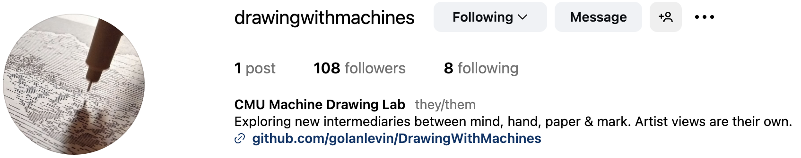

# Policies for Our Class Instagram

Drawing with Machines • Fall 2025 • Prof. Golan Levin, CMU

---

This semester we will share an Instagram channel, @[**DrawingWithMachines**](https://www.instagram.com/drawingwithmachines/). This account is a collective space for our class community to document and share our work, process, and experiments in code-based drawing. Think of it as a gift to your future self. Here are some guidelines to help us use it responsibly and respectfully:

### 🔒 Respect and Privacy

* Only post your own work (finished or in progress), or the work of others with their explicit permission. Feel free to sign your posts with your first name or initials if you want — or not.
* Don’t post photos or videos of classmates unless they’ve agreed to be shown.
* Even with permission, please avoid tagging individuals in photos. Let’s protect each other’s privacy.

### ✍️ Purpose and Content

* This account is for sharing our process: sketches, plotter failures, final drawings, time-lapses, experiments. Think of it as a studio logbook — not a portfolio.
* Feel free to include short captions or reflections — what you were trying, what worked, what surprised you.
* When relevant, feel free to tag tools or platforms we’re using (e.g. @axidraw, @p5xjs), or use hashtags like `#plotterart`, `#generativeart`, `#creativecoding`, and `#plottertwitter`.
* Please don’t repost artwork or media from outside accounts, even if it’s relevant or inspirational. This account is for sharing work made by members of our class.
* Do not post off-topic content (memes, unrelated selfies, promotions, etc.).
* Artistic work that engages with social or political ideas is welcome, as long as it connects meaningfully to our material and process. That said, this is a shared space — please don’t use the account as a soapbox or a platform to espouse personal views unrelated to the course.
* If you're unsure whether something is appropriate to post, just ask Golan or bring it up in class.

### 🔐 Account Security

* Login details for our account are in the `#key-information` channel of our Discord.
* Do not share the account login info outside of our class.
* Do not change the password, linked email, or any account settings.
* Avoid copying or transmitting the login details. Do not store them insecurely.
* If you notice suspicious behavior or login issues, report it to Golan immediately.

### 🤝 Follows, Likes, and Comments

* Please don’t use the class account to follow influencers, friends, or unrelated accounts.
* It’s okay to follow artists, labs, or projects relevant to generative art, drawing machines, or creative code — help curate our feed thoughtfully.
* Be mindful with likes — you’re acting on behalf of our entire group.
* Avoid leaving comments on others' posts unless it’s directly related to our work.
* If someone leaves a comment on one of our posts (e.g., “How did you do that?”), it’s fine to respond — but let Golan know if it involves harassment or a formal inquiry.
* Do not use the account to send or reply to direct messages (DMs). If someone messages us, let Golan know.

### 🚫 Community Standards

* Obviously: no hate speech, harassment, NSFW content, or private messaging through the account.
* Follow Instagram’s [Terms of Service](https://help.instagram.com/581066165581870) and [Community Guidelines](https://transparency.meta.com/policies/community-standards/), and the recommendations in Carnegie Mellon University's [Social Media Guidelines](https://www.cmu.edu/engage/alumni/get-involved/volunteer/current-volunteers/forms/socialmediaguidelines.pdf).
* Misuse of the account may result in disciplinary action and/or loss of access for the group.

*Thanks for helping make this a welcoming, thoughtful, and inspiring archive of our collective work!*

---